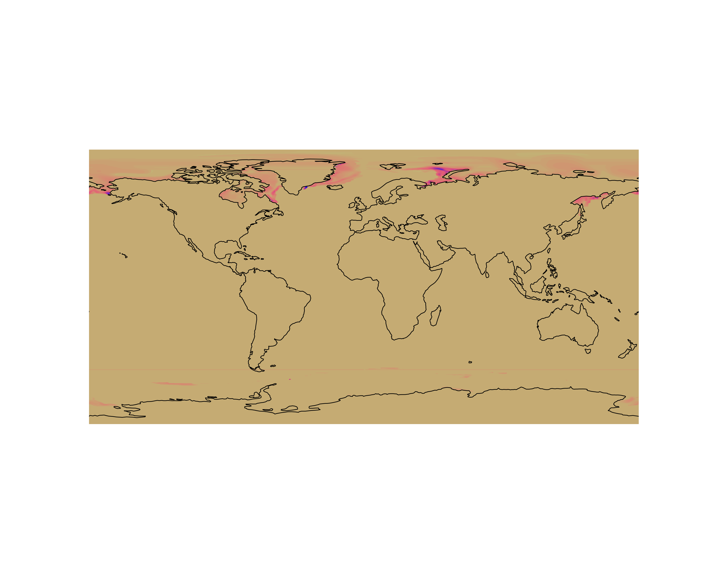
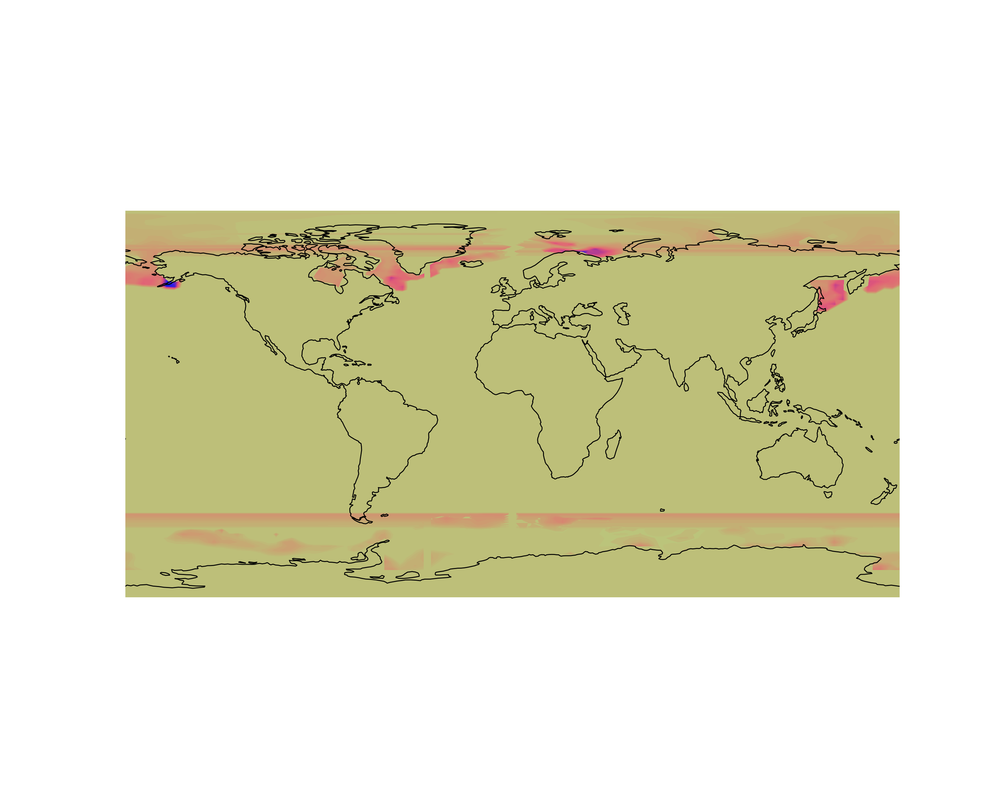
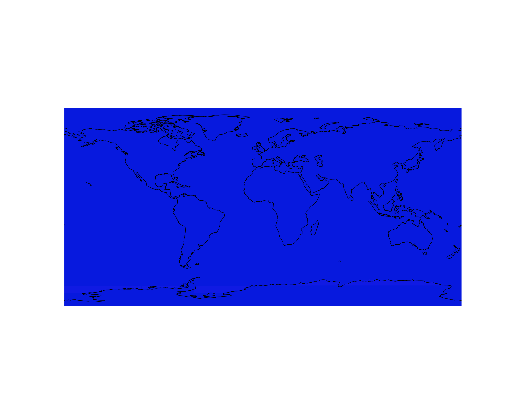

# Table of Contents

1.  [CICE Consortium](#org28fbdde)
    1.  [CICE Github Repository](#org5179e48)
        1.  [Resources Index](#org6d24216)
        2.  [CICE Consortium Test Data](#orgf8b290e)
    2.  [GX3 Description](#orge8e3b2d)
        1.  [GX3 Grid](#org2b3ded1)
        2.  [GX3 Bathymetry](#orgbf2fbdf)
        3.  [GX3 Land Mask](#org7393b2e)
        4.  [GX3 Forcing](#org08df58e)
        5.  [GX3 Initial Conditions](#orgd5aa7e0)
    3.  [GX1 Description](#org05ab192)
        1.  [GX1 Grid](#orgd404fe0)
        2.  [GX1 Bathymetry](#org31c07a2)
        3.  [GX1 Land Mask](#org2268e1c)
        4.  [GX1 Forcing](#org2a6fb4c)
        5.  [GX1 Initial Conditions](#orgfd2e842)
    4.  [TX1 Description](#org79cf8e6)
        1.  [TX1 Grid](#org6421b79)
        2.  [TX1 Bathymetry](#orgc70422f)
        3.  [TX1 Land Mask](#org1ae6ae3)
        4.  [TX1 Forcing](#org0eecc9b)
        5.  [TX1 Initial Conditions](#org9249e4b)
    5.  [Initial Conditions Discussion](#org2e0c1f6)
2.  [Climatological Datasets](#orge2dbf35)
    1.  [COREv2](#orgef674bc)
    2.  [C-GLORS](#orgc8939a8)
    3.  [ERA5](#org150c1e8)
        1.  [10u](#org25f314e)
        2.  [10v](#org703b36c)
        3.  [2d](#org6661811)
        4.  [2t](#org493eaea)
        5.  [metss](#org54397e7)
        6.  [mntss](#org5926abd)
        7.  [mror](#orgd5b196f)
        8.  [msdrswrf](#orgd6a9b35)
        9.  [msdrswrfcs](#orgdda916b)
        10. [msdwlwrf](#org4a5a706)
        11. [msdwlwrfcs](#orgae47d0c)
        12. [msdwswrf](#org939fd6f)
        13. [msdwswrfcs](#org7099012)
        14. [msl](#org36ae245)
        15. [msnlwrf](#org69dda3d)
        16. [msnlwrfcs](#org9e1095b)
        17. [msnswrf](#orgbbbc293)
        18. [msnswrfcs](#org679bb35)
        19. [msr](#org3984d1b)
        20. [msror](#org2f58934)
        21. [mtdwswrf](#orgb3f1f7b)
        22. [mtnlwrf](#orgffb5609)
        23. [mtnlwrfcs](#org8091c1d)
        24. [mtnswrf](#org62bfd96)
        25. [mtnswrfcs](#org61ea099)
        26. [mtpr](#org703fad6)
        27. [sp](#org99b2dfd)
        28. [z](#org64aa233)
    4.  [JRA55do](#org60ab42d)
        1.  [huss](#org9042284)
        2.  [prra](#org41569e1)
        3.  [prsn](#org58abefe)
        4.  [psl](#orgc49e63f)
        5.  [rlds](#orgc84a418)
        6.  [rsds](#orgf231b7e)
        7.  [tas](#org4792b1c)
        8.  [ts](#orgd4d04f7)
        9.  [uas](#org8f639e9)
        10. [vas](#orgbdb0273)
    5.  [MERRAv2](#org6bedea4)
        1.  [Surface Flux Diagnostics ('flx')](#org0abc25e)
        2.  [Ocean Surface Diagnostics ('ocn')](#org03ca400)
        3.  [Radiation Diagnostics ('rad')](#org5063a13)
        4.  [Single-level Diagnostics ('slv')](#org1d519b7)
    6.  [SOSE](#orga65f4b0)
        1.  [Bottom pressure](#org9145a77)
        2.  [Fresh water from atmosphere and land](#org9e5ccb7)
        3.  [Mixed layer depth](#org2a85212)
        4.  [Sea surface height anomaly](#org4281540)
        5.  [Sea ice area](#org5164d2b)
        6.  [Sea ice covered part of SIqnet](#org40cb11a)
        7.  [Ocean surface freshwater flux](#org89f3cbe)
        8.  [Sea ice effective ice thickness](#org2126178)
        9.  [Sea ice surface temperature over sea ice](#org3fd9cb6)
        10. [Sea ice zonal transport effective thickness](#orgec146f6)
        11. [Sea ice zonal velocity](#orgf8a0379)
        12. [Sea ice meridional transport effective thickness](#orgedaedf7)
        13. [Sea ice meridional velocity](#orgc0d5441)
        14. [Sea ice effective snow thickness](#orgb39e948)
        15. [Sea ice snow precipitation over sea ice](#org98336b2)
        16. [Zonal wind stress at surface](#org6a6e72b)
        17. [Meridional wind stress at surface](#orge50e9a6)
        18. [Total salt flux](#orgd114522)
        19. [Total heat flux](#orgcad33e4)
        20. [Atmospheric surface pressure](#org68eff42)
    7.  [BRAN](#orgea1d349)
    8.  [CAWCR](#orgea7c781)
3.  [Pre-processing Forcing and Initial Conditions](#org057ba5d)
    1.  [Mimicing CICE's current options for forcing](#orgcfbc076)
        1.  [Finding which dataset to mimic](#org1b51396)
        2.  [Creating Python module afim.py](#org8a1d213)
    2.  [One-to-One Forcing Discusion](#org08accaa)
        1.  [Table of Stand-alone CICE6 Forcing Fields](#orga0f92be)
4.  [External Drives](#org373a9d3)
    1.  [ioa01 (5000GB capacity &#x2013; 4940GB used)](#org6c2b476)
        1.  [Datasets](#org4552813)
    2.  [ioa02 (5000GB capacity &#x2013; 4170GB used)](#org0a77467)
        1.  [Datasets](#org8c6f352)
    3.  [ioa03 (5000GB capacity &#x2013; varying used)](#orgc15bedc)
    4.  [Tracking Data Downloads](#orgfd9826b)
5.  [Documenting Runs](#org29b629f)
    1.  [Initial Trials](#org8fe0643)
        1.  [CICE Installation](#orgfe74489)
        2.  [Grid, Forcing and Initial Conditions](#org49c392a)
        3.  [Test Run \`\`Vanilla''](#org389d754)
    2.  [Sandbox](#org8150af8)
        1.  [GX1 fail [2022-05-23 Mon 06:00]](#orgd05f616)
        2.  [GX1 success [2022-05-23 Mon 14:00]](#org1e539ea)
        3.  [GX3 success [2022-05-23 Mon 14:30]](#orgc03d9b5)
        4.  [TX1 (Binary Grid) partial success [2022-06-06 Mon]](#org40b9209)
        5.  [TX1 (NetCDF Grid &#x2013; ACCESS-OM) partial success [2022-06-06 Mon]](#org21a9a22)
        6.  [TXp25 (NetCDF Grid) from ACCESS-OM2 forced by ERA5 and BRAN](#org5f83a3b)
    3.  [AFIM stand-alone](#org5eb5303)
6.  [Python Notebook and Scripts](#org6fc8564)
    1.  [AFIM CICE Analysis](#org1f7b356)

# CICE Consortium

## CICE Github Repository

<https://github.com/CICE-Consortium>

### Resources Index

<https://github.com/CICE-Consortium/About-Us/wiki/Resource-Index>

### CICE Consortium Test Data

The *default* forcing data can be obtained here:
<https://github.com/CICE-Consortium/CICE/wiki/CICE-Input-Data>

[Standalone Forcing](https://cice-consortium-cice.readthedocs.io/en/master/developer_guide/dg_forcing.html) is described in detail and will be helpful when
pulling in more forcing data than the *default*. The following two lists
show the fields that are required for forcing. The documentation
states that all the variables have reasonable static defaults that
will be used in *default* mode. To advance the forcing, the subroutines
`get_forcing_atmo` and `get_forcing_ocn` are called each timestep from the
step loop. That subroutine computes the forcing year (`fyear`), calls
the appropriate forcing data method, and then calls `prepare_forcing`
which converts the input data fields to model forcing fields.

Data was downloaded and unpacked into the following local directory,
<file:///Volumes/ioa03/cice-dirs/input/CICE_data>.

## GX3 Description

Global Three-Degree Cartesian

### GX3 Grid

Header from the [GX3 grid file](file:///Volumes/ioa03/cice-dirs/input/CICE_data/grid/gx3/grid_gx3.nc):

> netcdf gridgx3 {
> dimensions:
> 	y = 116 ;
> 	x = 100 ;
> variables:
> 	double ulat(y, x) ;
> 		ulat:units = "rad" ;
> 	double ulon(y, x) ;
> 		ulon:units = "rad" ;
> 	double htn(y, x) ;
> 		htn:units = "cm" ;
> 	double hte(y, x) ;
> 		hte:units = "cm" ;
> 	double hus(y, x) ;
> 		hus:units = "cm" ;
> 	double huw(y, x) ;
> 		huw:units = "cm" ;
> 	double angle(y, x) ;
> 		angle:units = "rad" ;
> 
> // global attributes:
> 		:history = "Tue Apr 17 16:11:59 2007: ncatted -astandardname,,d,, globalgx3.grid.nc\n",
> 			"Tue Apr 17 16:11:38 2007: ncatted -aunits,huw,c,c,cm globalgx3.grid.nc\n",
> 			"Tue Apr 17 16:11:34 2007: ncatted -aunits,hus,c,c,cm globalgx3.grid.nc\n",
> 			"Tue Apr 17 16:11:30 2007: ncatted -aunits,hte,c,c,cm globalgx3.grid.nc\n",
> 			"Tue Apr 17 16:11:27 2007: ncatted -aunits,htn,c,c,cm globalgx3.grid.nc\n",
> 			"Tue Apr 17 16:09:35 2007: ncatted -aunits,ulat,o,c,rad globalgx3.grid.nc\n",
> 			"Tue Apr 17 16:09:32 2007: ncatted -aunits,ulon,o,c,rad globalgx3.grid.nc\n",
> 			"Tue Apr 17 16:09:19 2007: ncatted -aunits,angle,c,c,rad globalgx3.grid.nc\n",
> 			"Tue Apr 17 16:09:04 2007: ncatted -aunits,ulon,c,c,rad globalgx3.grid.nc\n",
> 			"Tue Apr 17 16:08:59 2007: ncatted -aunits,ulat,c,c,rad globalgx3.grid.nc\n",
> 			"Tue Apr 17 16:06:06 2007: ncatted -aunits,ulon,c,c,degreeeast globalgx3.grid.nc\n",
> 			"Tue Apr 17 16:05:53 2007: ncatted -aunits,ulat,c,c,degreenorth globalgx3.grid.nc\n",
> 			"Tue Apr 17 16:05:15 2007: ncrename -aunits,standardname globalgx3.grid.nc\n",
> 			"Tue Apr 17 16:04:40 2007: ncatted -aunits,ulon,c,c,longitude globalgx3.grid.nc\n",
> 			"Tue Apr 17 16:04:31 2007: ncatted -aunits,ulat,c,c,latitude globalgx3.grid.nc\n",
> 			"Tue Apr 17 16:02:44 2007: ncatted -aConventions,global,c,c,CF-1.0 globalgx3.grid.nc\n",
> 			"Tue Apr 17 15:55:18 2007: ncap -O -sulat=ulat\*0.0174533;ulon=ulon\*0.0174533;htn=htn\*100.0;hte=hte\*100.0;hus=hus\*100.0;huw=huw\*100.0;angle=angle\*0.0174533 globalgx3.grid.nc temp.nc\n",
> 			"Tue Apr 17 15:34:39 2007: ncrename -vunspecified,ulat -vunspecified2,ulon -vunspecified3,htn -vunspecified4,hte -vunspecified5,hus -vunspecified6,huw -vunspecified7,angle temp.nc\n",
> 			"Tue Apr 17 15:33:13 2007: ncks -x -a -vlongitude,latitude,unspecified1,t globalgx3.grid.nc temp.nc\n",
> 			"Tue Apr 17 15:32:26 2007: ncrename -dlongitude,x -dlatitude,y globalgx3.grid.nc\n",
> 			"Tue Apr 17 15:31:50 2007: ncwa -O -aunspecified1 globalgx3.grid.nc globalgx3.grid.nc\n",
> 			"Tue Apr 17 15:31:34 2007: ncwa -at globalgx3.grid.nc globalgx3.grid.nc\n",
> 			"Tue Apr 17 15:31:16 2007: ncatted -a,,d,, globalgx3.grid.nc\n",
> 			"Tue Apr 17 15:30:50 BST 2007 - XCONV V1.91 Development" ;
> 		:Conventions = "CF-1.0" ;
> }

### GX3 Bathymetry

Header from the [GX3 bathymetry file](file:///Volumes/ioa03/cice-dirs/input/CICE_data/grid/gx3/global_gx3.bathy.nc):

> netcdf globalgx3.bathy {
> dimensions:
> 	nj = 116 ;
> 	ni = 100 ;
> variables:
> 	float Bathymetry(nj, ni) ;
> 		Bathymetry:longname = "ocean bathymetry for grounding scheme" ;
> 		Bathymetry:units = "m" ;
> 		Bathymetry:coordinates = "TLON TLAT" ;
> 		Bathymetry:missingvalue = 1.e+30f ;
> 		Bathymetry:FillValue = 1.e+30f ;
> 	float TLAT(nj, ni) ;
> 		TLAT:longname = "T grid center latitude" ;
> 		TLAT:units = "degreesnorth" ;
> 		TLAT:missingvalue = 1.e+30f ;
> 		TLAT:FillValue = 1.e+30f ;
> 	float TLON(nj, ni) ;
> 		TLON:longname = "T grid center longitude" ;
> 		TLON:units = "degreeseast" ;
> 		TLON:missingvalue = 1.e+30f ;
> 		TLON:FillValue = 1.e+30f ;
> 
> // global attributes:
> 		:title = "ocean bathymetry for grounding scheme" ;
> 		:source = "created from bathyORCA025LIM.std" ;
> 		:history = "Mon Oct 29 15:57:35 2018: ncatted -a conventions,global,d,, gx3bathy.nc gx3bathyTP12.nc\n",
> 			"Mon Oct 29 15:56:16 2018: ncatted -a source,global,o,c,created from bathyORCA025LIM.std gx3bathyTP10.nc gx3bathyTP11.nc\n",
> 			"Mon Oct 29 15:54:19 2018: ncatted -a contents,global,d,, gx3bathyTP9.nc gx3bathyTP10.nc\n",
> 			"Mon Oct 29 15:53:44 2018: ncatted -a comment,global,d,, gx3bathyTP8.nc gx3bathyTP9.nc\n",
> 			"Mon Oct 29 15:53:36 2018: ncatted -a comment2,global,d,, gx3bathyTP7.nc gx3bathyTP8.nc\n",
> 			"Mon Oct 29 15:53:10 2018: ncatted -a comment3,global,d,, gx3bathyTP6.nc gx3bathyTP7.nc\n",
> 			"Mon Oct 29 15:27:25 2018: ncatted -a title,global,o,c,ocean bathymetry for grounding scheme gx3bathyTP5.nc gx3bathyTP6.nc\n",
> 			"Mon Oct 29 15:11:32 2018: ncks -x -v time,timebounds gx3bathyTP4.nc gx3bathyTP5.nc\n",
> 			"Mon Oct 29 15:10:09 2018: ncatted -a units,Bathymetry,o,c,m gx3bathyTP3.nc gx3bathyTP4.nc\n",
> 			"Mon Oct 29 15:06:47 2018: ncatted -a longname,Bathymetry,o,c,ocean bathymetry for grounding scheme gx3bathyTP2.nc gx3bathyTP3.nc\n",
> 			"Mon Oct 29 14:57:31 2018: ncks -x -v timebounds gx3bathyTP.nc gx3bathyTP2.nc\n",
> 			"Mon Oct 29 14:57:06 2018: ncks -x -v time gx3bathyTP.nc gx3bathyTP2.nc\n",
> 			"Mon Oct 29 14:55:17 2018: ncks -x -v ULAT,ULON gx3bathyTP.nc gx3bathyTP2.nc\n",
> 			"Thu Oct 25 18:26:01 2018: ncrename -v tarea,Bathymetry tempgx3.nc\n",
> 			"Thu Oct 25 17:26:26 2018: ncks -x -v hi tempgx3.nc tempgx3out.nc\n",
> 			"This dataset was created on 2018-10-25 at 17:24:50.3" ;
> 		:ioflavor = "ionetcdf" ;
> 		:NCO = "4.4.2" ;
> }

### GX3 Land Mask

Header from the [GX3 land mask file](file:///Volumes/ioa03/cice-dirs/input/CICE_data/grid/gx3/kmt_gx3.nc):

> netcdf kmtgx3 {
> dimensions:
> 	y = 116 ;
> 	x = 100 ;
> variables:
> 	float kmt(y, x) ;
> 		kmt:units = "1" ;
> 
> // global attributes:
> 		:history = "Tue Apr 17 16:12:58 2007: ncatted -astandardname,,d,, globalgx3.kmt.nc\n",
> 			"Tue Apr 17 16:01:24 2007: ncatted -astandardname,,c,c,modellevelnumber globalgx3.kmt.nc\n",
> 			"Tue Apr 17 16:00:39 2007: ncatted -aunits,,c,c,1 globalgx3.kmt.nc\n",
> 			"Tue Apr 17 15:58:38 2007: ncatted -aConventions,global,c,c,CF-1.0 globalgx3.kmt.nc\n",
> 			"Tue Apr 17 15:27:57 2007: ncrename -dlongitude,x -dlatitude,y temp.nc\n",
> 			"Tue Apr 17 15:27:39 2007: ncwa -aunspecified1 temp.nc temp.nc\n",
> 			"Tue Apr 17 15:27:32 2007: ncwa -at temp.nc temp.nc\n",
> 			"Tue Apr 17 15:26:58 2007: ncrename -vunspecified,kmt temp.nc\n",
> 			"Tue Apr 17 15:26:21 2007: ncks -C -vunspecified globalgx3.kmt.nc temp.nc\n",
> 			"Tue Apr 17 15:25:37 2007: ncatted -a,,d,, globalgx3.kmt.nc\n",
> 			"Tue Apr 17 15:25:13 BST 2007 - XCONV V1.91 Development" ;
> 		:Conventions = "CF-1.0" ;
> }

### GX3 Forcing

Three datasets are used for forcing: [1.2.4.1](#org12fd10a), [1.2.4.2](#orgbab5221), and [1.2.4.3](#org5f87a81)

1.  GX3 JRA55

    Separated into five yearly NetCDF files that have three-hourly data &#x2013; i.e.
    [8XDAILY](file:///Volumes/ioa03/cice-dirs/input/CICE_data/forcing/gx3/JRA55/8XDAILY).
    
    Dictories contents:
    
    > -rw-r-xr&#x2013;  1 dpath2o  staff   905M 22 Feb  2020 JRA55gx303hrforcing2005.nc
    > -rw-r-xr&#x2013;  1 dpath2o  staff   905M 22 Feb  2020 JRA55gx303hrforcing2006.nc
    > -rw-r-xr&#x2013;  1 dpath2o  staff   905M 22 Feb  2020 JRA55gx303hrforcing2007.nc
    > -rw-r-xr&#x2013;  1 dpath2o  staff   907M 22 Feb  2020 JRA55gx303hrforcing2008.nc
    > -rw-r-xr&#x2013;  1 dpath2o  staff   905M 22 Feb  2020 JRA55gx303hrforcing2009.nc
    
    Here is the header information of the first file
    
    > netcdf JRA55gx303hrforcing2005 {
    > dimensions:
    > 	time = UNLIMITED ; // (2920 currently)
    > 	nj = 116 ;
    > 	ni = 100 ;
    > variables:
    > 	float time(time) ;
    > 		time:longname = "model time" ;
    > 		time:units = "days since 1900-12-31 00:00:00" ;
    > 		time:calendar = "standard" ;
    > 	float LON(nj, ni) ;
    > 		LON:longname = "Longitude" ;
    > 		LON:units = "degreeseast" ;
    > 	float LAT(nj, ni) ;
    > 		LAT:longname = "Latitude" ;
    > 		LAT:units = "degreesnorth" ;
    > 	float glbrad(time, nj, ni) ;
    > 		glbrad:longname = "downward surface shortwave" ;
    > 		glbrad:units = "W/m2" ;
    > 		glbrad:coordinates = "LON LAT" ;
    > 		glbrad:FillValue = 1.e+30f ;
    > 	float dlwsfc(time, nj, ni) ;
    > 		dlwsfc:longname = "downward surface longwave" ;
    > 		dlwsfc:units = "W/m2" ;
    > 		dlwsfc:coordinates = "LON LAT" ;
    > 		dlwsfc:FillValue = 1.e+30f ;
    > 	float wndewd(time, nj, ni) ;
    > 		wndewd:longname = "x-ward winds" ;
    > 		wndewd:units = "m/s" ;
    > 		wndewd:coordinates = "LON LAT" ;
    > 		wndewd:FillValue = 1.e+30f ;
    > 	float wndnwd(time, nj, ni) ;
    > 		wndnwd:longname = "y-ward winds" ;
    > 		wndnwd:units = "m/s" ;
    > 		wndnwd:coordinates = "LON LAT" ;
    > 		wndnwd:FillValue = 1.e+30f ;
    > 	float airtmp(time, nj, ni) ;
    > 		airtmp:longname = "Air temperature" ;
    > 		airtmp:units = "Kelvin" ;
    > 		airtmp:coordinates = "LON LAT" ;
    > 		airtmp:FillValue = 1.e+30f ;
    > 	float spchmd(time, nj, ni) ;
    > 		spchmd:longname = "Specific Humidity" ;
    > 		spchmd:units = "kg/kg" ;
    > 		spchmd:coordinates = "LON LAT" ;
    > 		spchmd:FillValue = 1.e+30f ;
    > 	float ttlpcp(time, nj, ni) ;
    > 		ttlpcp:longname = "Precipitation" ;
    > 		ttlpcp:units = "kg m-2 s-1" ;
    > 		ttlpcp:coordinates = "LON LAT" ;
    > 		ttlpcp:FillValue = 1.e+30f ;
    > }

2.  GX3 NCAR

    Separate into [4XDAILY](file:///Volumes/ioa03/cice-dirs/input/CICE_data/forcing/gx3/NCAR_bulk/4XDAILY) (i.e. six-hourly) and [monthly](file:///Volumes/ioa03/cice-dirs/input/CICE_data/forcing/gx3/NCAR_bulk/MONTHLY) files, which are all binary,
    and hence NIL header information is listed here. The contents of the files can
    be dedecued from the file names:
    
    <table border="2" cellspacing="0" cellpadding="6" rules="groups" frame="hsides">
    
    
    <colgroup>
    <col  class="org-left" />
    
    <col  class="org-left" />
    </colgroup>
    <thead>
    <tr>
    <th scope="col" class="org-left">filename</th>
    <th scope="col" class="org-left">my guess</th>
    </tr>
    </thead>
    
    <tbody>
    <tr>
    <td class="org-left">cldf</td>
    <td class="org-left">cloud</td>
    </tr>
    
    
    <tr>
    <td class="org-left">prec</td>
    <td class="org-left">precipitation</td>
    </tr>
    
    
    <tr>
    <td class="org-left">swdn</td>
    <td class="org-left">net downward shortwave</td>
    </tr>
    
    
    <tr>
    <td class="org-left">dn10</td>
    <td class="org-left">dew-point temperature @ 10 m</td>
    </tr>
    
    
    <tr>
    <td class="org-left">q10</td>
    <td class="org-left">specific humidity @ 10 m</td>
    </tr>
    
    
    <tr>
    <td class="org-left">t10</td>
    <td class="org-left">air temperature @ 10 m</td>
    </tr>
    
    
    <tr>
    <td class="org-left">u10</td>
    <td class="org-left">zonal wind speed @ 10 m</td>
    </tr>
    
    
    <tr>
    <td class="org-left">v10</td>
    <td class="org-left">meridional wind speed @ 10 m</td>
    </tr>
    </tbody>
    </table>
    
    The directory contents are provided as:
    
    1.  GX3 NCAR 4XDAILY
    
        \#+BEGINQUOTE:
        -rw-r&#x2013;r&#x2013;  1 dpath2o  staff   1.1M 12 Dec  2003 cldf.1997.dat
        -rw-r&#x2013;r&#x2013;  1 dpath2o  staff   1.1M 12 Dec  2003 prec.1997.dat
        -rw-r&#x2013;r&#x2013;  1 dpath2o  staff   1.1M 12 Dec  2003 swdn.1997.dat
        \#+ENDQUOTE
    
    2.  GX3 NCAR MONTHLY
    
        > -rw-r&#x2013;r&#x2013;  1 dpath2o  staff   129M 12 Dec  2003 dn10.1997.dat
        > -rw-r&#x2013;r&#x2013;  1 dpath2o  staff   129M 12 Dec  2003 q10.1997.dat
        > -rw-r&#x2013;r&#x2013;  1 dpath2o  staff   129M 12 Dec  2003 t10.1997.dat
        > -rw-r&#x2013;r&#x2013;  1 dpath2o  staff   129M 12 Dec  2003 u10.1997.dat
        > -rw-r&#x2013;r&#x2013;  1 dpath2o  staff   129M 12 Dec  2003 v10.1997.dat

3.  GX3 WW3

    [One wave spectral file](file:///Volumes/ioa03/cice-dirs/input/CICE_data/forcing/gx3/WW3/ww3.20100101_efreq_remapgx3.nc) is given with a total of four time steps and 25
    frequencies. The header is provided as:
    
    > 	time = UNLIMITED ; // (4 currently)
    > 	ni = 100 ;
    > 	nj = 116 ;
    > 	f = 25 ;
    > variables:
    > 	double time(time) ;
    > 		time:standardname = "time" ;
    > 		time:longname = "julian day (UT)" ;
    > 		time:units = "days since 1990-01-01 00:00:00" ;
    > 		time:calendar = "standard" ;
    > 		time:axis = "T" ;
    > 	float TLON(nj, ni) ;
    > 		TLON:standardname = "longitude" ;
    > 		TLON:longname = "longitude" ;
    > 		TLON:units = "degreeseast" ;
    > 		TLON:CoordinateAxisType = "Lon" ;
    > 	float TLAT(nj, ni) ;
    > 		TLAT:standardname = "latitude" ;
    > 		TLAT:longname = "latitude" ;
    > 		TLAT:units = "degreesnorth" ;
    > 		TLAT:CoordinateAxisType = "Lat" ;
    > 	float f(f) ;
    > 		f:longname = "wavefrequency" ;
    > 		f:units = "s-1" ;
    > 		f:axis = "Hz" ;
    > 		f:standardname = "wavefrequency" ;
    > 	float efreq(time, f, nj, ni) ;
    > 		efreq:standardname = "powerspectraldensityofsurfaceelevation" ;
    > 		efreq:longname = "waveelevationspectrum" ;
    > 		efreq:units = "m2 s" ;
    > 		efreq:coordinates = "TLAT TLON" ;
    > 		efreq:FillValue = 9.96921e+36f ;
    > 		efreq:missingvalue = 9.96921e+36f ;
    > 		efreq:globwavename = "powerspectraldensityofsurfaceelevation" ;
    > 
    > // global attributes:
    > 		:CDI = "Climate Data Interface version 1.9.7.1 (<http://mpimet.mpg.de/cdi>)" ;
    > 		:history = "Wed Sep 04 15:05:27 2019: cdo chname,ef,efreq ww3.20100101efremapgx3.nc ww3.20100101efreqremapgx3.nc\nWed Sep 04 13:37:05 2019: cdo remapnn,../gx3tgrid.nc ww3.20100101ef.nc ww3.20100101efremapgx3.nc\nWed Sep  4 13:36:54 2019: ncks -x -v MAPSTA ww3.20100101ef.nc ww3.20100101ef.nc\nWed Sep  4 13:28:07 2019: ncatted -a coordinates,ef,c,c,longitude latitude ww3.20100101ef.nc" ;
    > 		:Conventions = "CF-1.6" ;
    > 		:WAVEWATCHIIIversionnumber = "5.16" ;
    > 		:WAVEWATCHIIIswitches = "F90 NOGRB NOPA LRB4 NC4 PR3 UQ FLX0 LN1 ST4 BT1 DB1 MLIM NL1 TR0 BS0 REF0 IS0 IC4 XX0 WNT1 WNX1 CRT1 CRX1 O0 O1 O2 O3 O4 O5 O6 O7 O11 SHRD" ;
    > 		:productname = "ww3.20100101ef.nc" ;
    > 		:area = "POP 1 degree grid (gx1v6b)" ;
    > 		:latituderesolution = "n/a" ;
    > 		:longituderesolution = "n/a" ;
    > 		:southernmostlatitude = "-79.22052" ;
    > 		:northernmostlatitude = "89.70641" ;
    > 		:westernmostlongitude = "1.4731102E-02" ;
    > 		:easternmostlongitude = "359.9960" ;
    > 		:minimumaltitude = "-12000 m" ;
    > 		:maximumaltitude = "9000 m" ;
    > 		:altituderesolution = "n/a" ;
    > 		:startdate = "2010-01-01 00:00:00" ;
    > 		:stopdate = "2010-01-01 18:00:00" ;
    > 		:NCO = "netCDF Operators version 4.7.9 (Homepage = <http://nco.sf.net>, Code = <http://github.com/nco/nco>)" ;
    > 		:CDO = "Climate Data Operators version 1.9.7.1 (<http://mpimet.mpg.de/cdo>)" ;
    > }

### GX3 Initial Conditions

There are a total of 12 initial condition files provided. With each file
containing NIL time step across the This is interesting to
me as I thought only one would be required. Nonetheless, the header of
the first file is given below.

> netcdf icedgx3v6.2005-01-01 {
> dimensions:
> 	ni = 100 ;
> 	nj = 116 ;
> 	ncat = 5 ;
> variables:
> 	double uvel(nj, ni) ;
> 	double vvel(nj, ni) ;
> 	double scalefactor(nj, ni) ;
> 	double swvdr(nj, ni) ;
> 	double swvdf(nj, ni) ;
> 	double swidr(nj, ni) ;
> 	double swidf(nj, ni) ;
> 	double strocnxT(nj, ni) ;
> 	double strocnyT(nj, ni) ;
> 	double stressp1(nj, ni) ;
> 	double stressp2(nj, ni) ;
> 	double stressp3(nj, ni) ;
> 	double stressp4(nj, ni) ;
> 	double stressm1(nj, ni) ;
> 	double stressm2(nj, ni) ;
> 	double stressm3(nj, ni) ;
> 	double stressm4(nj, ni) ;
> 	double stress121(nj, ni) ;
> 	double stress122(nj, ni) ;
> 	double stress123(nj, ni) ;
> 	double stress124(nj, ni) ;
> 	double iceumask(nj, ni) ;
> 	double sst(nj, ni) ;
> 	double frzmlt(nj, ni) ;
> 	double frzonset(nj, ni) ;
> 	double fsnow(nj, ni) ;
> 	double aicen(ncat, nj, ni) ;
> 	double vicen(ncat, nj, ni) ;
> 	double vsnon(ncat, nj, ni) ;
> 	double Tsfcn(ncat, nj, ni) ;
> 	double iage(ncat, nj, ni) ;
> 	double FY(ncat, nj, ni) ;
> 	double alvl(ncat, nj, ni) ;
> 	double vlvl(ncat, nj, ni) ;
> 	double apnd(ncat, nj, ni) ;
> 	double hpnd(ncat, nj, ni) ;
> 	double ipnd(ncat, nj, ni) ;
> 	double dhs(ncat, nj, ni) ;
> 	double ffrac(ncat, nj, ni) ;
> 	double fbrn(ncat, nj, ni) ;
> 	double firstice(ncat, nj, ni) ;
> 	double sice001(ncat, nj, ni) ;
> 	double qice001(ncat, nj, ni) ;
> 	double sice002(ncat, nj, ni) ;
> 	double qice002(ncat, nj, ni) ;
> 	double sice003(ncat, nj, ni) ;
> 	double qice003(ncat, nj, ni) ;
> 	double sice004(ncat, nj, ni) ;
> 	double qice004(ncat, nj, ni) ;
> 	double sice005(ncat, nj, ni) ;
> 	double qice005(ncat, nj, ni) ;
> 	double sice006(ncat, nj, ni) ;
> 	double qice006(ncat, nj, ni) ;
> 	double sice007(ncat, nj, ni) ;
> 	double qice007(ncat, nj, ni) ;
> 	double qsno001(ncat, nj, ni) ;
> 
> // global attributes:
> 		:istep1 = 87672 ;
> 		:time = 315619200. ;
> 		:timeforc = 315619200. ;
> 		:nyr = 11 ;
> 		:month = 1 ;
> 		:mday = 1 ;
> 		:sec = 0 ;
> 		:created = "2021-03-19" ;
> 		:history = "Wed Apr  7 12:29:43 2021: ncatted &#x2013;attribute created,global,c,c,2021-03-19 icedgx3v6.2005-01-01.nc" ;
> 		:NCO = "netCDF Operators version 4.9.5 (Homepage = <http://nco.sf.net>, Code = <http://github.com/nco/nco>)" ;
> }

## GX1 Description

Global One-Degree Cartesian

### GX1 Grid

For some reason the [GX1 grid file](file:///Volumes/ioa03/cice-dirs/input/CICE_data/grid/gx1/grid_gx1.bin) is in binary format and the header information
is not easily accessible.

### GX1 Bathymetry

Header from the [GX1 bathymetry file](file:///Volumes/ioa03/cice-dirs/input/CICE_data/grid/gx1/grid_gx1.bin):

> netcdf globalgx1.bathy {
> dimensions:
> 	nj = 384 ;
> 	ni = 320 ;
> variables:
> 	float Bathymetry(nj, ni) ;
> 		Bathymetry:longname = "ocean bathymetry for grounding scheme" ;
> 		Bathymetry:units = "m" ;
> 		Bathymetry:coordinates = "TLON TLAT" ;
> 		Bathymetry:missingvalue = 1.e+30f ;
> 		Bathymetry:FillValue = 1.e+30f ;
> 	float TLAT(nj, ni) ;
> 		TLAT:longname = "T grid center latitude" ;
> 		TLAT:units = "degreesnorth" ;
> 		TLAT:missingvalue = 1.e+30f ;
> 		TLAT:FillValue = 1.e+30f ;
> 	float TLON(nj, ni) ;
> 		TLON:longname = "T grid center longitude" ;
> 		TLON:units = "degreeseast" ;
> 		TLON:missingvalue = 1.e+30f ;
> 		TLON:FillValue = 1.e+30f ;
> 
> // global attributes:
> 		:title = "ocean bathymetry for grounding scheme" ;
> 		:source = "created from bathyORCA025LIM.std" ;
> 		:history = "Mon Oct 29 16:01:01 2018: ncatted -a source,global,o,c,created from bathyORCA025LIM.std gx1bathyTP10.nc gx1bathyTP11.nc\n",
> 			"Mon Oct 29 16:00:02 2018: ncatted -a contents,global,d,, gx1bathyTP9.nc gx1bathyTP10.nc\n",
> 			"Mon Oct 29 15:59:40 2018: ncatted -a comment,global,d,, gx1bathyTP8.nc gx1bathyTP9.nc\n",
> 			"Mon Oct 29 15:59:33 2018: ncatted -a comment2,global,d,, gx1bathyTP7.nc gx1bathyTP8.nc\n",
> 			"Mon Oct 29 15:59:26 2018: ncatted -a comment3,global,d,, gx1bathyTP6.nc gx1bathyTP7.nc\n",
> 			"Mon Oct 29 15:59:13 2018: ncatted -a conventions,global,d,, gx1bathyTP5.nc gx1bathyTP6.nc\n",
> 			"Mon Oct 29 15:27:15 2018: ncatted -a title,global,o,c,ocean bathymetry for grounding scheme gx1bathyTP4.nc gx1bathyTP5.nc\n",
> 			"Mon Oct 29 15:13:20 2018: ncks -x -v time,timebounds gx1bathyTP3.nc gx1bathyTP4.nc\n",
> 			"Mon Oct 29 15:13:04 2018: ncatted -a units,Bathymetry,o,c,m gx1bathyTP2.nc gx1bathyTP3.nc\n",
> 			"Mon Oct 29 15:12:46 2018: ncatted -a longname,Bathymetry,o,c,ocean bathymetry for grounding scheme gx1bathy.nc gx1bathyTP2.nc\n",
> 			"Fri Oct 26 13:28:47 2018: ncrename -v tarea,Bathymetry tempgx1.nc\n",
> 			"Thu Oct 25 17:17:42 2018: ncks -x -v ANGLE,ANGLET,NCAT,ULAT,ULON,VGRDa,aice,blkmask,hi,taubx,tauby,timebounds,tmask,uarea,uvel,vvel tempgx1.nc tempgx1out.nc\n",
> 			"This dataset was created on 2018-10-22 at 18:12:11.5" ;
> 		:ioflavor = "ionetcdf" ;
> 		:NCO = "4.4.2" ;
> }

### GX1 Land Mask

For some reason the [GX1 land mask file](file:///Volumes/ioa03/cice-dirs/input/CICE_data/grid/gx1/kmt_gx1.bin) is in binary format and the header
information is not easily accessible.

### GX1 Forcing

Four datasets are used for forcing: [1.3.4.1](#org8da65c5), [1.3.4.2](#orgec47000), [1.3.4.3](#org0bd7e04), and [1.3.4.4](#org01f43ad). I find it interesting to note that WaveWatch III data is not provided.

1.  GX1 CESM

    One file provides monthly summarised oceanographic data in the following format.
    Note that the time dimension is only 12 increments in length.
    
    > netcdf oceanforcingclim2Dgx1 {
    > dimensions:
    > 	time = 12 ;
    > 	nj = 384 ;
    > 	ni = 320 ;
    > variables:
    > 	double area(nj, ni) ;
    > 		area:longname = "area of grid cell in radians squared" ;
    > 		area:units = "area" ;
    > 	int mask(nj, ni) ;
    > 		mask:units = "unitless" ;
    > 		mask:longname = "domain maskr" ;
    > 		mask:FillValue = -2147483647 ;
    > 		mask:missingvalue = -2147483647 ;
    > 	double xc(nj, ni) ;
    > 		xc:missingvalue = 9.96920996838687e+36 ;
    > 		xc:FillValue = 9.96920996838687e+36 ;
    > 		xc:units = "degrees east" ;
    > 		xc:longname = "longitude of grid cell center" ;
    > 	double yc(nj, ni) ;
    > 		yc:missingvalue = 9.96920996838687e+36 ;
    > 		yc:FillValue = 9.96920996838687e+36 ;
    > 		yc:units = "degrees north" ;
    > 		yc:longname = "latitude of grid cell center" ;
    > 	float time(time) ;
    > 		time:calendar = "noleap" ;
    > 		time:longname = "observation time" ;
    > 		time:units = "days since 0001-01-01 00:00:00" ;
    > 	float S(time, nj, ni) ;
    > 		S:units = "ppt" ;
    > 		S:longname = "salinity" ;
    > 		S:FillValue = 9.96921e+36f ;
    > 	float T(time, nj, ni) ;
    > 		T:units = "degC" ;
    > 		T:longname = "temperature" ;
    > 		T:FillValue = 9.96921e+36f ;
    > 	float U(time, nj, ni) ;
    > 		U:units = "m/s" ;
    > 		U:longname = "u ocean current" ;
    > 		U:FillValue = 9.96921e+36f ;
    > 	float V(time, nj, ni) ;
    > 		V:units = "m/s" ;
    > 		V:longname = "v ocean current" ;
    > 		V:FillValue = 9.96921e+36f ;
    > 	float dhdx(time, nj, ni) ;
    > 		dhdx:units = "m/m" ;
    > 		dhdx:longname = "ocean surface slope: zonal" ;
    > 		dhdx:FillValue = 9.96921e+36f ;
    > 	float dhdy(time, nj, ni) ;
    > 		dhdy:units = "m/m" ;
    > 		dhdy:longname = "ocean surface slope: meridional" ;
    > 		dhdy:FillValue = 9.96921e+36f ;
    > 	float hblt(time, nj, ni) ;
    > 		hblt:units = "m" ;
    > 		hblt:longname = "boundary layer depth" ;
    > 		hblt:FillValue = 9.96921e+36f ;
    > 	float qdp(time, nj, ni) ;
    > 		qdp:units = "W/m2" ;
    > 		qdp:longname = "ocean heat flux convergence" ;
    > 		qdp:FillValue = 9.96921e+36f ;
    > 
    > // global attributes:
    > 		:creationdate = "Tue Feb 17 09:45:48 MST 2015" ;
    > 		:comment = "This data is on the displaced pole grid gx1v5" ;
    > 		:calendar = "standard" ;
    > 		:author = "D. Bailey" ;
    > 		:note3 = "qdp is computed from depth summed ocean column" ;
    > 		:note2 = "all fields interpolated to T-grid" ;
    > 		:note1 = "fields computed from years 402 to 1510 monthly means from pop" ;
    > 		:description = "Input data for DOCN7 mixed layer model from b.e11.B1850C5CN.f09g16.005" ;
    > 		:source = "popfrc.ncl" ;
    > 		:conventions = "CCSM data model domain description" ;
    > 		:title = "Monthly averaged ocean forcing from POP output" ;
    > 		:history = "Wed Mar 24 11:42:29 2021: ncatted &#x2013;glbattadd description2=From the CESM-LE control run as in Kay et al. 2015 popfrc.gx1.nc" ;
    > 		:description2 = "From the CESM-LE control run as in Kay et al. 2015" ;
    > 		:NCO = "netCDF Operators version 4.9.5 (Homepage = <http://nco.sf.net>, Code = <http://github.com/nco/nco>)" ;
    >     }

2.  GX1 COREII

    These files are given as binary with two sub-directories [4XDAILY](file:///Volumes/ioa03/cice-dirs/input/CICE_data/forcing/gx1/COREII/4XDAILY) and [MONTHLY](file:///Volumes/ioa03/cice-dirs/input/CICE_data/forcing/gx1/COREII/MONTHLY).
    The file names indicate the representative variable contained within.
    
    Here is the directory listing of the [4XDAILY](file:///Volumes/ioa03/cice-dirs/input/CICE_data/forcing/gx1/COREII/4XDAILY/):
    
    > -rwxr-xr-x  1 dpath2o  staff   1.3G 30 Aug  2017 q10.2005.dat
    > -rwxr-xr-x  1 dpath2o  staff   1.3G 30 Aug  2017 q10.2006.dat
    > -rwxr-xr-x  1 dpath2o  staff   1.3G 30 Aug  2017 q10.2007.dat
    > -rwxr-xr-x  1 dpath2o  staff   1.3G 30 Aug  2017 q10.2008.dat
    > -rwxr-xr-x  1 dpath2o  staff   1.3G 30 Aug  2017 q10.2009.dat
    > -rwxr-xr-x  1 dpath2o  staff   1.3G 30 Aug  2017 t10.2005.dat
    > -rwxr-xr-x  1 dpath2o  staff   1.3G 30 Aug  2017 t10.2006.dat
    > -rwxr-xr-x  1 dpath2o  staff   1.3G 30 Aug  2017 t10.2007.dat
    > -rwxr-xr-x  1 dpath2o  staff   1.3G 30 Aug  2017 t10.2008.dat
    > -rwxr-xr-x  1 dpath2o  staff   1.3G 30 Aug  2017 t10.2009.dat
    > -rwxr-xr-x  1 dpath2o  staff   1.3G 30 Aug  2017 u10.2005.dat
    > -rwxr-xr-x  1 dpath2o  staff   1.3G 30 Aug  2017 u10.2006.dat
    > -rwxr-xr-x  1 dpath2o  staff   1.3G 30 Aug  2017 u10.2007.dat
    > -rwxr-xr-x  1 dpath2o  staff   1.3G 30 Aug  2017 u10.2008.dat
    > -rwxr-xr-x  1 dpath2o  staff   1.3G 31 Aug  2017 u10.2009.dat
    > -rwxr-xr-x  1 dpath2o  staff   1.3G 30 Aug  2017 v10.2005.dat
    > -rwxr-xr-x  1 dpath2o  staff   1.3G 30 Aug  2017 v10.2006.dat
    > -rwxr-xr-x  1 dpath2o  staff   1.3G 30 Aug  2017 v10.2007.dat
    > -rwxr-xr-x  1 dpath2o  staff   1.3G 30 Aug  2017 v10.2008.dat
    > -rwxr-xr-x  1 dpath2o  staff   1.3G 31 Aug  2017 v10.2009.dat
    
    Here is the listing of the [MONTHLY](file:///Volumes/ioa03/cice-dirs/input/CICE_data/forcing/gx1/COREII/MONTHLY):
    
    > -rw-r&#x2013;r&#x2013;  1 dpath2o  staff    11M 12 Jul  2012 cldf.omip.dat
    > -rw-r&#x2013;r&#x2013;  1 dpath2o  staff    11M 12 Jul  2012 prec.nmyr.dat

3.  GX1 JRA55

    The forcing files are nearly identical to [1.2.4.1](#org12fd10a) with the exception of the
    change in grid. This is most notable in comparing the file sizes &#x2013; [1.2.4.1](#org12fd10a)
    files are 0.9GB and these GX1 JRA55 files are 9.5GB. Here is the directory
    listing of the [8XDAILY](file:///Volumes/ioa03/cice-dirs/input/CICE_data/forcing/gx1/JRA55/8XDAILY/):
    
    > -rw-r&#x2013;r&#x2013;@ 1 dpath2o  staff   9.4G 22 Aug  2019 JRA5503hrforcing2005.nc
    > -rw-r&#x2013;r&#x2013;  1 dpath2o  staff   9.4G 22 Aug  2019 JRA5503hrforcing2006.nc
    > -rw-r&#x2013;r&#x2013;  1 dpath2o  staff   9.4G 22 Aug  2019 JRA5503hrforcing2007.nc
    > -rw-r&#x2013;r&#x2013;  1 dpath2o  staff   9.4G 22 Aug  2019 JRA5503hrforcing2008.nc
    > -rw-r&#x2013;r&#x2013;  1 dpath2o  staff   9.4G 22 Aug  2019 JRA5503hrforcing2009.nc
    
    Here is the header information of the first file:
    
    > netcdf JRA5503hrforcing2005 {
    > dimensions:
    > 	nj = 384 ;
    > 	ni = 320 ;
    > 	time = UNLIMITED ; // (2920 currently)
    > variables:
    > 	float LAT(nj, ni) ;
    > 		LAT:longname = "Latitude" ;
    > 		LAT:units = "degreesnorth" ;
    > 	float LON(nj, ni) ;
    > 		LON:longname = "Longitude" ;
    > 		LON:units = "degreeseast" ;
    > 	float airtmp(time, nj, ni) ;
    > 		airtmp:longname = "Air temperature" ;
    > 		airtmp:units = "Kelvin" ;
    > 		airtmp:coordinates = "LON LAT" ;
    > 		airtmp:FillValue = 1.e+30f ;
    > 	float dlwsfc(time, nj, ni) ;
    > 		dlwsfc:longname = "downward surface longwave" ;
    > 		dlwsfc:units = "W/m2" ;
    > 		dlwsfc:coordinates = "LON LAT" ;
    > 		dlwsfc:FillValue = 1.e+30f ;
    > 	float glbrad(time, nj, ni) ;
    > 		glbrad:longname = "downward surface shortwave" ;
    > 		glbrad:units = "W/m2" ;
    > 		glbrad:coordinates = "LON LAT" ;
    > 		glbrad:FillValue = 1.e+30f ;
    > 	float spchmd(time, nj, ni) ;
    > 		spchmd:longname = "Specific Humidity" ;
    > 		spchmd:units = "kg/kg" ;
    > 		spchmd:coordinates = "LON LAT" ;
    > 		spchmd:FillValue = 1.e+30f ;
    > 	float time(time) ;
    > 		time:longname = "model time" ;
    > 		time:units = "days since 1900-12-31 00:00:00" ;
    > 		time:calendar = "standard" ;
    > 	float ttlpcp(time, nj, ni) ;
    > 		ttlpcp:longname = "Total precipiation" ;
    > 		ttlpcp:units = "kg m-2 s-1" ;
    > 		ttlpcp:coordinates = "LON LAT" ;
    > 		ttlpcp:FillValue = 1.e+30f ;
    > 		ttlpcp:comment = "derived from bucket dumps" ;
    > 	float wndewd(time, nj, ni) ;
    > 		wndewd:longname = "x-ward winds" ;
    > 		wndewd:units = "m/s" ;
    > 		wndewd:coordinates = "LON LAT" ;
    > 		wndewd:FillValue = 1.e+30f ;
    > 	float wndnwd(time, nj, ni) ;
    > 		wndnwd:longname = "y-ward winds" ;
    > 		wndnwd:units = "m/s" ;
    > 		wndnwd:coordinates = "LON LAT" ;
    > 		wndnwd:FillValue = 1.e+30f ;
    > 
    > // global attributes:
    > 		:history = "Mon Aug  5 15:31:32 2019: ncks -v time,LON,LAT,glbrad,dlwsfc,wndewd,wndnwd,airtmp,spchmd,ttlpcp JRA5503hrforcing20050101.00.netrad.nc JRA5503hrforcing20050101.00.nc" ;
    > 		:NCO = "netCDF Operators version 4.7.5 (Homepage = <http://nco.sf.net>, Code = <http://github.com/nco/nco>)" ;
    > }

4.  GX1 WOA

    Monthly statistics for silicate and nitrate are provided across two files. The
    header information for these two files is provided.
    
    [Nitrate](file:///Volumes/ioa03/cice-dirs/input/CICE_data/forcing/gx1/WOA/MONTHLY/nitrate_climatologyWOA_gx1v6f_20150107.nc) file:
    
    > netcdf nitrateclimatologyWOAgx1v6f20150107 {
    > dimensions:
    > 	time = 12 ;
    > 	nj = 384 ;
    > 	ni = 320 ;
    > variables:
    > 	float time(time) ;
    > 	int nj(nj) ;
    > 	int ni(ni) ;
    > 	float TLAT(nj, ni) ;
    > 		TLAT:FillValue = 1.e+30f ;
    > 	float TLON(nj, ni) ;
    > 		TLON:FillValue = 1.e+30f ;
    > 	double nitrate(time, nj, ni) ;
    > 		nitrate:FillValue = 1.00000001504747e+30 ;
    > }
    
    [Silicate](file:///Volumes/ioa03/cice-dirs/input/CICE_data/forcing/gx1/WOA/MONTHLY/silicate_climatologyWOA_gx1v6f_20150107.nc) file:
    
    > netcdf silicateclimatologyWOAgx1v6f20150107 {
    > dimensions:
    > 	time = 12 ;
    > 	nj = 384 ;
    > 	ni = 320 ;
    > variables:
    > 	float time(time) ;
    > 		time:FillValue = 9.96921e+36f ;
    > 	int nj(nj) ;
    > 	int ni(ni) ;
    > 	float TLAT(nj, ni) ;
    > 		TLAT:FillValue = 1.e+30f ;
    > 	float TLON(nj, ni) ;
    > 		TLON:FillValue = 1.e+30f ;
    > 	float silicate(time, nj, ni) ;
    > 		silicate:FillValue = 1.e+30f ;
    > }

### GX1 Initial Conditions

These files are nearly identical to the [1.2.5](#orgd5aa7e0) **other than the
underlying grid**. So there are a total of 12 initial condition files provided.
With each file containing NIL time step across the This is interesting to me as
I thought only one would be required. Nonetheless, the header of the first file
is given below.

> netcdf icedgx1v6.2005-01-01 {
> dimensions:
> 	ni = 320 ;
> 	nj = 384 ;
> 	ncat = 5 ;
> variables:
> 	double uvel(nj, ni) ;
> 	double vvel(nj, ni) ;
> 	double scalefactor(nj, ni) ;
> 	double swvdr(nj, ni) ;
> 	double swvdf(nj, ni) ;
> 	double swidr(nj, ni) ;
> 	double swidf(nj, ni) ;
> 	double strocnxT(nj, ni) ;
> 	double strocnyT(nj, ni) ;
> 	double stressp1(nj, ni) ;
> 	double stressp2(nj, ni) ;
> 	double stressp3(nj, ni) ;
> 	double stressp4(nj, ni) ;
> 	double stressm1(nj, ni) ;
> 	double stressm2(nj, ni) ;
> 	double stressm3(nj, ni) ;
> 	double stressm4(nj, ni) ;
> 	double stress121(nj, ni) ;
> 	double stress122(nj, ni) ;
> 	double stress123(nj, ni) ;
> 	double stress124(nj, ni) ;
> 	double iceumask(nj, ni) ;
> 	double sst(nj, ni) ;
> 	double frzmlt(nj, ni) ;
> 	double frzonset(nj, ni) ;
> 	double fsnow(nj, ni) ;
> 	double aicen(ncat, nj, ni) ;
> 	double vicen(ncat, nj, ni) ;
> 	double vsnon(ncat, nj, ni) ;
> 	double Tsfcn(ncat, nj, ni) ;
> 	double iage(ncat, nj, ni) ;
> 	double FY(ncat, nj, ni) ;
> 	double alvl(ncat, nj, ni) ;
> 	double vlvl(ncat, nj, ni) ;
> 	double apnd(ncat, nj, ni) ;
> 	double hpnd(ncat, nj, ni) ;
> 	double ipnd(ncat, nj, ni) ;
> 	double dhs(ncat, nj, ni) ;
> 	double ffrac(ncat, nj, ni) ;
> 	double fbrn(ncat, nj, ni) ;
> 	double firstice(ncat, nj, ni) ;
> 	double sice001(ncat, nj, ni) ;
> 	double qice001(ncat, nj, ni) ;
> 	double sice002(ncat, nj, ni) ;
> 	double qice002(ncat, nj, ni) ;
> 	double sice003(ncat, nj, ni) ;
> 	double qice003(ncat, nj, ni) ;
> 	double sice004(ncat, nj, ni) ;
> 	double qice004(ncat, nj, ni) ;
> 	double sice005(ncat, nj, ni) ;
> 	double qice005(ncat, nj, ni) ;
> 	double sice006(ncat, nj, ni) ;
> 	double qice006(ncat, nj, ni) ;
> 	double sice007(ncat, nj, ni) ;
> 	double qice007(ncat, nj, ni) ;
> 	double qsno001(ncat, nj, ni) ;
> 
> // global attributes:
> 		:istep1 = 87672 ;
> 		:time = 315619200. ;
> 		:timeforc = 315619200. ;
> 		:nyr = 11 ;
> 		:month = 1 ;
> 		:mday = 1 ;
> 		:sec = 0 ;
> 		:created = "2021-03-30" ;
> 		:history = "Fri Apr  2 08:48:44 2021: ncatted &#x2013;attribute created,global,c,c,2021-03-30 icedgx1v6.2005-01-01.nc" ;
> 		:NCO = "netCDF Operators version 4.9.5 (Homepage = <http://nco.sf.net>, Code = <http://github.com/nco/nco>)" ;
> }

## TX1 Description

Global One-Degree Tri-polar

### TX1 Grid

Here this [grid file](file:///Volumes/ioa03/cice-dirs/input/CICE_data/grid/tx1/grid_tx1.nc) is given in both NetCDF and binary format, hence here is the
header contents of this file. This header contents indicates are fair amount
more information than the [1.2.1](#org2b3ded1) file.

> netcdf gridtx1 {
> dimensions:
> 	nx = 360 ;
> 	ny = 300 ;
> 	nc = 4 ;
> variables:
> 	double ulat(ny, nx) ;
> 		ulat:units = "radians" ;
> 		ulat:title = "Latitude of U points" ;
> 	double ulon(ny, nx) ;
> 		ulon:units = "radians" ;
> 		ulon:title = "Longitude of U points" ;
> 	double tlat(ny, nx) ;
> 		tlat:units = "radians" ;
> 		tlat:title = "Latitude of T points" ;
> 	double tlon(ny, nx) ;
> 		tlon:units = "radians" ;
> 		tlon:title = "Longitude of T points" ;
> 	double htn(ny, nx) ;
> 		htn:units = "cm" ;
> 		htn:title = "Width of T cells on N side" ;
> 	double hte(ny, nx) ;
> 		hte:units = "cm" ;
> 		hte:title = "Width of T cells on E side" ;
> 	double hun(ny, nx) ;
> 		hun:units = "cm" ;
> 		hun:title = "Width of U cells on N side" ;
> 	double hue(ny, nx) ;
> 		hue:units = "cm" ;
> 		hue:title = "Width of U cells on E side" ;
> 	double angle(ny, nx) ;
> 		angle:units = "radians" ;
> 		angle:title = "Rotation Angle of U cells" ;
> 	double angleT(ny, nx) ;
> 		angleT:units = "radians" ;
> 		angleT:title = "Rotation Angle of T cells" ;
> 	double tarea(ny, nx) ;
> 		tarea:units = "m2" ;
> 		tarea:title = "area in m2 for T cells" ;
> 	double uarea(ny, nx) ;
> 		uarea:units = "m2" ;
> 		uarea:title = "area in m2 for U cells" ;
> 	double lontbonds(nc, ny, nx) ;
> 		lontbonds:units = "radians" ;
> 		lontbonds:title = "long. of T cell vertices" ;
> 	double lattbonds(nc, ny, nx) ;
> 		lattbonds:units = "radians" ;
> 		lattbonds:title = "lat. of T cell vertices" ;
> 	double lonubonds(nc, ny, nx) ;
> 		lonubonds:units = "radians" ;
> 		lonubonds:title = "long. of U cell vertices" ;
> 	double latubonds(nc, ny, nx) ;
> 		latubonds:units = "radians" ;
> 		latubonds:title = "lat. of U cell vertices" ;
> }

### TX1 Bathymetry

The [bathymetry file](file:///Volumes/ioa03/cice-dirs/input/CICE_data/grid/tx1/tx1_bathy.nc) for the tri-polar grid is pretty straight forward:

> netcdf tx1bathy {
> dimensions:
> 	dimj = 240 ;
> 	dimi = 360 ;
> variables:
> 	double Bathymetry(dimj, dimi) ;
> 		Bathymetry:longname = "ocean bathymetry for grounding scheme" ;
> 		Bathymetry:units = "m" ;
> 		Bathymetry:FillValue = 1.e+30 ;
> 	double lat(dimj, dimi) ;
> 		lat:longname = "Latitude" ;
> 		lat:units = "degreesnorth" ;
> 		lat:FillValue = 1.e+30 ;
> 	double lon(dimj, dimi) ;
> 		lon:longname = "Longitude" ;
> 		lon:units = "degreeseast" ;
> 		lon:FillValue = 1.e+30 ;
> 
> // global attributes:
> 		:history = "Wed Feb 10 21:25:30 2021: ncatted -a units,Bathymetry,o,c,m temptx1.nc tx1bathy.nc\n",
> 			"Wed Feb 10 21:24:26 2021: ncatted -a longname,Bathymetry,o,c,ocean bathymetry for grounding scheme temptx1.nc temptx1.nc\n",
> 			"Wed Feb 10 21:23:52 2021: ncks -x -v dx,dy,mask temptx1.nc temptx1.nc\n",
> 			"Wed Feb 10 21:22:19 2021: ncrename -v ang,Bathymetry temptx1.nc" ;
> 		:NCO = "4.4.2" ;
> }

### TX1 Land Mask

The [land mask file](file:///Volumes/ioa03/cice-dirs/input/CICE_data/grid/tx1/kmt_tx1.bin) is binary and cannot be easily shown here.

### TX1 Forcing

The only dataset utilised for the tri-polar forcing is JRA55. It is equivalent
in it's structure and content to the other two JRA55 ([1.2.4.1](#org12fd10a) and [1.3.4.3](#org0bd7e04)),
but just re-gridded onto the [1.4.1](#org6421b79).

### TX1 Initial Conditions

There is no version 6 files provided [1](#org28fbdde)

## Initial Conditions Discussion

All three (GX3, GX1 and TX1) cases of [1.1.2](#orgf8b290e) have the same
structure of the initial condition files. Each case provides twelve files named
for each month. The contents of those files show 56 gridded parameters over two
and three dimensions (one categorical dimension and two spatial dimensions).
There is not a time dimension. Hence time-step is implied as monthly with 12
files named for each month &#x2013; it is not known wether this is a snap snot or an
average over the month. The table below is made in order to consolidate the
initial condition parameters should at some point it be determined that initial
conditions should be provided. The short name and description (the first two
columns) are obtained from correlating the [1.1.2](#orgf8b290e) information
and the information found in the documentation, online [here](https://cice-consortium-cice.readthedocs.io/en/main/cice_index.html).

<table border="2" cellspacing="0" cellpadding="6" rules="groups" frame="hsides">

<colgroup>
<col  class="org-left" />

<col  class="org-left" />

<col  class="org-left" />

<col  class="org-left" />
</colgroup>
<thead>
<tr>
<th scope="col" class="org-left">CICE6 short</th>
<th scope="col" class="org-left">CICE6 description</th>
<th scope="col" class="org-left">Dims</th>
<th scope="col" class="org-left">Units</th>
</tr>
</thead>

<tbody>
<tr>
<td class="org-left">uvel</td>
<td class="org-left">sea ice velocity, eastward</td>
<td class="org-left">ni, nj</td>
<td class="org-left">m/s</td>
</tr>

<tr>
<td class="org-left">vvel</td>
<td class="org-left">sea ice velocity, northward</td>
<td class="org-left">ni, nj</td>
<td class="org-left">m/s</td>
</tr>

<tr>
<td class="org-left">scalefactor</td>
<td class="org-left">timestep offsets in shortwave radiation components</td>
<td class="org-left">ni, nj</td>
<td class="org-left">-</td>
</tr>

<tr>
<td class="org-left">swvdr</td>
<td class="org-left">incoming shortwave radiation, visible direct</td>
<td class="org-left">ni, nj</td>
<td class="org-left">W/m2</td>
</tr>

<tr>
<td class="org-left">swvdf</td>
<td class="org-left">incoming shortwave radiation, visible diffuse</td>
<td class="org-left">ni, nj</td>
<td class="org-left">W/m2</td>
</tr>

<tr>
<td class="org-left">swidr</td>
<td class="org-left">incoming shortwave radiation, infrared direct</td>
<td class="org-left">ni, nj</td>
<td class="org-left">W/m2</td>
</tr>

<tr>
<td class="org-left">swidf</td>
<td class="org-left">incoming shortwave radiation, infrared diffuse</td>
<td class="org-left">ni, nj</td>
<td class="org-left">W/m2</td>
</tr>

<tr>
<td class="org-left">strocnxT</td>
<td class="org-left">ice-ocean stress</td>
<td class="org-left">ni, nj</td>
<td class="org-left">N/m</td>
</tr>

<tr>
<td class="org-left">strocnyT</td>
<td class="org-left">ice-ocean stress</td>
<td class="org-left">ni, nj</td>
<td class="org-left">N/m</td>
</tr>

<tr>
<td class="org-left">stressp_[1-4]</td>
<td class="org-left">internal strain tensor</td>
<td class="org-left">ni, nj</td>
<td class="org-left">N/m</td>
</tr>

<tr>
<td class="org-left">stressm_[1-4]</td>
<td class="org-left">internal strain tensor</td>
<td class="org-left">ni, nj</td>
<td class="org-left">N/m</td>
</tr>

<tr>
<td class="org-left">stress12_[1-4]</td>
<td class="org-left">internal strain tensor</td>
<td class="org-left">ni, nj</td>
<td class="org-left">N/m</td>
</tr>

<tr>
<td class="org-left">iceumask</td>
<td class="org-left">the mask where there is ice in a gridcell</td>
<td class="org-left">ni, nj</td>
<td class="org-left">-</td>
</tr>

<tr>
<td class="org-left">sst</td>
<td class="org-left">sea surface temperature</td>
<td class="org-left">ni, nj</td>
<td class="org-left">C</td>
</tr>

<tr>
<td class="org-left">frzmlt</td>
<td class="org-left">ice ocean heat exhange</td>
<td class="org-left">ni, nj</td>
<td class="org-left">W/m2</td>
</tr>

<tr>
<td class="org-left">frzonset</td>
<td class="org-left">Julian day in which the onset of freezing occurs</td>
<td class="org-left">ni, nj</td>
<td class="org-left">-</td>
</tr>

<tr>
<td class="org-left">ulat</td>
<td class="org-left">u-grid latitudes</td>
<td class="org-left">ni, nj</td>
<td class="org-left">-</td>
</tr>

<tr>
<td class="org-left">ulon</td>
<td class="org-left">u-grid longitudes</td>
<td class="org-left">ni, nj</td>
<td class="org-left">-</td>
</tr>

<tr>
<td class="org-left">tlat</td>
<td class="org-left">t-grid latitudes</td>
<td class="org-left">ni, nj</td>
<td class="org-left">-</td>
</tr>

<tr>
<td class="org-left">tlon</td>
<td class="org-left">t-grid latitudes</td>
<td class="org-left">ni, nj</td>
<td class="org-left">-</td>
</tr>

<tr>
<td class="org-left">aicen</td>
<td class="org-left">ice fraction per category</td>
<td class="org-left">ncat, ni, nj</td>
<td class="org-left">-</td>
</tr>

<tr>
<td class="org-left">vicen</td>
<td class="org-left">ice volume per unit area per category</td>
<td class="org-left">ncat, ni, nj</td>
<td class="org-left">-</td>
</tr>

<tr>
<td class="org-left">vsnon</td>
<td class="org-left">snow volume per unit area per category</td>
<td class="org-left">ncat, ni, nj</td>
<td class="org-left">-</td>
</tr>

<tr>
<td class="org-left">Tsfcn</td>
<td class="org-left">surface snow/ice temperature per category</td>
<td class="org-left">ncat, ni, nj</td>
<td class="org-left">C</td>
</tr>

<tr>
<td class="org-left">iage</td>
<td class="org-left">ice age</td>
<td class="org-left">ncat, ni, nj</td>
<td class="org-left">-</td>
</tr>

<tr>
<td class="org-left">FY</td>
<td class="org-left">first year ice area</td>
<td class="org-left">ncat, ni, nj</td>
<td class="org-left">-</td>
</tr>

<tr>
<td class="org-left">alvl</td>
<td class="org-left">fraction of level ice area</td>
<td class="org-left">ncat, ni, nj</td>
<td class="org-left">-</td>
</tr>

<tr>
<td class="org-left">vlvl</td>
<td class="org-left">volume of the level ice area</td>
<td class="org-left">ncat, ni, nj</td>
<td class="org-left">-</td>
</tr>

<tr>
<td class="org-left">apnd</td>
<td class="org-left">fraction of ponds per cell</td>
<td class="org-left">ncat, ni, nj</td>
<td class="org-left">-</td>
</tr>

<tr>
<td class="org-left">hpnd</td>
<td class="org-left">depth of ponds per cell</td>
<td class="org-left">ncat, ni, nj</td>
<td class="org-left">-</td>
</tr>

<tr>
<td class="org-left">ipnd</td>
<td class="org-left">other pond characteristics</td>
<td class="org-left">ncat, ni, nj</td>
<td class="org-left">-</td>
</tr>

<tr>
<td class="org-left">dhs</td>
<td class="org-left">-</td>
<td class="org-left">ncat, ni, nj</td>
<td class="org-left">-</td>
</tr>

<tr>
<td class="org-left">ffrac</td>
<td class="org-left">-</td>
<td class="org-left">ncat, ni, nj</td>
<td class="org-left">-</td>
</tr>

<tr>
<td class="org-left">fbrs</td>
<td class="org-left">-</td>
<td class="org-left">ncat, ni, nj</td>
<td class="org-left">-</td>
</tr>

<tr>
<td class="org-left">sice00[1-5]</td>
<td class="org-left">-</td>
<td class="org-left">ncat, ni, nj</td>
<td class="org-left">-</td>
</tr>

<tr>
<td class="org-left">qice00[1-5]</td>
<td class="org-left">-</td>
<td class="org-left">ncat, ni, nj</td>
<td class="org-left">-</td>
</tr>

<tr>
<td class="org-left">qsno00[1-5]</td>
<td class="org-left">-</td>
<td class="org-left">ncat, ni, nj</td>
<td class="org-left">-</td>
</tr>
</tbody>
</table>

# Climatological Datasets

The following external datasets are relevant to stand-alone [CICE6](#org28fbdde). Below is
given information that is helpful to reference for this purpose.

## COREv2

[COREv2](https://data1.gfdl.noaa.gov/nomads/forms/core/COREv2/CIAF_v2.html) is a high quality, but now aging, global one degree and one-hour
atmospheric climate dataset with from years 1948-2009. I have downloaded the
following files: 

> -rw-r&#x2013;r&#x2013;  1 dpath2o  staff   102M 24 Oct  2012 ncarprecip.1948-2009.23OCT2012.nc
> -rw-r&#x2013;r&#x2013;  1 dpath2o  staff   3.0G 24 Oct  2012 ncarrad.1948-2009.23OCT2012.nc
> -rw-r&#x2013;r&#x2013;  1 dpath2o  staff   6.1G 24 Oct  2012 q10.1948-2009.23OCT2012.nc
> -rw-r&#x2013;r&#x2013;  1 dpath2o  staff   509K 18 Jun  2009 runoff.15JUNE2009.nc
> -rw-r&#x2013;r&#x2013;  1 dpath2o  staff   386M 26 Jul  2016 runoff.daitren.iaf.20120419.nc
> -rw-r&#x2013;r&#x2013;  1 dpath2o  staff   6.1G 24 Oct  2012 slp.1948-2009.23OCT2012.nc
> -rw-r&#x2013;r&#x2013;  1 dpath2o  staff   6.1G 24 Oct  2012 u10.1948-2009.23OCT2012.nc
> -rw-r&#x2013;r&#x2013;  1 dpath2o  staff   6.1G 24 Oct  2012 v10.1948-2009.23OCT2012.nc

Header of u10 file:

> netcdf u10.1948-2009.23OCT2012 {
> dimensions:
> 	LAT = 94 ;
> 	LON = 192 ;
> 	TIME = UNLIMITED ; // (90520 currently)
> 	bnds = 2 ;
> variables:
> 	double LAT(LAT) ;
> 		LAT:units = "degreesnorth" ;
> 		LAT:pointspacing = "uneven" ;
> 		LAT:axis = "Y" ;
> 	double LON(LON) ;
> 		LON:units = "degreeseast" ;
> 		LON:modulo = 360. ;
> 		LON:pointspacing = "even" ;
> 		LON:axis = "X" ;
> 	double TIME(TIME) ;
> 		TIME:units = "days since 1948-01-01 00:00:00" ;
> 		TIME:axis = "T" ;
> 		TIME:bounds = "TIMEbnds" ;
> 		TIME:timeorigin = "1-JAN-1948" ;
> 		TIME:calendar = "NOLEAP" ;
> 	double TIMEbnds(TIME, bnds) ;
> 	float U10MOD(TIME, LAT, LON) ;
> 		U10MOD:missingvalue = -1.e+34f ;
> 		U10MOD:FillValue = -1.e+34f ;
> 		U10MOD:longname = "10m U Wind" ;
> 		U10MOD:units = "m/s" ;
> 
> // global attributes:
> 		:history = "Thu Sep 27 07:10:36 2012: ncatted -O -a bounds,LAT,d,c,LATbnds u10mod.1948-2009.nomads.nc\n",
> 			"Thu Sep 27 07:10:08 2012: ncks -x -v LATbnds u10mod.1948-2009.new.nc u10mod.1948-2009.nomads.nc\n",
> 			"FERRET V6.725   18-Sep-12" ;
> 		:Conventions = "CF-1.0" ;
> 		:NCO = "4.0.3" ;
> }

## C-GLORS

The CMCC Global Ocean Physical Reanalysis System ([C-GLORS](http://c-glors.cmcc.it/index/index.html)) is used  to simulate
the state of the ocean in the last decades. It consists of a variational data
assimilation system (OceanVar), capable of assimilating all in-situ observations
along with altimetry data, and a forecast step performed by the ocean model NEMO
coupled with the LIM2 sea-ice model. 

I have downloaded the MLD files for 2010-2020 and here is the header
information:

> netcdf CGv72010MLD {
> dimensions:
> 	y = 1050 ;
> 	x = 1442 ;
> 	timecounter = UNLIMITED ; // (365 currently)
> 	axisnbounds = 2 ;
> variables:
> 	float navlat(y, x) ;
> 		navlat:standardname = "latitude" ;
> 		navlat:longname = "Latitude" ;
> 		navlat:units = "degreesnorth" ;
> 		navlat:navmodel = "gridT" ;
> 	float navlon(y, x) ;
> 		navlon:standardname = "longitude" ;
> 		navlon:longname = "Longitude" ;
> 		navlon:units = "degreeseast" ;
> 		navlon:navmodel = "gridT" ;
> 	float somxl010(timecounter, y, x) ;
> 		somxl010:standardname = "oceanmixedlayerthicknessdefinedbysigmatheta" ;
> 		somxl010:longname = "Mixed Layer Depth (dsigma = 0.01 wrt 10m)" ;
> 		somxl010:units = "m" ;
> 		somxl010:onlineoperation = "average" ;
> 		somxl010:intervaloperation = "1080 s" ;
> 		somxl010:intervalwrite = "1 d" ;
> 		somxl010:cellmethods = "time: mean (interval: 1080 s)" ;
> 		somxl010:FillValue = 1.e+20f ;
> 		somxl010:missingvalue = 1.e+20f ;
> 		somxl010:coordinates = "timecentered navlon navlat" ;
> 	double timecentered(timecounter) ;
> 		timecentered:standardname = "time" ;
> 		timecentered:longname = "Time axis" ;
> 		timecentered:calendar = "gregorian" ;
> 		timecentered:units = "seconds since 1950-01-01 00:00:00" ;
> 		timecentered:timeorigin = "1950-01-01 00:00:00" ;
> 		timecentered:bounds = "timecenteredbounds" ;
> 	double timecenteredbounds(timecounter, axisnbounds) ;
> 	double timecounter(timecounter) ;
> 		timecounter:axis = "T" ;
> 		timecounter:standardname = "time" ;
> 		timecounter:longname = "Time axis" ;
> 		timecounter:calendar = "gregorian" ;
> 		timecounter:units = "seconds since 1950-01-01 00:00:00" ;
> 		timecounter:timeorigin = "1950-01-01 00:00:00" ;
> 		timecounter:bounds = "timecounterbounds" ;
> 	double timecounterbounds(timecounter, axisnbounds) ;
> 
> // global attributes:
> 		:name = "NEMO1d2009122720100106" ;
> 		:description = "ocean T grid variables" ;
> 		:title = "ocean T grid variables" ;
> 		:Conventions = "CF-1.5" ;
> 		:production = "An IPSL model" ;
> 		:timeStamp = "2016-Aug-14 13:15:38 CEST" ;
> }

## ERA5

$1/4$ degree spatial and 1 hour temporal resolutions. A thorough description of
all the fields in ERA5 is given [here](https://cds.climate.copernicus.eu/cdsapp#!/dataset/reanalysis-era5-single-levels?tab=overview) 

[COSIMA GitHub Working Group/Issue](https://github.com/COSIMA/access-om2/issues/242). For a comprehensive listing on gadi of mapped
ERA5 fields [see Andrew Kiss's](https://github.com/COSIMA/access-om2/issues/242#issuecomment-913908910) helpful table &#x2013; that thread also contains other
helpful for information re. ERA5 setup for CICE6. 

-   [Latitudes and Longitudes (grid) in text (ascii) format](https://rda.ucar.edu/datasets/ds633.0/docs/ERA5.025deg_lats_lons.txt)
-   [Pressure Levels (levels) in text (ascii) format](https://rda.ucar.edu/datasets/ds633.0/docs/ERA5.025deg_std_pres_levels.txt)
-   [ERA5 Atmospheric Surface Analysis](https://rda.ucar.edu/datasets/ds633.0/docs/ds633.0.e5.oper.an.sfc.grib1.table.web.txt)
-   [ERA5 Atmospheric Pressure Level Analysis](https://rda.ucar.edu/datasets/ds633.0/docs/ds633.0.e5.oper.an.pl.grib1.table.web.txt)
-   [ERA5 Accummulated Fields](https://rda.ucar.edu/datasets/ds633.0/docs/ds633.0.e5.oper.fc.sfc.accumu.grib1.table.web.txt)
-   [ERA5 Instantaneous Fields](https://rda.ucar.edu/datasets/ds633.0/docs/ds633.0.e5.oper.fc.sfc.instan.grib1.table.web.txt)

The following ERA5 fields have been downloaded from gadi to my [local repository](file:///Volumes/ioa02/reanalysis/ERA5) and
organised in same year sub-directory structure for the years 2010-2019.

### [10u](file:///Volumes/ioa02/reanalysis/ERA5/10u)

Ten-metre zonal surface winds

> netcdf \\10uera5opersfc20100101-20100131 {
> dimensions:
> 	longitude = 1440 ;
> 	latitude = 721 ;
> 	time = 744 ;
> variables:
> 	float longitude(longitude) ;
> 		longitude:units = "degreeseast" ;
> 		longitude:longname = "longitude" ;
> 	float latitude(latitude) ;
> 		latitude:units = "degreesnorth" ;
> 		latitude:longname = "latitude" ;
> 	int time(time) ;
> 		time:units = "hours since 1900-01-01 00:00:00.0" ;
> 		time:longname = "time" ;
> 		time:calendar = "gregorian" ;
> 	short u10(time, latitude, longitude) ;
> 		u10:scalefactor = 0.00113594702823864 ;
> 		u10:addoffset = 7.62408107433744 ;
> 		u10:FillValue = -32767s ;
> 		u10:missingvalue = -32767s ;
> 		u10:units = "m s\*\*-1" ;
> 		u10:longname = "10 metre U wind component" ;
> 
> // global attributes:
> 		:Conventions = "CF-1.6" ;
> 		:history = "2020-09-28 12:42:00 UTC+1000 by era5replicationtools-1.2.1: mv *g/data/rt52/admin/incoming/era5/single-levels/reanalysis/10u/2010*.10uera5opersfc20100101-20100131.tmp *g/data/rt52/era5/single-levels/reanalysis/10u/2010/10uera5opersfc20100101-20100131.nc\n",
> 			"2020-09-28 12:40:58 UTC+1000 by era5replicationtools-1.2.1: nccopy -k4 -d5 -s /g/data/zt77/admin/incoming/era5/single-levels/reanalysis/10u/2010/10uera5opersfc20100101-20100131.nc /g/data/rt52/admin/incoming/era5/single-levels/reanalysis/10u/2010*.10uera5opersfc20100101-20100131.tmp\n",
> 			"2020-09-28 12:36:04 UTC+1000 by era5replicationtools-1.2.1: curl &#x2013;connect-timeout 20 &#x2013;show-error &#x2013;silent &#x2013;max-time 36000 -o /g/data/zt77/admin/incoming/era5/single-levels/reanalysis/10u/2010/10uera5opersfc20100101-20100131.nc <http://136.156.133.25/cache-compute-0008/cache/data0/adaptor.mars.internal-1601260358.5388222-19803-23-f152e830-9d4e-468b-a146-f2132486120c.nc\n>",
> 			"2020-09-28 02:33:37 GMT by gribtonetcdf-2.16.0: *opt/ecmwf/eccodes/bin/gribtonetcdf -S param -o /cache/data0/adaptor.mars.internal-1601260358.5388222-19803-23-f152e830-9d4e-468b-a146-f2132486120c.nc /cache/tmp/f152e830-9d4e-468b-a146-f2132486120c-adaptor.mars.internal-1601260358.5393667-19803-6-tmp.grib" ;
> 		:license = "Licence to use Copernicus Products: <https://apps.ecmwf.int/datasets/licences/copernicus>*" ;
> 		:summary = "ERA5 is the fifth generation ECMWF atmospheric reanalysis of the global climate. This file is part of the ERA5 replica hosted at NCI Australia. For more information please see <http://dx.doi.org/10.25914/5f48874388857>" ;
> 		:title = "ERA5 single-levels reanalysis 10mucomponentofwind 20100101-20100131" ;
> }

### [10v](file:///Volumes/ioa02/reanalysis/ERA5/10v)

Ten-metre meridional surface winds 

> netcdf \\10vera5opersfc20100101-20100131 {
> dimensions:
> 	longitude = 1440 ;
> 	latitude = 721 ;
> 	time = 744 ;
> variables:
> 	float longitude(longitude) ;
> 		longitude:units = "degreeseast" ;
> 		longitude:longname = "longitude" ;
> 	float latitude(latitude) ;
> 		latitude:units = "degreesnorth" ;
> 		latitude:longname = "latitude" ;
> 	int time(time) ;
> 		time:units = "hours since 1900-01-01 00:00:00.0" ;
> 		time:longname = "time" ;
> 		time:calendar = "gregorian" ;
> 	short v10(time, latitude, longitude) ;
> 		v10:scalefactor = 0.00113620990606891 ;
> 		v10:addoffset = -6.70077104684757 ;
> 		v10:FillValue = -32767s ;
> 		v10:missingvalue = -32767s ;
> 		v10:units = "m s\*\*-1" ;
> 		v10:longname = "10 metre V wind component" ;
> 
> // global attributes:
> 		:Conventions = "CF-1.6" ;
> 		:history = "2020-09-28 12:40:15 UTC+1000 by era5replicationtools-1.2.1: mv *g/data/rt52/admin/incoming/era5/single-levels/reanalysis/10v/2010*.10vera5opersfc20100101-20100131.tmp *g/data/rt52/era5/single-levels/reanalysis/10v/2010/10vera5opersfc20100101-20100131.nc\n",
> 			"2020-09-28 12:39:12 UTC+1000 by era5replicationtools-1.2.1: nccopy -k4 -d5 -s /g/data/zt77/admin/incoming/era5/single-levels/reanalysis/10v/2010/10vera5opersfc20100101-20100131.nc /g/data/rt52/admin/incoming/era5/single-levels/reanalysis/10v/2010*.10vera5opersfc20100101-20100131.tmp\n",
> 			"2020-09-28 12:35:24 UTC+1000 by era5replicationtools-1.2.1: curl &#x2013;connect-timeout 20 &#x2013;show-error &#x2013;silent &#x2013;max-time 36000 -o /g/data/zt77/admin/incoming/era5/single-levels/reanalysis/10v/2010/10vera5opersfc20100101-20100131.nc <http://136.156.132.153/cache-compute-0002/cache/data1/adaptor.mars.internal-1601260363.3011663-8591-19-7ca36757-cc7c-4890-9fc2-43150cac7864.nc\n>",
> 			"2020-09-28 02:33:37 GMT by gribtonetcdf-2.16.0: *opt/ecmwf/eccodes/bin/gribtonetcdf -S param -o /cache/data1/adaptor.mars.internal-1601260363.3011663-8591-19-7ca36757-cc7c-4890-9fc2-43150cac7864.nc /cache/tmp/7ca36757-cc7c-4890-9fc2-43150cac7864-adaptor.mars.internal-1601260363.3017175-8591-7-tmp.grib" ;
> 		:license = "Licence to use Copernicus Products: <https://apps.ecmwf.int/datasets/licences/copernicus>*" ;
> 		:summary = "ERA5 is the fifth generation ECMWF atmospheric reanalysis of the global climate. This file is part of the ERA5 replica hosted at NCI Australia. For more information please see <http://dx.doi.org/10.25914/5f48874388857>" ;
> 		:title = "ERA5 single-levels reanalysis 10mvcomponentofwind 20100101-20100131" ;
> }

### [2d](file:///Volumes/ioa02/reanalysis/ERA5/2d)

Two-metre dew-point temperature

> netcdf \\2dera5opersfc20100101-20100131 {
> dimensions:
> 	longitude = 1440 ;
> 	latitude = 721 ;
> 	time = 744 ;
> variables:
> 	float longitude(longitude) ;
> 		longitude:units = "degreeseast" ;
> 		longitude:longname = "longitude" ;
> 	float latitude(latitude) ;
> 		latitude:units = "degreesnorth" ;
> 		latitude:longname = "latitude" ;
> 	int time(time) ;
> 		time:units = "hours since 1900-01-01 00:00:00.0" ;
> 		time:longname = "time" ;
> 		time:calendar = "gregorian" ;
> 	short d2m(time, latitude, longitude) ;
> 		d2m:scalefactor = 0.00140529551830638 ;
> 		d2m:addoffset = 257.339492054389 ;
> 		d2m:FillValue = -32767s ;
> 		d2m:missingvalue = -32767s ;
> 		d2m:units = "K" ;
> 		d2m:longname = "2 metre dewpoint temperature" ;
> 
> // global attributes:
> 		:Conventions = "CF-1.6" ;
> 		:history = "2020-09-28 12:43:43 UTC+1000 by era5replicationtools-1.2.1: mv *g/data/rt52/admin/incoming/era5/single-levels/reanalysis/2d/2010*.2dera5opersfc20100101-20100131.tmp *g/data/rt52/era5/single-levels/reanalysis/2d/2010/2dera5opersfc20100101-20100131.nc\n",
> 			"2020-09-28 12:42:44 UTC+1000 by era5replicationtools-1.2.1: nccopy -k4 -d5 -s /g/data/zt77/admin/incoming/era5/single-levels/reanalysis/2d/2010/2dera5opersfc20100101-20100131.nc /g/data/rt52/admin/incoming/era5/single-levels/reanalysis/2d/2010*.2dera5opersfc20100101-20100131.tmp\n",
> 			"2020-09-28 12:37:40 UTC+1000 by era5replicationtools-1.2.1: curl &#x2013;connect-timeout 20 &#x2013;show-error &#x2013;silent &#x2013;max-time 36000 -o /g/data/zt77/admin/incoming/era5/single-levels/reanalysis/2d/2010/2dera5opersfc20100101-20100131.nc <http://136.156.132.201/cache-compute-0004/cache/data5/adaptor.mars.internal-1601260378.023689-11063-21-0f2ccb24-24bb-4785-bfe1-620949bb0f34.nc\n>",
> 			"2020-09-28 02:33:43 GMT by gribtonetcdf-2.16.0: *opt/ecmwf/eccodes/bin/gribtonetcdf -S param -o /cache/data5/adaptor.mars.internal-1601260378.023689-11063-21-0f2ccb24-24bb-4785-bfe1-620949bb0f34.nc /cache/tmp/0f2ccb24-24bb-4785-bfe1-620949bb0f34-adaptor.mars.internal-1601260378.0242786-11063-3-tmp.grib" ;
> 		:license = "Licence to use Copernicus Products: <https://apps.ecmwf.int/datasets/licences/copernicus>*" ;
> 		:summary = "ERA5 is the fifth generation ECMWF atmospheric reanalysis of the global climate. This file is part of the ERA5 replica hosted at NCI Australia. For more information please see <http://dx.doi.org/10.25914/5f48874388857>" ;
> 		:title = "ERA5 single-levels reanalysis 2mdewpointtemperature 20100101-20100131" ;
> }

### [2t](file:///Volumes/ioa02/reanalysis/ERA5/2t)

Two-metre air temperature

> netcdf \\2tera5opersfc20100101-20100131 {
> dimensions:
> 	longitude = 1440 ;
> 	latitude = 721 ;
> 	time = 744 ;
> variables:
> 	float longitude(longitude) ;
> 		longitude:units = "degreeseast" ;
> 		longitude:longname = "longitude" ;
> 	float latitude(latitude) ;
> 		latitude:units = "degreesnorth" ;
> 		latitude:longname = "latitude" ;
> 	int time(time) ;
> 		time:units = "hours since 1900-01-01 00:00:00.0" ;
> 		time:longname = "time" ;
> 		time:calendar = "gregorian" ;
> 	short t2m(time, latitude, longitude) ;
> 		t2m:scalefactor = 0.00163849236925778 ;
> 		t2m:addoffset = 268.255307157624 ;
> 		t2m:FillValue = -32767s ;
> 		t2m:missingvalue = -32767s ;
> 		t2m:units = "K" ;
> 		t2m:longname = "2 metre temperature" ;
> 
> // global attributes:
> 		:Conventions = "CF-1.6" ;
> 		:history = "2020-09-28 12:42:00 UTC+1000 by era5replicationtools-1.2.1: mv *g/data/rt52/admin/incoming/era5/single-levels/reanalysis/2t/2010*.2tera5opersfc20100101-20100131.tmp *g/data/rt52/era5/single-levels/reanalysis/2t/2010/2tera5opersfc20100101-20100131.nc\n",
> 			"2020-09-28 12:41:06 UTC+1000 by era5replicationtools-1.2.1: nccopy -k4 -d5 -s /g/data/zt77/admin/incoming/era5/single-levels/reanalysis/2t/2010/2tera5opersfc20100101-20100131.nc /g/data/rt52/admin/incoming/era5/single-levels/reanalysis/2t/2010*.2tera5opersfc20100101-20100131.tmp\n",
> 			"2020-09-28 12:37:30 UTC+1000 by era5replicationtools-1.2.1: curl &#x2013;connect-timeout 20 &#x2013;show-error &#x2013;silent &#x2013;max-time 36000 -o /g/data/zt77/admin/incoming/era5/single-levels/reanalysis/2t/2010/2tera5opersfc20100101-20100131.nc <http://136.156.133.36/cache-compute-0010/cache/data6/adaptor.mars.internal-1601260376.2580519-20638-15-e6b74d84-3516-47c1-900e-48a2e567b012.nc\n>",
> 			"2020-09-28 02:33:41 GMT by gribtonetcdf-2.16.0: *opt/ecmwf/eccodes/bin/gribtonetcdf -S param -o /cache/data6/adaptor.mars.internal-1601260376.2580519-20638-15-e6b74d84-3516-47c1-900e-48a2e567b012.nc /cache/tmp/e6b74d84-3516-47c1-900e-48a2e567b012-adaptor.mars.internal-1601260376.258729-20638-3-tmp.grib" ;
> 		:license = "Licence to use Copernicus Products: <https://apps.ecmwf.int/datasets/licences/copernicus>*" ;
> 		:summary = "ERA5 is the fifth generation ECMWF atmospheric reanalysis of the global climate. This file is part of the ERA5 replica hosted at NCI Australia. For more information please see <http://dx.doi.org/10.25914/5f48874388857>" ;
> 		:title = "ERA5 single-levels reanalysis 2mtemperature 20100101-20100131" ;
> }

### [metss](file:///Volumes/ioa02/reanalysis/ERA5/metss)

Mean eastward turbulent surface stress

> netcdf metssera5opersfc20100101-20100131 {
> dimensions:
> 	longitude = 1440 ;
> 	latitude = 721 ;
> 	time = 744 ;
> variables:
> 	float longitude(longitude) ;
> 		longitude:units = "degreeseast" ;
> 		longitude:longname = "longitude" ;
> 	float latitude(latitude) ;
> 		latitude:units = "degreesnorth" ;
> 		latitude:longname = "latitude" ;
> 	int time(time) ;
> 		time:units = "hours since 1900-01-01 00:00:00.0" ;
> 		time:longname = "time" ;
> 		time:calendar = "gregorian" ;
> 	short metss(time, latitude, longitude) ;
> 		metss:scalefactor = 0.000366911687951802 ;
> 		metss:addoffset = -0.80675398578172 ;
> 		metss:FillValue = -32767s ;
> 		metss:missingvalue = -32767s ;
> 		metss:units = "N m\*\*-2" ;
> 		metss:longname = "Mean eastward turbulent surface stress" ;
> 
> // global attributes:
> 		:Conventions = "CF-1.6" ;
> 		:history = "2020-10-06 09:10:44 UTC+1100 by era5replicationtools-1.2.1: mv *g/data/rt52/admin/incoming/era5/single-levels/reanalysis/metss/2010*.metssera5opersfc20100101-20100131.tmp *g/data/rt52/era5/single-levels/reanalysis/metss/2010/metssera5opersfc20100101-20100131.nc\n",
> 			"2020-10-06 09:09:59 UTC+1100 by era5replicationtools-1.2.1: nccopy -k4 -d5 -s /g/data/zt77/admin/incoming/era5/single-levels/reanalysis/metss/2010/metssera5opersfc20100101-20100131.nc /g/data/rt52/admin/incoming/era5/single-levels/reanalysis/metss/2010*.metssera5opersfc20100101-20100131.tmp\n",
> 			"2020-10-06 09:04:24 UTC+1100 by era5replicationtools-1.2.1: curl &#x2013;connect-timeout 20 &#x2013;show-error &#x2013;silent &#x2013;max-time 36000 -o /g/data/zt77/admin/incoming/era5/single-levels/reanalysis/metss/2010/metssera5opersfc20100101-20100131.nc <http://136.156.132.110/cache-compute-0001/cache/data2/adaptor.mars.internal-1601935170.1456351-18982-33-a6b9dca0-74b0-4ce5-8017-3660c3fbe2d5.nc\n>",
> 			"2020-10-05 22:00:31 GMT by gribtonetcdf-2.16.0: *opt/ecmwf/eccodes/bin/gribtonetcdf -S param -o /cache/data2/adaptor.mars.internal-1601935170.1456351-18982-33-a6b9dca0-74b0-4ce5-8017-3660c3fbe2d5.nc /cache/tmp/a6b9dca0-74b0-4ce5-8017-3660c3fbe2d5-adaptor.mars.internal-1601935170.1462164-18982-8-tmp.grib" ;
> 		:license = "Licence to use Copernicus Products: <https://apps.ecmwf.int/datasets/licences/copernicus>*" ;
> 		:summary = "ERA5 is the fifth generation ECMWF atmospheric reanalysis of the global climate. This file is part of the ERA5 replica hosted at NCI Australia. For more information please see <http://dx.doi.org/10.25914/5f48874388857>" ;
> 		:title = "ERA5 single-levels reanalysis meaneastwardturbulentsurfacestress 20100101-20100131" ;
> }

### [mntss](file:///Volumes/ioa02/reanalysis/ERA5/mntss)

Mean northward turbulent surface stress

> netcdf mntssera5opersfc20100101-20100131 {
> dimensions:
> 	longitude = 1440 ;
> 	latitude = 721 ;
> 	time = 744 ;
> variables:
> 	float longitude(longitude) ;
> 		longitude:units = "degreeseast" ;
> 		longitude:longname = "longitude" ;
> 	float latitude(latitude) ;
> 		latitude:units = "degreesnorth" ;
> 		latitude:longname = "latitude" ;
> 	int time(time) ;
> 		time:units = "hours since 1900-01-01 00:00:00.0" ;
> 		time:longname = "time" ;
> 		time:calendar = "gregorian" ;
> 	short mntss(time, latitude, longitude) ;
> 		mntss:scalefactor = 0.000288605498999811 ;
> 		mntss:addoffset = 0.0627023578645138 ;
> 		mntss:FillValue = -32767s ;
> 		mntss:missingvalue = -32767s ;
> 		mntss:units = "N m\*\*-2" ;
> 		mntss:longname = "Mean northward turbulent surface stress" ;
> 
> // global attributes:
> 		:Conventions = "CF-1.6" ;
> 		:history = "2020-10-06 09:07:45 UTC+1100 by era5replicationtools-1.2.1: mv *g/data/rt52/admin/incoming/era5/single-levels/reanalysis/mntss/2010*.mntssera5opersfc20100101-20100131.tmp *g/data/rt52/era5/single-levels/reanalysis/mntss/2010/mntssera5opersfc20100101-20100131.nc\n",
> 			"2020-10-06 09:06:59 UTC+1100 by era5replicationtools-1.2.1: nccopy -k4 -d5 -s /g/data/zt77/admin/incoming/era5/single-levels/reanalysis/mntss/2010/mntssera5opersfc20100101-20100131.nc /g/data/rt52/admin/incoming/era5/single-levels/reanalysis/mntss/2010*.mntssera5opersfc20100101-20100131.tmp\n",
> 			"2020-10-06 09:03:25 UTC+1100 by era5replicationtools-1.2.1: curl &#x2013;connect-timeout 20 &#x2013;show-error &#x2013;silent &#x2013;max-time 36000 -o /g/data/zt77/admin/incoming/era5/single-levels/reanalysis/mntss/2010/mntssera5opersfc20100101-20100131.nc <http://136.156.133.37/cache-compute-0011/cache/data9/adaptor.mars.internal-1601935174.829866-29967-28-db022499-88a8-4c1e-9b82-746968321737.nc\n>",
> 			"2020-10-05 22:00:30 GMT by gribtonetcdf-2.16.0: *opt/ecmwf/eccodes/bin/gribtonetcdf -S param -o /cache/data9/adaptor.mars.internal-1601935174.829866-29967-28-db022499-88a8-4c1e-9b82-746968321737.nc /cache/tmp/db022499-88a8-4c1e-9b82-746968321737-adaptor.mars.internal-1601935174.8304174-29967-7-tmp.grib" ;
> 		:license = "Licence to use Copernicus Products: <https://apps.ecmwf.int/datasets/licences/copernicus>*" ;
> 		:summary = "ERA5 is the fifth generation ECMWF atmospheric reanalysis of the global climate. This file is part of the ERA5 replica hosted at NCI Australia. For more information please see <http://dx.doi.org/10.25914/5f48874388857>" ;
> 		:title = "ERA5 single-levels reanalysis meannorthwardturbulentsurfacestress 20100101-20100131" ;
> }

### [mror](file:///Volumes/ioa02/reanalysis/ERA5/mror)

Mean runoff rate

> netcdf mrorera5opersfc20100101-20100131 {
> dimensions:
> 	longitude = 1440 ;
> 	latitude = 721 ;
> 	time = 744 ;
> variables:
> 	float longitude(longitude) ;
> 		longitude:units = "degreeseast" ;
> 		longitude:longname = "longitude" ;
> 	float latitude(latitude) ;
> 		latitude:units = "degreesnorth" ;
> 		latitude:longname = "latitude" ;
> 	int time(time) ;
> 		time:units = "hours since 1900-01-01 00:00:00.0" ;
> 		time:longname = "time" ;
> 		time:calendar = "gregorian" ;
> 	short mror(time, latitude, longitude) ;
> 		mror:scalefactor = 3.5196145727257e-07 ;
> 		mror:addoffset = 0.011532369108993 ;
> 		mror:FillValue = -32767s ;
> 		mror:missingvalue = -32767s ;
> 		mror:units = "kg m\*\*-2 s\*\*-1" ;
> 		mror:longname = "Mean runoff rate" ;
> 
> // global attributes:
> 		:Conventions = "CF-1.6" ;
> 		:history = "2020-10-06 09:09:27 UTC+1100 by era5replicationtools-1.2.1: mv *g/data/rt52/admin/incoming/era5/single-levels/reanalysis/mror/2010*.mrorera5opersfc20100101-20100131.tmp *g/data/rt52/era5/single-levels/reanalysis/mror/2010/mrorera5opersfc20100101-20100131.nc\n",
> 			"2020-10-06 09:09:11 UTC+1100 by era5replicationtools-1.2.1: nccopy -k4 -d5 -s /g/data/zt77/admin/incoming/era5/single-levels/reanalysis/mror/2010/mrorera5opersfc20100101-20100131.nc /g/data/rt52/admin/incoming/era5/single-levels/reanalysis/mror/2010*.mrorera5opersfc20100101-20100131.tmp\n",
> 			"2020-10-06 09:04:54 UTC+1100 by era5replicationtools-1.2.1: curl &#x2013;connect-timeout 20 &#x2013;show-error &#x2013;silent &#x2013;max-time 36000 -o /g/data/zt77/admin/incoming/era5/single-levels/reanalysis/mror/2010/mrorera5opersfc20100101-20100131.nc <http://136.156.132.198/cache-compute-0003/cache/data2/adaptor.mars.internal-1601935221.2261062-30150-20-349424a8-a7ab-4eae-8d46-b300f17ce397.nc\n>",
> 			"2020-10-05 22:01:06 GMT by gribtonetcdf-2.16.0: *opt/ecmwf/eccodes/bin/gribtonetcdf -S param -o /cache/data2/adaptor.mars.internal-1601935221.2261062-30150-20-349424a8-a7ab-4eae-8d46-b300f17ce397.nc /cache/tmp/349424a8-a7ab-4eae-8d46-b300f17ce397-adaptor.mars.internal-1601935221.2266717-30150-7-tmp.grib" ;
> 		:license = "Licence to use Copernicus Products: <https://apps.ecmwf.int/datasets/licences/copernicus>*" ;
> 		:summary = "ERA5 is the fifth generation ECMWF atmospheric reanalysis of the global climate. This file is part of the ERA5 replica hosted at NCI Australia. For more information please see <http://dx.doi.org/10.25914/5f48874388857>" ;
> 		:title = "ERA5 single-levels reanalysis meanrunoffrate 20100101-20100131" ;
> }

### [msdrswrf](file:///Volumes/ioa02/reanalysis/ERA5/msdrswrf)

Mean surface direct short-wave radiation flux

> netcdf msdrswrfera5opersfc20100101-20100131 {
> dimensions:
> 	longitude = 1440 ;
> 	latitude = 721 ;
> 	time = 744 ;
> variables:
> 	float longitude(longitude) ;
> 		longitude:units = "degreeseast" ;
> 		longitude:longname = "longitude" ;
> 	float latitude(latitude) ;
> 		latitude:units = "degreesnorth" ;
> 		latitude:longname = "latitude" ;
> 	int time(time) ;
> 		time:units = "hours since 1900-01-01 00:00:00.0" ;
> 		time:longname = "time" ;
> 		time:calendar = "gregorian" ;
> 	short msdrswrf(time, latitude, longitude) ;
> 		msdrswrf:scalefactor = 0.0188225779378328 ;
> 		msdrswrf:addoffset = 616.740588711031 ;
> 		msdrswrf:FillValue = -32767s ;
> 		msdrswrf:missingvalue = -32767s ;
> 		msdrswrf:units = "W m\*\*-2" ;
> 		msdrswrf:longname = "Mean surface direct short-wave radiation flux" ;
> 
> // global attributes:
> 		:Conventions = "CF-1.6" ;
> 		:history = "2020-10-06 09:14:19 UTC+1100 by era5replicationtools-1.2.1: mv *g/data/rt52/admin/incoming/era5/single-levels/reanalysis/msdrswrf/2010*.msdrswrfera5opersfc20100101-20100131.tmp *g/data/rt52/era5/single-levels/reanalysis/msdrswrf/2010/msdrswrfera5opersfc20100101-20100131.nc\n",
> 			"2020-10-06 09:13:44 UTC+1100 by era5replicationtools-1.2.1: nccopy -k4 -d5 -s /g/data/zt77/admin/incoming/era5/single-levels/reanalysis/msdrswrf/2010/msdrswrfera5opersfc20100101-20100131.nc /g/data/rt52/admin/incoming/era5/single-levels/reanalysis/msdrswrf/2010*.msdrswrfera5opersfc20100101-20100131.tmp\n",
> 			"2020-10-06 09:08:14 UTC+1100 by era5replicationtools-1.2.1: curl &#x2013;connect-timeout 20 &#x2013;show-error &#x2013;silent &#x2013;max-time 36000 -o /g/data/zt77/admin/incoming/era5/single-levels/reanalysis/msdrswrf/2010/msdrswrfera5opersfc20100101-20100131.nc <http://136.156.133.36/cache-compute-0010/cache/data1/adaptor.mars.internal-1601935408.957139-15597-14-b57f2409-d32e-448d-bf0e-ee6d5e9e4503.nc\n>",
> 			"2020-10-05 22:04:10 GMT by gribtonetcdf-2.16.0: *opt/ecmwf/eccodes/bin/gribtonetcdf -S param -o /cache/data1/adaptor.mars.internal-1601935408.957139-15597-14-b57f2409-d32e-448d-bf0e-ee6d5e9e4503.nc /cache/tmp/b57f2409-d32e-448d-bf0e-ee6d5e9e4503-adaptor.mars.internal-1601935408.9578357-15597-6-tmp.grib" ;
> 		:license = "Licence to use Copernicus Products: <https://apps.ecmwf.int/datasets/licences/copernicus>*" ;
> 		:summary = "ERA5 is the fifth generation ECMWF atmospheric reanalysis of the global climate. This file is part of the ERA5 replica hosted at NCI Australia. For more information please see <http://dx.doi.org/10.25914/5f48874388857>" ;
> 		:title = "ERA5 single-levels reanalysis meansurfacedirectshortwaveradiationflux 20100101-20100131" ;
> }

### [msdrswrfcs](file:///Volumes/ioa02/reanalysis/ERA5/msdrswrfcs)

Mean surface direct short-wave radiation flux, clear sky

> netcdf msdrswrfcsera5opersfc20100101-20100131 {
> dimensions:
> 	longitude = 1440 ;
> 	latitude = 721 ;
> 	time = 744 ;
> variables:
> 	float longitude(longitude) ;
> 		longitude:units = "degreeseast" ;
> 		longitude:longname = "longitude" ;
> 	float latitude(latitude) ;
> 		latitude:units = "degreesnorth" ;
> 		latitude:longname = "latitude" ;
> 	int time(time) ;
> 		time:units = "hours since 1900-01-01 00:00:00.0" ;
> 		time:longname = "time" ;
> 		time:calendar = "gregorian" ;
> 	short msdrswrfcs(time, latitude, longitude) ;
> 		msdrswrfcs:scalefactor = 0.0182069529855187 ;
> 		msdrswrfcs:addoffset = 596.569021523507 ;
> 		msdrswrfcs:FillValue = -32767s ;
> 		msdrswrfcs:missingvalue = -32767s ;
> 		msdrswrfcs:units = "W m\*\*-2" ;
> 		msdrswrfcs:longname = "Mean surface direct short-wave radiation flux, clear sky" ;
> 
> // global attributes:
> 		:Conventions = "CF-1.6" ;
> 		:history = "2020-10-06 09:12:53 UTC+1100 by era5replicationtools-1.2.1: mv *g/data/rt52/admin/incoming/era5/single-levels/reanalysis/msdrswrfcs/2010*.msdrswrfcsera5opersfc20100101-20100131.tmp *g/data/rt52/era5/single-levels/reanalysis/msdrswrfcs/2010/msdrswrfcsera5opersfc20100101-20100131.nc\n",
> 			"2020-10-06 09:12:21 UTC+1100 by era5replicationtools-1.2.1: nccopy -k4 -d5 -s /g/data/zt77/admin/incoming/era5/single-levels/reanalysis/msdrswrfcs/2010/msdrswrfcsera5opersfc20100101-20100131.nc /g/data/rt52/admin/incoming/era5/single-levels/reanalysis/msdrswrfcs/2010*.msdrswrfcsera5opersfc20100101-20100131.tmp\n",
> 			"2020-10-06 09:08:21 UTC+1100 by era5replicationtools-1.2.1: curl &#x2013;connect-timeout 20 &#x2013;show-error &#x2013;silent &#x2013;max-time 36000 -o /g/data/zt77/admin/incoming/era5/single-levels/reanalysis/msdrswrfcs/2010/msdrswrfcsera5opersfc20100101-20100131.nc <http://136.156.132.153/cache-compute-0002/cache/data3/adaptor.mars.internal-1601935426.7869933-12103-12-b44cb567-fe87-4047-bde0-d85c747fde81.nc\n>",
> 			"2020-10-05 22:04:43 GMT by gribtonetcdf-2.16.0: *opt/ecmwf/eccodes/bin/gribtonetcdf -S param -o /cache/data3/adaptor.mars.internal-1601935426.7869933-12103-12-b44cb567-fe87-4047-bde0-d85c747fde81.nc /cache/tmp/b44cb567-fe87-4047-bde0-d85c747fde81-adaptor.mars.internal-1601935426.787668-12103-5-tmp.grib" ;
> 		:license = "Licence to use Copernicus Products: <https://apps.ecmwf.int/datasets/licences/copernicus>*" ;
> 		:summary = "ERA5 is the fifth generation ECMWF atmospheric reanalysis of the global climate. This file is part of the ERA5 replica hosted at NCI Australia. For more information please see <http://dx.doi.org/10.25914/5f48874388857>" ;
> 		:title = "ERA5 single-levels reanalysis meansurfacedirectshortwaveradiationfluxclearsky 20100101-20100131" ;
> }

### [msdwlwrf](file:///Volumes/ioa02/reanalysis/ERA5/msdwlwrf)

Mean surface downward long-wave radiation flux

> netcdf msdwlwrfera5opersfc20100101-20100131 {
> dimensions:
> 	longitude = 1440 ;
> 	latitude = 721 ;
> 	time = 744 ;
> variables:
> 	float longitude(longitude) ;
> 		longitude:units = "degreeseast" ;
> 		longitude:longname = "longitude" ;
> 	float latitude(latitude) ;
> 		latitude:units = "degreesnorth" ;
> 		latitude:longname = "latitude" ;
> 	int time(time) ;
> 		time:units = "hours since 1900-01-01 00:00:00.0" ;
> 		time:longname = "time" ;
> 		time:calendar = "gregorian" ;
> 	short msdwlwrf(time, latitude, longitude) ;
> 		msdwlwrf:scalefactor = 0.00672298478721479 ;
> 		msdwlwrf:addoffset = 289.4882766912 ;
> 		msdwlwrf:FillValue = -32767s ;
> 		msdwlwrf:missingvalue = -32767s ;
> 		msdwlwrf:units = "W m\*\*-2" ;
> 		msdwlwrf:longname = "Mean surface downward long-wave radiation flux" ;
> 
> // global attributes:
> 		:Conventions = "CF-1.6" ;
> 		:history = "2020-10-06 09:09:32 UTC+1100 by era5replicationtools-1.2.1: mv *g/data/rt52/admin/incoming/era5/single-levels/reanalysis/msdwlwrf/2010*.msdwlwrfera5opersfc20100101-20100131.tmp *g/data/rt52/era5/single-levels/reanalysis/msdwlwrf/2010/msdwlwrfera5opersfc20100101-20100131.nc\n",
> 			"2020-10-06 09:08:27 UTC+1100 by era5replicationtools-1.2.1: nccopy -k4 -d5 -s /g/data/zt77/admin/incoming/era5/single-levels/reanalysis/msdwlwrf/2010/msdwlwrfera5opersfc20100101-20100131.nc /g/data/rt52/admin/incoming/era5/single-levels/reanalysis/msdwlwrf/2010*.msdwlwrfera5opersfc20100101-20100131.tmp\n",
> 			"2020-10-06 09:01:48 UTC+1100 by era5replicationtools-1.2.1: curl &#x2013;connect-timeout 20 &#x2013;show-error &#x2013;silent &#x2013;max-time 36000 -o /g/data/zt77/admin/incoming/era5/single-levels/reanalysis/msdwlwrf/2010/msdwlwrfera5opersfc20100101-20100131.nc <http://136.156.133.46/cache-compute-0015/cache/data3/adaptor.mars.internal-1601935022.9836493-31252-13-a31306dc-69ab-4a06-bc9e-ad88c60a42ca.nc\n>",
> 			"2020-10-05 21:57:45 GMT by gribtonetcdf-2.16.0: *opt/ecmwf/eccodes/bin/gribtonetcdf -S param -o /cache/data3/adaptor.mars.internal-1601935022.9836493-31252-13-a31306dc-69ab-4a06-bc9e-ad88c60a42ca.nc /cache/tmp/a31306dc-69ab-4a06-bc9e-ad88c60a42ca-adaptor.mars.internal-1601935022.9842257-31252-5-tmp.grib" ;
> 		:license = "Licence to use Copernicus Products: <https://apps.ecmwf.int/datasets/licences/copernicus>*" ;
> 		:summary = "ERA5 is the fifth generation ECMWF atmospheric reanalysis of the global climate. This file is part of the ERA5 replica hosted at NCI Australia. For more information please see <http://dx.doi.org/10.25914/5f48874388857>" ;
> 		:title = "ERA5 single-levels reanalysis meansurfacedownwardlongwaveradiationflux 20100101-20100131" ;
> }

### [msdwlwrfcs](file:///Volumes/ioa02/reanalysis/ERA5/msdwlwrfcs)

Mean surface downward long-wave radiation flux, clear sky

> netcdf msdwlwrfcsera5opersfc20100101-20100131 {
> dimensions:
> 	longitude = 1440 ;
> 	latitude = 721 ;
> 	time = 744 ;
> variables:
> 	float longitude(longitude) ;
> 		longitude:units = "degreeseast" ;
> 		longitude:longname = "longitude" ;
> 	float latitude(latitude) ;
> 		latitude:units = "degreesnorth" ;
> 		latitude:longname = "latitude" ;
> 	int time(time) ;
> 		time:units = "hours since 1900-01-01 00:00:00.0" ;
> 		time:longname = "time" ;
> 		time:calendar = "gregorian" ;
> 	short msdwlwrfcs(time, latitude, longitude) ;
> 		msdwlwrfcs:scalefactor = 0.00657778122565039 ;
> 		msdwlwrfcs:addoffset = 287.159476612317 ;
> 		msdwlwrfcs:FillValue = -32767s ;
> 		msdwlwrfcs:missingvalue = -32767s ;
> 		msdwlwrfcs:units = "W m\*\*-2" ;
> 		msdwlwrfcs:longname = "Mean surface downward long-wave radiation flux, clear sky" ;
> 
> // global attributes:
> 		:Conventions = "CF-1.6" ;
> 		:history = "2020-10-06 09:16:35 UTC+1100 by era5replicationtools-1.2.1: mv *g/data/rt52/admin/incoming/era5/single-levels/reanalysis/msdwlwrfcs/2010*.msdwlwrfcsera5opersfc20100101-20100131.tmp *g/data/rt52/era5/single-levels/reanalysis/msdwlwrfcs/2010/msdwlwrfcsera5opersfc20100101-20100131.nc\n",
> 			"2020-10-06 09:15:39 UTC+1100 by era5replicationtools-1.2.1: nccopy -k4 -d5 -s /g/data/zt77/admin/incoming/era5/single-levels/reanalysis/msdwlwrfcs/2010/msdwlwrfcsera5opersfc20100101-20100131.nc /g/data/rt52/admin/incoming/era5/single-levels/reanalysis/msdwlwrfcs/2010*.msdwlwrfcsera5opersfc20100101-20100131.tmp\n",
> 			"2020-10-06 09:09:11 UTC+1100 by era5replicationtools-1.2.1: curl &#x2013;connect-timeout 20 &#x2013;show-error &#x2013;silent &#x2013;max-time 36000 -o /g/data/zt77/admin/incoming/era5/single-levels/reanalysis/msdwlwrfcs/2010/msdwlwrfcsera5opersfc20100101-20100131.nc <http://136.156.132.105/cache-compute-0000/cache/data4/adaptor.mars.internal-1601935467.8587792-11179-31-6f536992-db19-476c-8205-d5ebf4a7e4c2.nc\n>",
> 			"2020-10-05 22:05:11 GMT by gribtonetcdf-2.16.0: *opt/ecmwf/eccodes/bin/gribtonetcdf -S param -o /cache/data4/adaptor.mars.internal-1601935467.8587792-11179-31-6f536992-db19-476c-8205-d5ebf4a7e4c2.nc /cache/tmp/6f536992-db19-476c-8205-d5ebf4a7e4c2-adaptor.mars.internal-1601935467.859394-11179-9-tmp.grib" ;
> 		:license = "Licence to use Copernicus Products: <https://apps.ecmwf.int/datasets/licences/copernicus>*" ;
> 		:summary = "ERA5 is the fifth generation ECMWF atmospheric reanalysis of the global climate. This file is part of the ERA5 replica hosted at NCI Australia. For more information please see <http://dx.doi.org/10.25914/5f48874388857>" ;
> 		:title = "ERA5 single-levels reanalysis meansurfacedownwardlongwaveradiationfluxclearsky 20100101-20100131" ;
> }

### [msdwswrf](file:///Volumes/ioa02/reanalysis/ERA5/msdwswrf)

Mean surface downward short-wave radiation flux

> netcdf msdwswrfera5opersfc20100101-20100131 {
> dimensions:
> 	longitude = 1440 ;
> 	latitude = 721 ;
> 	time = 744 ;
> variables:
> 	float longitude(longitude) ;
> 		longitude:units = "degreeseast" ;
> 		longitude:longname = "longitude" ;
> 	float latitude(latitude) ;
> 		latitude:units = "degreesnorth" ;
> 		latitude:longname = "latitude" ;
> 	int time(time) ;
> 		time:units = "hours since 1900-01-01 00:00:00.0" ;
> 		time:longname = "time" ;
> 		time:calendar = "gregorian" ;
> 	short msdwswrf(time, latitude, longitude) ;
> 		msdwswrf:scalefactor = 0.0201353707292509 ;
> 		msdwswrf:addoffset = 659.755557314635 ;
> 		msdwswrf:FillValue = -32767s ;
> 		msdwswrf:missingvalue = -32767s ;
> 		msdwswrf:units = "W m\*\*-2" ;
> 		msdwswrf:longname = "Mean surface downward short-wave radiation flux" ;
> 
> // global attributes:
> 		:Conventions = "CF-1.6" ;
> 		:history = "2020-10-06 09:05:31 UTC+1100 by era5replicationtools-1.2.1: mv *g/data/rt52/admin/incoming/era5/single-levels/reanalysis/msdwswrf/2010*.msdwswrfera5opersfc20100101-20100131.tmp *g/data/rt52/era5/single-levels/reanalysis/msdwswrf/2010/msdwswrfera5opersfc20100101-20100131.nc\n",
> 			"2020-10-06 09:04:54 UTC+1100 by era5replicationtools-1.2.1: nccopy -k4 -d5 -s /g/data/zt77/admin/incoming/era5/single-levels/reanalysis/msdwswrf/2010/msdwswrfera5opersfc20100101-20100131.nc /g/data/rt52/admin/incoming/era5/single-levels/reanalysis/msdwswrf/2010*.msdwswrfera5opersfc20100101-20100131.tmp\n",
> 			"2020-10-06 09:01:28 UTC+1100 by era5replicationtools-1.2.1: curl &#x2013;connect-timeout 20 &#x2013;show-error &#x2013;silent &#x2013;max-time 36000 -o /g/data/zt77/admin/incoming/era5/single-levels/reanalysis/msdwswrf/2010/msdwswrfera5opersfc20100101-20100131.nc <http://136.156.132.105/cache-compute-0000/cache/data1/adaptor.mars.internal-1601935012.7223494-5877-21-fad3c536-1dd2-422a-9b5d-47a7db1e9840.nc\n>",
> 			"2020-10-05 21:57:36 GMT by gribtonetcdf-2.16.0: *opt/ecmwf/eccodes/bin/gribtonetcdf -S param -o /cache/data1/adaptor.mars.internal-1601935012.7223494-5877-21-fad3c536-1dd2-422a-9b5d-47a7db1e9840.nc /cache/tmp/fad3c536-1dd2-422a-9b5d-47a7db1e9840-adaptor.mars.internal-1601935012.7229025-5877-7-tmp.grib" ;
> 		:license = "Licence to use Copernicus Products: <https://apps.ecmwf.int/datasets/licences/copernicus>*" ;
> 		:summary = "ERA5 is the fifth generation ECMWF atmospheric reanalysis of the global climate. This file is part of the ERA5 replica hosted at NCI Australia. For more information please see <http://dx.doi.org/10.25914/5f48874388857>" ;
> 		:title = "ERA5 single-levels reanalysis meansurfacedownwardshortwaveradiationflux 20100101-20100131" ;
> }

### [msdwswrfcs](file:///Volumes/ioa02/reanalysis/ERA5/msdwswrfcs)

Mean surface downward short-wave radiation flux, clear sky

> netcdf msdwswrfcsera5opersfc20100101-20100131 {
> dimensions:
> 	longitude = 1440 ;
> 	latitude = 721 ;
> 	time = 744 ;
> variables:
> 	float longitude(longitude) ;
> 		longitude:units = "degreeseast" ;
> 		longitude:longname = "longitude" ;
> 	float latitude(latitude) ;
> 		latitude:units = "degreesnorth" ;
> 		latitude:longname = "latitude" ;
> 	int time(time) ;
> 		time:units = "hours since 1900-01-01 00:00:00.0" ;
> 		time:longname = "time" ;
> 		time:calendar = "gregorian" ;
> 	short msdwswrfcs(time, latitude, longitude) ;
> 		msdwswrfcs:scalefactor = 0.0194467863519143 ;
> 		msdwswrfcs:addoffset = 637.193401606824 ;
> 		msdwswrfcs:FillValue = -32767s ;
> 		msdwswrfcs:missingvalue = -32767s ;
> 		msdwswrfcs:units = "W m\*\*-2" ;
> 		msdwswrfcs:longname = "Mean surface downward short-wave radiation flux, clear sky" ;
> 
> // global attributes:
> 		:Conventions = "CF-1.6" ;
> 		:history = "2020-10-06 09:12:58 UTC+1100 by era5replicationtools-1.2.1: mv *g/data/rt52/admin/incoming/era5/single-levels/reanalysis/msdwswrfcs/2010*.msdwswrfcsera5opersfc20100101-20100131.tmp *g/data/rt52/era5/single-levels/reanalysis/msdwswrfcs/2010/msdwswrfcsera5opersfc20100101-20100131.nc\n",
> 			"2020-10-06 09:12:25 UTC+1100 by era5replicationtools-1.2.1: nccopy -k4 -d5 -s /g/data/zt77/admin/incoming/era5/single-levels/reanalysis/msdwswrfcs/2010/msdwswrfcsera5opersfc20100101-20100131.nc /g/data/rt52/admin/incoming/era5/single-levels/reanalysis/msdwswrfcs/2010*.msdwswrfcsera5opersfc20100101-20100131.tmp\n",
> 			"2020-10-06 09:08:27 UTC+1100 by era5replicationtools-1.2.1: curl &#x2013;connect-timeout 20 &#x2013;show-error &#x2013;silent &#x2013;max-time 36000 -o /g/data/zt77/admin/incoming/era5/single-levels/reanalysis/msdwswrfcs/2010/msdwswrfcsera5opersfc20100101-20100131.nc <http://136.156.132.235/cache-compute-0006/cache/data8/adaptor.mars.internal-1601935429.6491008-27899-16-e96963ed-62ea-4560-b279-6b1ed587aa92.nc\n>",
> 			"2020-10-05 22:04:51 GMT by gribtonetcdf-2.16.0: *opt/ecmwf/eccodes/bin/gribtonetcdf -S param -o /cache/data8/adaptor.mars.internal-1601935429.6491008-27899-16-e96963ed-62ea-4560-b279-6b1ed587aa92.nc /cache/tmp/e96963ed-62ea-4560-b279-6b1ed587aa92-adaptor.mars.internal-1601935429.6498413-27899-8-tmp.grib" ;
> 		:license = "Licence to use Copernicus Products: <https://apps.ecmwf.int/datasets/licences/copernicus>*" ;
> 		:summary = "ERA5 is the fifth generation ECMWF atmospheric reanalysis of the global climate. This file is part of the ERA5 replica hosted at NCI Australia. For more information please see <http://dx.doi.org/10.25914/5f48874388857>" ;
> 		:title = "ERA5 single-levels reanalysis meansurfacedownwardshortwaveradiationfluxclearsky 20100101-20100131" ;
> }

### [msl](file:///Volumes/ioa02/reanalysis/ERA5/msl)

Mean sea level pressure

> netcdf mslera5opersfc20100101-20100131 {
> dimensions:
> 	longitude = 1440 ;
> 	latitude = 721 ;
> 	time = 744 ;
> variables:
> 	float longitude(longitude) ;
> 		longitude:units = "degreeseast" ;
> 		longitude:longname = "longitude" ;
> 	float latitude(latitude) ;
> 		latitude:units = "degreesnorth" ;
> 		latitude:longname = "latitude" ;
> 	int time(time) ;
> 		time:units = "hours since 1900-01-01 00:00:00.0" ;
> 		time:longname = "time" ;
> 		time:calendar = "gregorian" ;
> 	short msl(time, latitude, longitude) ;
> 		msl:scalefactor = 0.196378160621366 ;
> 		msl:addoffset = 100651.52681092 ;
> 		msl:FillValue = -32767s ;
> 		msl:missingvalue = -32767s ;
> 		msl:units = "Pa" ;
> 		msl:longname = "Mean sea level pressure" ;
> 		msl:standardname = "airpressureatmeansealevel" ;
> 
> // global attributes:
> 		:Conventions = "CF-1.6" ;
> 		:history = "2020-09-28 12:39:13 UTC+1000 by era5replicationtools-1.2.1: mv *g/data/rt52/admin/incoming/era5/single-levels/reanalysis/msl/2010*.mslera5opersfc20100101-20100131.tmp *g/data/rt52/era5/single-levels/reanalysis/msl/2010/mslera5opersfc20100101-20100131.nc\n",
> 			"2020-09-28 12:38:23 UTC+1000 by era5replicationtools-1.2.1: nccopy -k4 -d5 -s /g/data/zt77/admin/incoming/era5/single-levels/reanalysis/msl/2010/mslera5opersfc20100101-20100131.nc /g/data/rt52/admin/incoming/era5/single-levels/reanalysis/msl/2010*.mslera5opersfc20100101-20100131.tmp\n",
> 			"2020-09-28 12:35:03 UTC+1000 by era5replicationtools-1.2.1: curl &#x2013;connect-timeout 20 &#x2013;show-error &#x2013;silent &#x2013;max-time 36000 -o /g/data/zt77/admin/incoming/era5/single-levels/reanalysis/msl/2010/mslera5opersfc20100101-20100131.nc <http://136.156.133.39/cache-compute-0012/cache/data5/adaptor.mars.internal-1601260296.1220453-31017-5-1e4f2d61-ed30-44f1-bdfb-012d72c51c74.nc\n>",
> 			"2020-09-28 02:32:49 GMT by gribtonetcdf-2.16.0: *opt/ecmwf/eccodes/bin/gribtonetcdf -S param -o /cache/data5/adaptor.mars.internal-1601260296.1220453-31017-5-1e4f2d61-ed30-44f1-bdfb-012d72c51c74.nc /cache/tmp/1e4f2d61-ed30-44f1-bdfb-012d72c51c74-adaptor.mars.internal-1601260296.12292-31017-3-tmp.grib" ;
> 		:license = "Licence to use Copernicus Products: <https://apps.ecmwf.int/datasets/licences/copernicus>*" ;
> 		:summary = "ERA5 is the fifth generation ECMWF atmospheric reanalysis of the global climate. This file is part of the ERA5 replica hosted at NCI Australia. For more information please see <http://dx.doi.org/10.25914/5f48874388857>" ;
> 		:title = "ERA5 single-levels reanalysis meansealevelpressure 20100101-20100131" ;
> }

### [msnlwrf](file:///Volumes/ioa02/reanalysis/ERA5/msnlwrf)

Mean surface net long-wave radiation flux

> netcdf msnlwrfera5opersfc20100101-20100131 {
> dimensions:
> 	longitude = 1440 ;
> 	latitude = 721 ;
> 	time = 744 ;
> variables:
> 	float longitude(longitude) ;
> 		longitude:units = "degreeseast" ;
> 		longitude:longname = "longitude" ;
> 	float latitude(latitude) ;
> 		latitude:units = "degreesnorth" ;
> 		latitude:longname = "latitude" ;
> 	int time(time) ;
> 		time:units = "hours since 1900-01-01 00:00:00.0" ;
> 		time:longname = "time" ;
> 		time:calendar = "gregorian" ;
> 	short msnlwrf(time, latitude, longitude) ;
> 		msnlwrf:scalefactor = 0.00765515516156936 ;
> 		msnlwrf:addoffset = -185.368207460393 ;
> 		msnlwrf:FillValue = -32767s ;
> 		msnlwrf:missingvalue = -32767s ;
> 		msnlwrf:units = "W m\*\*-2" ;
> 		msnlwrf:longname = "Mean surface net long-wave radiation flux" ;
> 
> // global attributes:
> 		:Conventions = "CF-1.6" ;
> 		:history = "2020-10-06 09:09:18 UTC+1100 by era5replicationtools-1.2.1: mv *g/data/rt52/admin/incoming/era5/single-levels/reanalysis/msnlwrf/2010*.msnlwrfera5opersfc20100101-20100131.tmp *g/data/rt52/era5/single-levels/reanalysis/msnlwrf/2010/msnlwrfera5opersfc20100101-20100131.nc\n",
> 			"2020-10-06 09:08:14 UTC+1100 by era5replicationtools-1.2.1: nccopy -k4 -d5 -s /g/data/zt77/admin/incoming/era5/single-levels/reanalysis/msnlwrf/2010/msnlwrfera5opersfc20100101-20100131.nc /g/data/rt52/admin/incoming/era5/single-levels/reanalysis/msnlwrf/2010*.msnlwrfera5opersfc20100101-20100131.tmp\n",
> 			"2020-10-06 09:02:18 UTC+1100 by era5replicationtools-1.2.1: curl &#x2013;connect-timeout 20 &#x2013;show-error &#x2013;silent &#x2013;max-time 36000 -o /g/data/zt77/admin/incoming/era5/single-levels/reanalysis/msnlwrf/2010/msnlwrfera5opersfc20100101-20100131.nc <http://136.156.132.153/cache-compute-0002/cache/data6/adaptor.mars.internal-1601935105.2208984-18608-5-8a196cc4-a7d0-47dd-b326-528e0e8ffb31.nc\n>",
> 			"2020-10-05 21:59:08 GMT by gribtonetcdf-2.16.0: *opt/ecmwf/eccodes/bin/gribtonetcdf -S param -o /cache/data6/adaptor.mars.internal-1601935105.2208984-18608-5-8a196cc4-a7d0-47dd-b326-528e0e8ffb31.nc /cache/tmp/8a196cc4-a7d0-47dd-b326-528e0e8ffb31-adaptor.mars.internal-1601935105.2214694-18608-1-tmp.grib" ;
> 		:license = "Licence to use Copernicus Products: <https://apps.ecmwf.int/datasets/licences/copernicus>*" ;
> 		:summary = "ERA5 is the fifth generation ECMWF atmospheric reanalysis of the global climate. This file is part of the ERA5 replica hosted at NCI Australia. For more information please see <http://dx.doi.org/10.25914/5f48874388857>" ;
> 		:title = "ERA5 single-levels reanalysis meansurfacenetlongwaveradiationflux 20100101-20100131" ;
> }

### [msnlwrfcs](file:///Volumes/ioa02/reanalysis/ERA5/msnlwrfcs)

Mean surface net long-wave radiation flux, clear sky

> netcdf msnlwrfcsera5opersfc20100101-20100131 {
> dimensions:
> 	longitude = 1440 ;
> 	latitude = 721 ;
> 	time = 744 ;
> variables:
> 	float longitude(longitude) ;
> 		longitude:units = "degreeseast" ;
> 		longitude:longname = "longitude" ;
> 	float latitude(latitude) ;
> 		latitude:units = "degreesnorth" ;
> 		latitude:longname = "latitude" ;
> 	int time(time) ;
> 		time:units = "hours since 1900-01-01 00:00:00.0" ;
> 		time:longname = "time" ;
> 		time:calendar = "gregorian" ;
> 	short msnlwrfcs(time, latitude, longitude) ;
> 		msnlwrfcs:scalefactor = 0.00686127063368837 ;
> 		msnlwrfcs:addoffset = -207.683118135317 ;
> 		msnlwrfcs:FillValue = -32767s ;
> 		msnlwrfcs:missingvalue = -32767s ;
> 		msnlwrfcs:units = "W m\*\*-2" ;
> 		msnlwrfcs:longname = "Mean surface net long-wave radiation flux, clear sky" ;
> 
> // global attributes:
> 		:Conventions = "CF-1.6" ;
> 		:history = "2020-10-06 09:11:31 UTC+1100 by era5replicationtools-1.2.1: mv *g/data/rt52/admin/incoming/era5/single-levels/reanalysis/msnlwrfcs/2010*.msnlwrfcsera5opersfc20100101-20100131.tmp *g/data/rt52/era5/single-levels/reanalysis/msnlwrfcs/2010/msnlwrfcsera5opersfc20100101-20100131.nc\n",
> 			"2020-10-06 09:10:36 UTC+1100 by era5replicationtools-1.2.1: nccopy -k4 -d5 -s /g/data/zt77/admin/incoming/era5/single-levels/reanalysis/msnlwrfcs/2010/msnlwrfcsera5opersfc20100101-20100131.nc /g/data/rt52/admin/incoming/era5/single-levels/reanalysis/msnlwrfcs/2010*.msnlwrfcsera5opersfc20100101-20100131.tmp\n",
> 			"2020-10-06 09:06:58 UTC+1100 by era5replicationtools-1.2.1: curl &#x2013;connect-timeout 20 &#x2013;show-error &#x2013;silent &#x2013;max-time 36000 -o /g/data/zt77/admin/incoming/era5/single-levels/reanalysis/msnlwrfcs/2010/msnlwrfcsera5opersfc20100101-20100131.nc <http://136.156.133.25/cache-compute-0008/cache/data7/adaptor.mars.internal-1601935291.563169-20885-28-16218919-c599-4310-b83c-d3e5b2d7ef7d.nc\n>",
> 			"2020-10-05 22:02:20 GMT by gribtonetcdf-2.16.0: *opt/ecmwf/eccodes/bin/gribtonetcdf -S param -o /cache/data7/adaptor.mars.internal-1601935291.563169-20885-28-16218919-c599-4310-b83c-d3e5b2d7ef7d.nc /cache/tmp/16218919-c599-4310-b83c-d3e5b2d7ef7d-adaptor.mars.internal-1601935291.5818343-20885-10-tmp.grib" ;
> 		:license = "Licence to use Copernicus Products: <https://apps.ecmwf.int/datasets/licences/copernicus>*" ;
> 		:summary = "ERA5 is the fifth generation ECMWF atmospheric reanalysis of the global climate. This file is part of the ERA5 replica hosted at NCI Australia. For more information please see <http://dx.doi.org/10.25914/5f48874388857>" ;
> 		:title = "ERA5 single-levels reanalysis meansurfacenetlongwaveradiationfluxclearsky 20100101-20100131" ;
> }

### [msnswrf](file:///Volumes/ioa02/reanalysis/ERA5/msnswrf)

Mean surface net short-wave radiation flux

> netcdf msnswrfera5opersfc20100101-20100131 {
> dimensions:
> 	longitude = 1440 ;
> 	latitude = 721 ;
> 	time = 744 ;
> variables:
> 	float longitude(longitude) ;
> 		longitude:units = "degreeseast" ;
> 		longitude:longname = "longitude" ;
> 	float latitude(latitude) ;
> 		latitude:units = "degreesnorth" ;
> 		latitude:longname = "latitude" ;
> 	int time(time) ;
> 		time:units = "hours since 1900-01-01 00:00:00.0" ;
> 		time:longname = "time" ;
> 		time:calendar = "gregorian" ;
> 	short msnswrf(time, latitude, longitude) ;
> 		msnswrf:scalefactor = 0.0171468954572505 ;
> 		msnswrf:addoffset = 561.835176552271 ;
> 		msnswrf:FillValue = -32767s ;
> 		msnswrf:missingvalue = -32767s ;
> 		msnswrf:units = "W m\*\*-2" ;
> 		msnswrf:longname = "Mean surface net short-wave radiation flux" ;
> 
> // global attributes:
> 		:Conventions = "CF-1.6" ;
> 		:history = "2020-10-06 09:07:34 UTC+1100 by era5replicationtools-1.2.1: mv *g/data/rt52/admin/incoming/era5/single-levels/reanalysis/msnswrf/2010*.msnswrfera5opersfc20100101-20100131.tmp *g/data/rt52/era5/single-levels/reanalysis/msnswrf/2010/msnswrfera5opersfc20100101-20100131.nc\n",
> 			"2020-10-06 09:06:58 UTC+1100 by era5replicationtools-1.2.1: nccopy -k4 -d5 -s /g/data/zt77/admin/incoming/era5/single-levels/reanalysis/msnswrf/2010/msnswrfera5opersfc20100101-20100131.nc /g/data/rt52/admin/incoming/era5/single-levels/reanalysis/msnswrf/2010*.msnswrfera5opersfc20100101-20100131.tmp\n",
> 			"2020-10-06 09:02:13 UTC+1100 by era5replicationtools-1.2.1: curl &#x2013;connect-timeout 20 &#x2013;show-error &#x2013;silent &#x2013;max-time 36000 -o /g/data/zt77/admin/incoming/era5/single-levels/reanalysis/msnswrf/2010/msnswrfera5opersfc20100101-20100131.nc <http://136.156.133.39/cache-compute-0012/cache/data8/adaptor.mars.internal-1601935069.7217205-6425-1-6f222a72-e8c4-4c60-acb7-d3b89ffc8e8f.nc\n>",
> 			"2020-10-05 21:58:59 GMT by gribtonetcdf-2.16.0: *opt/ecmwf/eccodes/bin/gribtonetcdf -S param -o /cache/data8/adaptor.mars.internal-1601935069.7217205-6425-1-6f222a72-e8c4-4c60-acb7-d3b89ffc8e8f.nc /cache/tmp/6f222a72-e8c4-4c60-acb7-d3b89ffc8e8f-adaptor.mars.internal-1601935069.723566-6425-1-tmp.grib" ;
> 		:license = "Licence to use Copernicus Products: <https://apps.ecmwf.int/datasets/licences/copernicus>*" ;
> 		:summary = "ERA5 is the fifth generation ECMWF atmospheric reanalysis of the global climate. This file is part of the ERA5 replica hosted at NCI Australia. For more information please see <http://dx.doi.org/10.25914/5f48874388857>" ;
> 		:title = "ERA5 single-levels reanalysis meansurfacenetshortwaveradiationflux 20100101-20100131" ;
> }

### [msnswrfcs](file:///Volumes/ioa02/reanalysis/ERA5/msnswrfcs)

Mean surface net short-wave radiation flux, clear sky

> netcdf msnswrfcsera5opersfc20100101-20100131 {
> dimensions:
> 	longitude = 1440 ;
> 	latitude = 721 ;
> 	time = 744 ;
> variables:
> 	float longitude(longitude) ;
> 		longitude:units = "degreeseast" ;
> 		longitude:longname = "longitude" ;
> 	float latitude(latitude) ;
> 		latitude:units = "degreesnorth" ;
> 		latitude:longname = "latitude" ;
> 	int time(time) ;
> 		time:units = "hours since 1900-01-01 00:00:00.0" ;
> 		time:longname = "time" ;
> 		time:calendar = "gregorian" ;
> 	short msnswrfcs(time, latitude, longitude) ;
> 		msnswrfcs:scalefactor = 0.0169985923122702 ;
> 		msnswrfcs:addoffset = 556.975875703844 ;
> 		msnswrfcs:FillValue = -32767s ;
> 		msnswrfcs:missingvalue = -32767s ;
> 		msnswrfcs:units = "W m\*\*-2" ;
> 		msnswrfcs:longname = "Mean surface net short-wave radiation flux, clear sky" ;
> 
> // global attributes:
> 		:Conventions = "CF-1.6" ;
> 		:history = "2020-10-06 09:12:36 UTC+1100 by era5replicationtools-1.2.1: mv *g/data/rt52/admin/incoming/era5/single-levels/reanalysis/msnswrfcs/2010*.msnswrfcsera5opersfc20100101-20100131.tmp *g/data/rt52/era5/single-levels/reanalysis/msnswrfcs/2010/msnswrfcsera5opersfc20100101-20100131.nc\n",
> 			"2020-10-06 09:12:01 UTC+1100 by era5replicationtools-1.2.1: nccopy -k4 -d5 -s /g/data/zt77/admin/incoming/era5/single-levels/reanalysis/msnswrfcs/2010/msnswrfcsera5opersfc20100101-20100131.nc /g/data/rt52/admin/incoming/era5/single-levels/reanalysis/msnswrfcs/2010*.msnswrfcsera5opersfc20100101-20100131.tmp\n",
> 			"2020-10-06 09:06:10 UTC+1100 by era5replicationtools-1.2.1: curl &#x2013;connect-timeout 20 &#x2013;show-error &#x2013;silent &#x2013;max-time 36000 -o /g/data/zt77/admin/incoming/era5/single-levels/reanalysis/msnswrfcs/2010/msnswrfcsera5opersfc20100101-20100131.nc <http://136.156.133.39/cache-compute-0012/cache/data6/adaptor.mars.internal-1601935253.1640558-4989-18-bababa4c-ec9e-4ba6-98cd-9ad90e6be27b.nc\n>",
> 			"2020-10-05 22:01:38 GMT by gribtonetcdf-2.16.0: *opt/ecmwf/eccodes/bin/gribtonetcdf -S param -o /cache/data6/adaptor.mars.internal-1601935253.1640558-4989-18-bababa4c-ec9e-4ba6-98cd-9ad90e6be27b.nc /cache/tmp/bababa4c-ec9e-4ba6-98cd-9ad90e6be27b-adaptor.mars.internal-1601935253.164695-4989-6-tmp.grib" ;
> 		:license = "Licence to use Copernicus Products: <https://apps.ecmwf.int/datasets/licences/copernicus>*" ;
> 		:summary = "ERA5 is the fifth generation ECMWF atmospheric reanalysis of the global climate. This file is part of the ERA5 replica hosted at NCI Australia. For more information please see <http://dx.doi.org/10.25914/5f48874388857>" ;
> 		:title = "ERA5 single-levels reanalysis meansurfacenetshortwaveradiationfluxclearsky 20100101-20100131" ;
> }

### [msr](file:///Volumes/ioa02/reanalysis/ERA5/msr)

Mean snowfall rate

> netcdf msrera5opersfc20100101-20100131 {
> dimensions:
> 	longitude = 1440 ;
> 	latitude = 721 ;
> 	time = 744 ;
> variables:
> 	float longitude(longitude) ;
> 		longitude:units = "degreeseast" ;
> 		longitude:longname = "longitude" ;
> 	float latitude(latitude) ;
> 		latitude:units = "degreesnorth" ;
> 		latitude:longname = "latitude" ;
> 	int time(time) ;
> 		time:units = "hours since 1900-01-01 00:00:00.0" ;
> 		time:longname = "time" ;
> 		time:calendar = "gregorian" ;
> 	short msr(time, latitude, longitude) ;
> 		msr:scalefactor = 3.16955222732488e-08 ;
> 		msr:addoffset = 0.00103853548280527 ;
> 		msr:FillValue = -32767s ;
> 		msr:missingvalue = -32767s ;
> 		msr:units = "kg m\*\*-2 s\*\*-1" ;
> 		msr:longname = "Mean snowfall rate" ;
> 
> // global attributes:
> 		:Conventions = "CF-1.6" ;
> 		:history = "2020-10-06 09:04:04 UTC+1100 by era5replicationtools-1.2.1: mv *g/data/rt52/admin/incoming/era5/single-levels/reanalysis/msr/2010*.msrera5opersfc20100101-20100131.tmp *g/data/rt52/era5/single-levels/reanalysis/msr/2010/msrera5opersfc20100101-20100131.nc\n",
> 			"2020-10-06 09:03:42 UTC+1100 by era5replicationtools-1.2.1: nccopy -k4 -d5 -s /g/data/zt77/admin/incoming/era5/single-levels/reanalysis/msr/2010/msrera5opersfc20100101-20100131.nc /g/data/rt52/admin/incoming/era5/single-levels/reanalysis/msr/2010*.msrera5opersfc20100101-20100131.tmp\n",
> 			"2020-10-06 09:00:18 UTC+1100 by era5replicationtools-1.2.1: curl &#x2013;connect-timeout 20 &#x2013;show-error &#x2013;silent &#x2013;max-time 36000 -o /g/data/zt77/admin/incoming/era5/single-levels/reanalysis/msr/2010/msrera5opersfc20100101-20100131.nc <http://136.156.133.25/cache-compute-0008/cache/data8/adaptor.mars.internal-1601934958.8138766-19540-22-829a84f4-b413-4b71-b15a-99bb8c146d46.nc\n>",
> 			"2020-10-05 21:56:43 GMT by gribtonetcdf-2.16.0: *opt/ecmwf/eccodes/bin/gribtonetcdf -S param -o /cache/data8/adaptor.mars.internal-1601934958.8138766-19540-22-829a84f4-b413-4b71-b15a-99bb8c146d46.nc /cache/tmp/829a84f4-b413-4b71-b15a-99bb8c146d46-adaptor.mars.internal-1601934958.8144617-19540-8-tmp.grib" ;
> 		:license = "Licence to use Copernicus Products: <https://apps.ecmwf.int/datasets/licences/copernicus>*" ;
> 		:summary = "ERA5 is the fifth generation ECMWF atmospheric reanalysis of the global climate. This file is part of the ERA5 replica hosted at NCI Australia. For more information please see <http://dx.doi.org/10.25914/5f48874388857>" ;
> 		:title = "ERA5 single-levels reanalysis meansnowfallrate 20100101-20100131" ;
> }

### [msror](file:///Volumes/ioa02/reanalysis/ERA5/msror)

Mean surface runoff rate

> netcdf msrorera5opersfc20100101-20100131 {
> dimensions:
> 	longitude = 1440 ;
> 	latitude = 721 ;
> 	time = 744 ;
> variables:
> 	float longitude(longitude) ;
> 		longitude:units = "degreeseast" ;
> 		longitude:longname = "longitude" ;
> 	float latitude(latitude) ;
> 		latitude:units = "degreesnorth" ;
> 		latitude:longname = "latitude" ;
> 	int time(time) ;
> 		time:units = "hours since 1900-01-01 00:00:00.0" ;
> 		time:longname = "time" ;
> 		time:calendar = "gregorian" ;
> 	short msror(time, latitude, longitude) ;
> 		msror:scalefactor = 3.49596662796261e-07 ;
> 		msror:addoffset = 0.0114548842531823 ;
> 		msror:FillValue = -32767s ;
> 		msror:missingvalue = -32767s ;
> 		msror:units = "kg m\*\*-2 s\*\*-1" ;
> 		msror:longname = "Mean surface runoff rate" ;
> 
> // global attributes:
> 		:Conventions = "CF-1.6" ;
> 		:history = "2020-10-06 09:02:38 UTC+1100 by era5replicationtools-1.2.1: mv *g/data/rt52/admin/incoming/era5/single-levels/reanalysis/msror/2010*.msrorera5opersfc20100101-20100131.tmp *g/data/rt52/era5/single-levels/reanalysis/msror/2010/msrorera5opersfc20100101-20100131.nc\n",
> 			"2020-10-06 09:02:24 UTC+1100 by era5replicationtools-1.2.1: nccopy -k4 -d5 -s /g/data/zt77/admin/incoming/era5/single-levels/reanalysis/msror/2010/msrorera5opersfc20100101-20100131.nc /g/data/rt52/admin/incoming/era5/single-levels/reanalysis/msror/2010*.msrorera5opersfc20100101-20100131.tmp\n",
> 			"2020-10-06 08:58:36 UTC+1100 by era5replicationtools-1.2.1: curl &#x2013;connect-timeout 20 &#x2013;show-error &#x2013;silent &#x2013;max-time 36000 -o /g/data/zt77/admin/incoming/era5/single-levels/reanalysis/msror/2010/msrorera5opersfc20100101-20100131.nc <http://136.156.133.46/cache-compute-0015/cache/data2/adaptor.mars.internal-1601934851.1730347-28836-22-a7717ea4-1d51-4b28-a876-87ce3356d63c.nc\n>",
> 			"2020-10-05 21:55:17 GMT by gribtonetcdf-2.16.0: *opt/ecmwf/eccodes/bin/gribtonetcdf -S param -o /cache/data2/adaptor.mars.internal-1601934851.1730347-28836-22-a7717ea4-1d51-4b28-a876-87ce3356d63c.nc /cache/tmp/a7717ea4-1d51-4b28-a876-87ce3356d63c-adaptor.mars.internal-1601934851.173735-28836-8-tmp.grib" ;
> 		:license = "Licence to use Copernicus Products: <https://apps.ecmwf.int/datasets/licences/copernicus>*" ;
> 		:summary = "ERA5 is the fifth generation ECMWF atmospheric reanalysis of the global climate. This file is part of the ERA5 replica hosted at NCI Australia. For more information please see <http://dx.doi.org/10.25914/5f48874388857>" ;
> 		:title = "ERA5 single-levels reanalysis meansurfacerunoffrate 20100101-20100131" ;
> }

### [mtdwswrf](file:///Volumes/ioa02/reanalysis/ERA5/mtdwswrf)

Mean top downward short-wave radiation flux

> netcdf mtdwswrfera5opersfc20100101-20100131 {
> dimensions:
> 	longitude = 1440 ;
> 	latitude = 721 ;
> 	time = 744 ;
> variables:
> 	float longitude(longitude) ;
> 		longitude:units = "degreeseast" ;
> 		longitude:longname = "longitude" ;
> 	float latitude(latitude) ;
> 		latitude:units = "degreesnorth" ;
> 		latitude:longname = "latitude" ;
> 	int time(time) ;
> 		time:units = "hours since 1900-01-01 00:00:00.0" ;
> 		time:longname = "time" ;
> 		time:calendar = "gregorian" ;
> 	short mtdwswrf(time, latitude, longitude) ;
> 		mtdwswrf:scalefactor = 0.021422889994354 ;
> 		mtdwswrf:addoffset = 701.942413555003 ;
> 		mtdwswrf:FillValue = -32767s ;
> 		mtdwswrf:missingvalue = -32767s ;
> 		mtdwswrf:units = "W m\*\*-2" ;
> 		mtdwswrf:longname = "Mean top downward short-wave radiation flux" ;
> 
> // global attributes:
> 		:Conventions = "CF-1.6" ;
> 		:history = "2020-10-06 09:11:01 UTC+1100 by era5replicationtools-1.2.1: mv *g/data/rt52/admin/incoming/era5/single-levels/reanalysis/mtdwswrf/2010*.mtdwswrfera5opersfc20100101-20100131.tmp *g/data/rt52/era5/single-levels/reanalysis/mtdwswrf/2010/mtdwswrfera5opersfc20100101-20100131.nc\n",
> 			"2020-10-06 09:10:32 UTC+1100 by era5replicationtools-1.2.1: nccopy -k4 -d5 -s /g/data/zt77/admin/incoming/era5/single-levels/reanalysis/mtdwswrf/2010/mtdwswrfera5opersfc20100101-20100131.nc /g/data/rt52/admin/incoming/era5/single-levels/reanalysis/mtdwswrf/2010*.mtdwswrfera5opersfc20100101-20100131.tmp\n",
> 			"2020-10-06 09:06:38 UTC+1100 by era5replicationtools-1.2.1: curl &#x2013;connect-timeout 20 &#x2013;show-error &#x2013;silent &#x2013;max-time 36000 -o /g/data/zt77/admin/incoming/era5/single-levels/reanalysis/mtdwswrf/2010/mtdwswrfera5opersfc20100101-20100131.nc <http://136.156.132.236/cache-compute-0007/cache/data7/adaptor.mars.internal-1601935311.62434-12055-32-fb7e93c7-424f-4538-bf13-ba57fce74df4.nc\n>",
> 			"2020-10-05 22:02:35 GMT by gribtonetcdf-2.16.0: *opt/ecmwf/eccodes/bin/gribtonetcdf -S param -o /cache/data7/adaptor.mars.internal-1601935311.62434-12055-32-fb7e93c7-424f-4538-bf13-ba57fce74df4.nc /cache/tmp/fb7e93c7-424f-4538-bf13-ba57fce74df4-adaptor.mars.internal-1601935311.6249025-12055-14-tmp.grib" ;
> 		:license = "Licence to use Copernicus Products: <https://apps.ecmwf.int/datasets/licences/copernicus>*" ;
> 		:summary = "ERA5 is the fifth generation ECMWF atmospheric reanalysis of the global climate. This file is part of the ERA5 replica hosted at NCI Australia. For more information please see <http://dx.doi.org/10.25914/5f48874388857>" ;
> 		:title = "ERA5 single-levels reanalysis meantopdownwardshortwaveradiationflux 20100101-20100131" ;
> }

### [mtnlwrf](file:///Volumes/ioa02/reanalysis/ERA5/mtnlwrf)

Mean top net long-wave radiation flux

> netcdf mtnlwrfera5opersfc20100101-20100131 {
> dimensions:
> 	longitude = 1440 ;
> 	latitude = 721 ;
> 	time = 744 ;
> variables:
> 	float longitude(longitude) ;
> 		longitude:units = "degreeseast" ;
> 		longitude:longname = "longitude" ;
> 	float latitude(latitude) ;
> 		latitude:units = "degreesnorth" ;
> 		latitude:longname = "latitude" ;
> 	int time(time) ;
> 		time:units = "hours since 1900-01-01 00:00:00.0" ;
> 		time:longname = "time" ;
> 		time:calendar = "gregorian" ;
> 	short mtnlwrf(time, latitude, longitude) ;
> 		mtnlwrf:scalefactor = 0.00547009042080898 ;
> 		mtnlwrf:addoffset = -239.618579771773 ;
> 		mtnlwrf:FillValue = -32767s ;
> 		mtnlwrf:missingvalue = -32767s ;
> 		mtnlwrf:units = "W m\*\*-2" ;
> 		mtnlwrf:longname = "Mean top net long-wave radiation flux" ;
> 
> // global attributes:
> 		:Conventions = "CF-1.6" ;
> 		:history = "2020-10-06 09:09:23 UTC+1100 by era5replicationtools-1.2.1: mv *g/data/rt52/admin/incoming/era5/single-levels/reanalysis/mtnlwrf/2010*.mtnlwrfera5opersfc20100101-20100131.tmp *g/data/rt52/era5/single-levels/reanalysis/mtnlwrf/2010/mtnlwrfera5opersfc20100101-20100131.nc\n",
> 			"2020-10-06 09:08:21 UTC+1100 by era5replicationtools-1.2.1: nccopy -k4 -d5 -s /g/data/zt77/admin/incoming/era5/single-levels/reanalysis/mtnlwrf/2010/mtnlwrfera5opersfc20100101-20100131.nc /g/data/rt52/admin/incoming/era5/single-levels/reanalysis/mtnlwrf/2010*.mtnlwrfera5opersfc20100101-20100131.tmp\n",
> 			"2020-10-06 09:02:24 UTC+1100 by era5replicationtools-1.2.1: curl &#x2013;connect-timeout 20 &#x2013;show-error &#x2013;silent &#x2013;max-time 36000 -o /g/data/zt77/admin/incoming/era5/single-levels/reanalysis/mtnlwrf/2010/mtnlwrfera5opersfc20100101-20100131.nc <http://136.156.133.41/cache-compute-0013/cache/data1/adaptor.mars.internal-1601935118.9578016-15806-13-c7cd5c57-4899-4528-8267-f01896333fba.nc\n>",
> 			"2020-10-05 21:59:22 GMT by gribtonetcdf-2.16.0: *opt/ecmwf/eccodes/bin/gribtonetcdf -S param -o /cache/data1/adaptor.mars.internal-1601935118.9578016-15806-13-c7cd5c57-4899-4528-8267-f01896333fba.nc /cache/tmp/c7cd5c57-4899-4528-8267-f01896333fba-adaptor.mars.internal-1601935118.9584107-15806-4-tmp.grib" ;
> 		:license = "Licence to use Copernicus Products: <https://apps.ecmwf.int/datasets/licences/copernicus>*" ;
> 		:summary = "ERA5 is the fifth generation ECMWF atmospheric reanalysis of the global climate. This file is part of the ERA5 replica hosted at NCI Australia. For more information please see <http://dx.doi.org/10.25914/5f48874388857>" ;
> 		:title = "ERA5 single-levels reanalysis meantopnetlongwaveradiationflux 20100101-20100131" ;
> }

### [mtnlwrfcs](file:///Volumes/ioa02/reanalysis/ERA5/mtnlwrfcs)

Mean top net long-wave radiation flux, clear sky

> netcdf mtnlwrfcsera5opersfc20100101-20100131 {
> dimensions:
> 	longitude = 1440 ;
> 	latitude = 721 ;
> 	time = 744 ;
> variables:
> 	float longitude(longitude) ;
> 		longitude:units = "degreeseast" ;
> 		longitude:longname = "longitude" ;
> 	float latitude(latitude) ;
> 		latitude:units = "degreesnorth" ;
> 		latitude:longname = "latitude" ;
> 	int time(time) ;
> 		time:units = "hours since 1900-01-01 00:00:00.0" ;
> 		time:longname = "time" ;
> 		time:calendar = "gregorian" ;
> 	short mtnlwrfcs(time, latitude, longitude) ;
> 		mtnlwrfcs:scalefactor = 0.00447323906109327 ;
> 		mtnlwrfcs:addoffset = -272.350747361718 ;
> 		mtnlwrfcs:FillValue = -32767s ;
> 		mtnlwrfcs:missingvalue = -32767s ;
> 		mtnlwrfcs:units = "W m\*\*-2" ;
> 		mtnlwrfcs:longname = "Mean top net long-wave radiation flux, clear sky" ;
> 
> // global attributes:
> 		:Conventions = "CF-1.6" ;
> 		:history = "2020-10-06 09:12:24 UTC+1100 by era5replicationtools-1.2.1: mv *g/data/rt52/admin/incoming/era5/single-levels/reanalysis/mtnlwrfcs/2010*.mtnlwrfcsera5opersfc20100101-20100131.tmp *g/data/rt52/era5/single-levels/reanalysis/mtnlwrfcs/2010/mtnlwrfcsera5opersfc20100101-20100131.nc\n",
> 			"2020-10-06 09:11:30 UTC+1100 by era5replicationtools-1.2.1: nccopy -k4 -d5 -s /g/data/zt77/admin/incoming/era5/single-levels/reanalysis/mtnlwrfcs/2010/mtnlwrfcsera5opersfc20100101-20100131.nc /g/data/rt52/admin/incoming/era5/single-levels/reanalysis/mtnlwrfcs/2010*.mtnlwrfcsera5opersfc20100101-20100131.tmp\n",
> 			"2020-10-06 09:06:09 UTC+1100 by era5replicationtools-1.2.1: curl &#x2013;connect-timeout 20 &#x2013;show-error &#x2013;silent &#x2013;max-time 36000 -o /g/data/zt77/admin/incoming/era5/single-levels/reanalysis/mtnlwrfcs/2010/mtnlwrfcsera5opersfc20100101-20100131.nc <http://136.156.132.110/cache-compute-0001/cache/data6/adaptor.mars.internal-1601935245.2007327-31712-13-9fe894bb-6f03-4d13-b576-5f138e35f11b.nc\n>",
> 			"2020-10-05 22:01:29 GMT by gribtonetcdf-2.16.0: *opt/ecmwf/eccodes/bin/gribtonetcdf -S param -o /cache/data6/adaptor.mars.internal-1601935245.2007327-31712-13-9fe894bb-6f03-4d13-b576-5f138e35f11b.nc /cache/tmp/9fe894bb-6f03-4d13-b576-5f138e35f11b-adaptor.mars.internal-1601935245.2013144-31712-6-tmp.grib" ;
> 		:license = "Licence to use Copernicus Products: <https://apps.ecmwf.int/datasets/licences/copernicus>*" ;
> 		:summary = "ERA5 is the fifth generation ECMWF atmospheric reanalysis of the global climate. This file is part of the ERA5 replica hosted at NCI Australia. For more information please see <http://dx.doi.org/10.25914/5f48874388857>" ;
> 		:title = "ERA5 single-levels reanalysis meantopnetlongwaveradiationfluxclearsky 20100101-20100131" ;
> }

### [mtnswrf](file:///Volumes/ioa02/reanalysis/ERA5/mtnswrf)

Mean top net short-wave radiation flux

> netcdf mtnswrfera5opersfc20100101-20100131 {
> dimensions:
> 	longitude = 1440 ;
> 	latitude = 721 ;
> 	time = 744 ;
> variables:
> 	float longitude(longitude) ;
> 		longitude:units = "degreeseast" ;
> 		longitude:longname = "longitude" ;
> 	float latitude(latitude) ;
> 		latitude:units = "degreesnorth" ;
> 		latitude:longname = "latitude" ;
> 	int time(time) ;
> 		time:units = "hours since 1900-01-01 00:00:00.0" ;
> 		time:longname = "time" ;
> 		time:calendar = "gregorian" ;
> 	short mtnswrf(time, latitude, longitude) ;
> 		mtnswrf:scalefactor = 0.0207843758106603 ;
> 		mtnswrf:addoffset = 681.020857812095 ;
> 		mtnswrf:FillValue = -32767s ;
> 		mtnswrf:missingvalue = -32767s ;
> 		mtnswrf:units = "W m\*\*-2" ;
> 		mtnswrf:longname = "Mean top net short-wave radiation flux" ;
> 
> // global attributes:
> 		:Conventions = "CF-1.6" ;
> 		:history = "2020-10-06 09:08:09 UTC+1100 by era5replicationtools-1.2.1: mv *g/data/rt52/admin/incoming/era5/single-levels/reanalysis/mtnswrf/2010*.mtnswrfera5opersfc20100101-20100131.tmp *g/data/rt52/era5/single-levels/reanalysis/mtnswrf/2010/mtnswrfera5opersfc20100101-20100131.nc\n",
> 			"2020-10-06 09:07:33 UTC+1100 by era5replicationtools-1.2.1: nccopy -k4 -d5 -s /g/data/zt77/admin/incoming/era5/single-levels/reanalysis/mtnswrf/2010/mtnswrfera5opersfc20100101-20100131.nc /g/data/rt52/admin/incoming/era5/single-levels/reanalysis/mtnswrf/2010*.mtnswrfera5opersfc20100101-20100131.tmp\n",
> 			"2020-10-06 09:03:06 UTC+1100 by era5replicationtools-1.2.1: curl &#x2013;connect-timeout 20 &#x2013;show-error &#x2013;silent &#x2013;max-time 36000 -o /g/data/zt77/admin/incoming/era5/single-levels/reanalysis/mtnswrf/2010/mtnswrfera5opersfc20100101-20100131.nc <http://136.156.132.201/cache-compute-0004/cache/data9/adaptor.mars.internal-1601935110.2694445-4501-11-b5809659-6840-445d-a99a-233947a79209.nc\n>",
> 			"2020-10-05 21:59:15 GMT by gribtonetcdf-2.16.0: *opt/ecmwf/eccodes/bin/gribtonetcdf -S param -o /cache/data9/adaptor.mars.internal-1601935110.2694445-4501-11-b5809659-6840-445d-a99a-233947a79209.nc /cache/tmp/b5809659-6840-445d-a99a-233947a79209-adaptor.mars.internal-1601935110.270101-4501-4-tmp.grib" ;
> 		:license = "Licence to use Copernicus Products: <https://apps.ecmwf.int/datasets/licences/copernicus>*" ;
> 		:summary = "ERA5 is the fifth generation ECMWF atmospheric reanalysis of the global climate. This file is part of the ERA5 replica hosted at NCI Australia. For more information please see <http://dx.doi.org/10.25914/5f48874388857>" ;
> 		:title = "ERA5 single-levels reanalysis meantopnetshortwaveradiationflux 20100101-20100131" ;
> }

### [mtnswrfcs](file:///Volumes/ioa02/reanalysis/ERA5/mtnswrfcs)

Mean top net short-wave radiation flux, clear sky

> netcdf mtnswrfcsera5opersfc20100101-20100131 {
> dimensions:
> 	longitude = 1440 ;
> 	latitude = 721 ;
> 	time = 744 ;
> variables:
> 	float longitude(longitude) ;
> 		longitude:units = "degreeseast" ;
> 		longitude:longname = "longitude" ;
> 	float latitude(latitude) ;
> 		latitude:units = "degreesnorth" ;
> 		latitude:longname = "latitude" ;
> 	int time(time) ;
> 		time:units = "hours since 1900-01-01 00:00:00.0" ;
> 		time:longname = "time" ;
> 		time:calendar = "gregorian" ;
> 	short mtnswrfcs(time, latitude, longitude) ;
> 		mtnswrfcs:scalefactor = 0.0203156234263653 ;
> 		mtnswrfcs:addoffset = 665.661717188287 ;
> 		mtnswrfcs:FillValue = -32767s ;
> 		mtnswrfcs:missingvalue = -32767s ;
> 		mtnswrfcs:units = "W m\*\*-2" ;
> 		mtnswrfcs:longname = "Mean top net short-wave radiation flux, clear sky" ;
> 
> // global attributes:
> 		:Conventions = "CF-1.6" ;
> 		:history = "2020-10-06 09:10:27 UTC+1100 by era5replicationtools-1.2.1: mv *g/data/rt52/admin/incoming/era5/single-levels/reanalysis/mtnswrfcs/2010*.mtnswrfcsera5opersfc20100101-20100131.tmp *g/data/rt52/era5/single-levels/reanalysis/mtnswrfcs/2010/mtnswrfcsera5opersfc20100101-20100131.nc\n",
> 			"2020-10-06 09:09:55 UTC+1100 by era5replicationtools-1.2.1: nccopy -k4 -d5 -s /g/data/zt77/admin/incoming/era5/single-levels/reanalysis/mtnswrfcs/2010/mtnswrfcsera5opersfc20100101-20100131.nc /g/data/rt52/admin/incoming/era5/single-levels/reanalysis/mtnswrfcs/2010*.mtnswrfcsera5opersfc20100101-20100131.tmp\n",
> 			"2020-10-06 09:06:03 UTC+1100 by era5replicationtools-1.2.1: curl &#x2013;connect-timeout 20 &#x2013;show-error &#x2013;silent &#x2013;max-time 36000 -o /g/data/zt77/admin/incoming/era5/single-levels/reanalysis/mtnswrfcs/2010/mtnswrfcsera5opersfc20100101-20100131.nc <http://136.156.133.37/cache-compute-0011/cache/data8/adaptor.mars.internal-1601935241.8915317-1334-3-4c3516f9-0313-410d-9c58-6f6f823a7e3f.nc\n>",
> 			"2020-10-05 22:01:23 GMT by gribtonetcdf-2.16.0: *opt/ecmwf/eccodes/bin/gribtonetcdf -S param -o /cache/data8/adaptor.mars.internal-1601935241.8915317-1334-3-4c3516f9-0313-410d-9c58-6f6f823a7e3f.nc /cache/tmp/4c3516f9-0313-410d-9c58-6f6f823a7e3f-adaptor.mars.internal-1601935241.8921776-1334-1-tmp.grib" ;
> 		:license = "Licence to use Copernicus Products: <https://apps.ecmwf.int/datasets/licences/copernicus>*" ;
> 		:summary = "ERA5 is the fifth generation ECMWF atmospheric reanalysis of the global climate. This file is part of the ERA5 replica hosted at NCI Australia. For more information please see <http://dx.doi.org/10.25914/5f48874388857>" ;
> 		:title = "ERA5 single-levels reanalysis meantopnetshortwaveradiationfluxclearsky 20100101-20100131" ;
> }

### [mtpr](file:///Volumes/ioa02/reanalysis/ERA5/mtpr)

Mean total precipitation rate

> netcdf mtprera5opersfc20100101-20100131 {
> dimensions:
> 	longitude = 1440 ;
> 	latitude = 721 ;
> 	time = 744 ;
> variables:
> 	float longitude(longitude) ;
> 		longitude:units = "degreeseast" ;
> 		longitude:longname = "longitude" ;
> 	float latitude(latitude) ;
> 		latitude:units = "degreesnorth" ;
> 		latitude:longname = "latitude" ;
> 	int time(time) ;
> 		time:units = "hours since 1900-01-01 00:00:00.0" ;
> 		time:longname = "time" ;
> 		time:calendar = "gregorian" ;
> 	short mtpr(time, latitude, longitude) ;
> 		mtpr:scalefactor = 3.71643823606165e-07 ;
> 		mtpr:addoffset = 0.0121772815242796 ;
> 		mtpr:FillValue = -32767s ;
> 		mtpr:missingvalue = -32767s ;
> 		mtpr:units = "kg m\*\*-2 s\*\*-1" ;
> 		mtpr:longname = "Mean total precipitation rate" ;
> 
> // global attributes:
> 		:Conventions = "CF-1.6" ;
> 		:history = "2020-10-06 09:14:14 UTC+1100 by era5replicationtools-1.2.1: mv *g/data/rt52/admin/incoming/era5/single-levels/reanalysis/mtpr/2010*.mtprera5opersfc20100101-20100131.tmp *g/data/rt52/era5/single-levels/reanalysis/mtpr/2010/mtprera5opersfc20100101-20100131.nc\n",
> 			"2020-10-06 09:13:40 UTC+1100 by era5replicationtools-1.2.1: nccopy -k4 -d5 -s /g/data/zt77/admin/incoming/era5/single-levels/reanalysis/mtpr/2010/mtprera5opersfc20100101-20100131.nc /g/data/rt52/admin/incoming/era5/single-levels/reanalysis/mtpr/2010*.mtprera5opersfc20100101-20100131.tmp\n",
> 			"2020-10-06 09:07:33 UTC+1100 by era5replicationtools-1.2.1: curl &#x2013;connect-timeout 20 &#x2013;show-error &#x2013;silent &#x2013;max-time 36000 -o /g/data/zt77/admin/incoming/era5/single-levels/reanalysis/mtpr/2010/mtprera5opersfc20100101-20100131.nc <http://136.156.133.46/cache-compute-0015/cache/data8/adaptor.mars.internal-1601935342.505529-1432-7-5cc4d452-44f9-435e-8afc-b8d12664c4a7.nc\n>",
> 			"2020-10-05 22:03:07 GMT by gribtonetcdf-2.16.0: *opt/ecmwf/eccodes/bin/gribtonetcdf -S param -o /cache/data8/adaptor.mars.internal-1601935342.505529-1432-7-5cc4d452-44f9-435e-8afc-b8d12664c4a7.nc /cache/tmp/5cc4d452-44f9-435e-8afc-b8d12664c4a7-adaptor.mars.internal-1601935342.5060759-1432-3-tmp.grib" ;
> 		:license = "Licence to use Copernicus Products: <https://apps.ecmwf.int/datasets/licences/copernicus>*" ;
> 		:summary = "ERA5 is the fifth generation ECMWF atmospheric reanalysis of the global climate. This file is part of the ERA5 replica hosted at NCI Australia. For more information please see <http://dx.doi.org/10.25914/5f48874388857>" ;
> 		:title = "ERA5 single-levels reanalysis meantotalprecipitationrate 20100101-20100131" ;
> }

### [sp](file:///Volumes/ioa02/reanalysis/ERA5/sp)

Surface pressure

> netcdf spera5opersfc20100101-20100131 {
> dimensions:
> 	longitude = 1440 ;
> 	latitude = 721 ;
> 	time = 744 ;
> variables:
> 	float longitude(longitude) ;
> 		longitude:units = "degreeseast" ;
> 		longitude:longname = "longitude" ;
> 	float latitude(latitude) ;
> 		latitude:units = "degreesnorth" ;
> 		latitude:longname = "latitude" ;
> 	int time(time) ;
> 		time:units = "hours since 1900-01-01 00:00:00.0" ;
> 		time:longname = "time" ;
> 		time:calendar = "gregorian" ;
> 	short sp(time, latitude, longitude) ;
> 		sp:scalefactor = 0.882383148089512 ;
> 		sp:addoffset = 77345.396699051 ;
> 		sp:FillValue = -32767s ;
> 		sp:missingvalue = -32767s ;
> 		sp:units = "Pa" ;
> 		sp:longname = "Surface pressure" ;
> 		sp:standardname = "surfaceairpressure" ;
> 
> // global attributes:
> 		:Conventions = "CF-1.6" ;
> 		:history = "2020-09-28 12:39:13 UTC+1000 by era5replicationtools-1.2.1: mv *g/data/rt52/admin/incoming/era5/single-levels/reanalysis/sp/2010*.spera5opersfc20100101-20100131.tmp *g/data/rt52/era5/single-levels/reanalysis/sp/2010/spera5opersfc20100101-20100131.nc\n",
> 			"2020-09-28 12:38:26 UTC+1000 by era5replicationtools-1.2.1: nccopy -k4 -d5 -s /g/data/zt77/admin/incoming/era5/single-levels/reanalysis/sp/2010/spera5opersfc20100101-20100131.nc /g/data/rt52/admin/incoming/era5/single-levels/reanalysis/sp/2010*.spera5opersfc20100101-20100131.tmp\n",
> 			"2020-09-28 12:34:44 UTC+1000 by era5replicationtools-1.2.1: curl &#x2013;connect-timeout 20 &#x2013;show-error &#x2013;silent &#x2013;max-time 36000 -o /g/data/zt77/admin/incoming/era5/single-levels/reanalysis/sp/2010/spera5opersfc20100101-20100131.nc <http://136.156.132.198/cache-compute-0003/cache/data4/adaptor.mars.internal-1601260248.6544905-25194-9-c80c2295-8d73-4f03-8c30-c28361fb17ff.nc\n>",
> 			"2020-09-28 02:32:17 GMT by gribtonetcdf-2.16.0: *opt/ecmwf/eccodes/bin/gribtonetcdf -S param -o /cache/data4/adaptor.mars.internal-1601260248.6544905-25194-9-c80c2295-8d73-4f03-8c30-c28361fb17ff.nc /cache/tmp/c80c2295-8d73-4f03-8c30-c28361fb17ff-adaptor.mars.internal-1601260248.6552908-25194-4-tmp.grib" ;
> 		:license = "Licence to use Copernicus Products: <https://apps.ecmwf.int/datasets/licences/copernicus>*" ;
> 		:summary = "ERA5 is the fifth generation ECMWF atmospheric reanalysis of the global climate. This file is part of the ERA5 replica hosted at NCI Australia. For more information please see <http://dx.doi.org/10.25914/5f48874388857>" ;
> 		:title = "ERA5 single-levels reanalysis surfacepressure 20100101-20100131" ;
> }

### [z](file:///Volumes/ioa02/reanalysis/ERA5/z)

Geopotential

> netcdf zera5opersfc20100101-20100131 {
> dimensions:
> 	longitude = 1440 ;
> 	latitude = 721 ;
> 	time = 744 ;
> variables:
> 	float longitude(longitude) ;
> 		longitude:units = "degreeseast" ;
> 		longitude:longname = "longitude" ;
> 	float latitude(latitude) ;
> 		latitude:units = "degreesnorth" ;
> 		latitude:longname = "latitude" ;
> 	int time(time) ;
> 		time:units = "hours since 1900-01-01 00:00:00.0" ;
> 		time:longname = "time" ;
> 		time:calendar = "gregorian" ;
> 	short z(time, latitude, longitude) ;
> 		z:scalefactor = 0.897939420788 ;
> 		z:addoffset = 28035.3894091959 ;
> 		z:FillValue = -32767s ;
> 		z:missingvalue = -32767s ;
> 		z:units = "m\*\*2 s\*\*-2" ;
> 		z:longname = "Geopotential" ;
> 		z:standardname = "geopotential" ;
> 
> // global attributes:
> 		:Conventions = "CF-1.6" ;
> 		:history = "2020-09-24 12:45:20 UTC+1000 by era5replicationtools-1.2.1: mv *g/data/rt52/admin/incoming/era5/single-levels/reanalysis/z/2010*.zera5opersfc20100101-20100131.tmp *g/data/rt52/era5/single-levels/reanalysis/z/2010/zera5opersfc20100101-20100131.nc\n",
> 			"2020-09-24 12:45:06 UTC+1000 by era5replicationtools-1.2.1: nccopy -k4 -d5 -s /g/data/zt77/admin/incoming/era5/single-levels/reanalysis/z/2010/zera5opersfc20100101-20100131.nc /g/data/rt52/admin/incoming/era5/single-levels/reanalysis/z/2010*.zera5opersfc20100101-20100131.tmp\n",
> 			"2020-09-24 12:41:04 UTC+1000 by era5replicationtools-1.2.1: curl &#x2013;connect-timeout 20 &#x2013;show-error &#x2013;silent &#x2013;max-time 36000 -o /g/data/zt77/admin/incoming/era5/single-levels/reanalysis/z/2010/zera5opersfc20100101-20100131.nc <http://136.156.133.41/cache-compute-0013/cache/data7/adaptor.mars.internal-1600915045.6589952-3753-13-24833832-41d7-4def-96fb-c55f6af6e05a.nc\n>",
> 			"2020-09-24 02:38:37 GMT by gribtonetcdf-2.16.0: *opt/ecmwf/eccodes/bin/gribtonetcdf -S param -o /cache/data7/adaptor.mars.internal-1600915045.6589952-3753-13-24833832-41d7-4def-96fb-c55f6af6e05a.nc /cache/tmp/24833832-41d7-4def-96fb-c55f6af6e05a-adaptor.mars.internal-1600915045.660192-3753-4-tmp.grib" ;
> 		:license = "Licence to use Copernicus Products: <https://apps.ecmwf.int/datasets/licences/copernicus>*" ;
> 		:summary = "ERA5 is the fifth generation ECMWF atmospheric reanalysis of the global climate. This file is part of the ERA5 replica hosted at NCI Australia. For more information please see <http://dx.doi.org/10.25914/5f48874388857>" ;
> 		:title = "ERA5 single-levels reanalysis geopotential 20100101-20100131" ;
> }

## JRA55do

[JRA55do](https://climate.mri-jma.go.jp/pub/ocean/JRA55-do/) is a $1/2$ degree spatial and three-hour temporal resolution atmospheric
climate dataset. Version 1.5 has been downloaded to my [local repository](file:///Volumes/ioa01/reanalysis/JRA55do/) for the
following parameters. 

### [huss](file:///Volumes/ioa01/reanalysis/JRA55do/huss)

Near-surface specific humidity

> netcdf hussinput4MIPsatmosphericStateOMIPMRI-JRA55-do-1-5-0gr201001010000-201012312100 {
> dimensions:
> 	time = UNLIMITED ; // (2920 currently)
> 	lat = 320 ;
> 	lon = 640 ;
> 	bnds = 2 ;
> variables:
> 	double time(time) ;
> 		time:bounds = "timebnds" ;
> 		time:units = "days since 1900-01-01 00:00:00" ;
> 		time:calendar = "gregorian" ;
> 		time:axis = "T" ;
> 		time:longname = "time" ;
> 		time:standardname = "time" ;
> 	double timebnds(time, bnds) ;
> 	double lat(lat) ;
> 		lat:bounds = "latbnds" ;
> 		lat:units = "degreesnorth" ;
> 		lat:axis = "Y" ;
> 		lat:longname = "Latitude" ;
> 		lat:standardname = "latitude" ;
> 	double latbnds(lat, bnds) ;
> 	double lon(lon) ;
> 		lon:bounds = "lonbnds" ;
> 		lon:units = "degreeseast" ;
> 		lon:axis = "X" ;
> 		lon:longname = "Longitude" ;
> 		lon:standardname = "longitude" ;
> 	double lonbnds(lon, bnds) ;
> 	double height ;
> 		height:units = "m" ;
> 		height:axis = "Z" ;
> 		height:positive = "up" ;
> 		height:longname = "height" ;
> 		height:standardname = "height" ;
> 	float huss(time, lat, lon) ;
> 		huss:standardname = "specifichumidity" ;
> 		huss:longname = "Near-Surface Specific Humidity" ;
> 		huss:comment = "Near-surface (usually, 2 meter) specific humidity" ;
> 		huss:units = "1" ;
> 		huss:originalunits = "1.0" ;
> 		huss:history = "2020-09-15T15:01:10Z altered by CMOR: Converted units from \\'1.0\\' to \\'1\\'. 2020-09-15T15:01:10Z altered by CMOR: Treated scalar dimension: \\'height\\'." ;
> 		huss:cellmethods = "area: mean time: point" ;
> 		huss:cellmeasures = "area: areacella" ;
> 		huss:coordinates = "height" ;
> 		huss:missingvalue = 1.e+20f ;
> 		huss:FillValue = 1.e+20f ;
> 
> // global attributes:
> 		:Conventions = "CF-1.7 CMIP-6.2" ;
> 		:activityid = "input4MIPs" ;
> 		:cellmeasures = "area: areacella" ;
> 		:comment = "Based on JRA-55 reanalysis (1958-01 to 2020-07)" ;
> 		:contact = "Hiroyuki Tsujino (htsujino@mri-jma.go.jp)" ;
> 		:creationdate = "2020-09-15T15:01:18Z" ;
> 		:dataspecsversion = "01.00.32" ;
> 		:datasetcategory = "atmosphericState" ;
> 		:externalvariables = "areacella" ;
> 		:frequency = "3hrPt" ;
> 		:furtherinfourl = "<http://climate.mri-jma.go.jp/~htsujino/jra55do.html>" ;
> 		:grid = "data regridded to the normal atmosphere TL319 gaussian grid (320x640 latxlon) from a reduced TL319 gaussian grid" ;
> 		:gridlabel = "gr" ;
> 		:history = "2020-09-15T15:01:18Z; CMOR rewrote data to be consistent with input4MIPs, CMIP6, and CF-1.7 CMIP-6.2 standards" ;
> 		:institution = "Meteorological Research Institute, Tsukuba, Ibaraki 305-0052, Japan" ;
> 		:institutionid = "MRI" ;
> 		:mipera = "CMIP6" ;
> 		:nominalresolution = "50 km" ;
> 		:product = "reanalysis" ;
> 		:realm = "atmos" ;
> 		:references = "Tsujino et al., 2018: JRA-55 based surface dataset for driving ocean-sea-ice models (JRA55-do), Ocean Modelling, 130(1), pp 79-139. <https://doi.org/10.1016/j.ocemod.2018.07.002>" ;
> 		:region = "globalocean" ;
> 		:releaseyear = "2020" ;
> 		:source = "MRI JRA55-do 1.5.0: Atmospheric state generated for OMIP based on the JRA-55 reanalysis" ;
> 		:sourcedescription = "Atmospheric state and terrestrial runoff datasets produced by MRI for the OMIP experiment of CMIP6" ;
> 		:sourceid = "MRI-JRA55-do-1-5-0" ;
> 		:sourcetype = "satelliteblended" ;
> 		:sourceversion = "1.5.0" ;
> 		:tableid = "input4MIPsA3hrPt" ;
> 		:tableinfo = "Creation Date:(14 September 2020) MD5:d10deb7a45fa93934ec0a16c9d534e45" ;
> 		:targetmip = "OMIP" ;
> 		:title = "MRI JRA55-do 1.5.0 dataset prepared for input4MIPs" ;
> 		:trackingid = "hdl:21.14100/369cad98-ed94-4040-a47d-72258fd68584" ;
> 		:variableid = "huss" ;
> 		:license = "OMIP boundary condition data produced by MRI is licensed under a Creative Commons Attribution-[NonCommercial-]ShareAlike 4.0 International License (<https://creativecommons.org/licenses>). Consult <https://pcmdi.llnl.gov/CMIP6/TermsOfUse> for terms of use governing input4MIPs output, including citation requirements and proper acknowledgment. Further information about this data, including some limitations, can be found via the furtherinfourl (recorded as a global attribute in this file). The data producers and data providers make no warranty, either express or implied, including, but not limited to, warranties of merchantability and fitness for a particular purpose. All liabilities arising from the supply of the information (including any liability arising in negligence) are excluded to the fullest extent permitted by law." ;
> 		:cmorversion = "3.6.0" ;
> }

### [prra](file:///Volumes/ioa01/reanalysis/JRA55do/prra)

Rainfall flux

> netcdf prrainput4MIPsatmosphericStateOMIPMRI-JRA55-do-1-5-0gr201001010130-201012312230 {
> dimensions:
> 	time = UNLIMITED ; // (2920 currently)
> 	lat = 320 ;
> 	lon = 640 ;
> 	bnds = 2 ;
> variables:
> 	double time(time) ;
> 		time:bounds = "timebnds" ;
> 		time:units = "days since 1900-01-01 00:00:00" ;
> 		time:calendar = "gregorian" ;
> 		time:axis = "T" ;
> 		time:longname = "time" ;
> 		time:standardname = "time" ;
> 	double timebnds(time, bnds) ;
> 	double lat(lat) ;
> 		lat:bounds = "latbnds" ;
> 		lat:units = "degreesnorth" ;
> 		lat:axis = "Y" ;
> 		lat:longname = "Latitude" ;
> 		lat:standardname = "latitude" ;
> 	double latbnds(lat, bnds) ;
> 	double lon(lon) ;
> 		lon:bounds = "lonbnds" ;
> 		lon:units = "degreeseast" ;
> 		lon:axis = "X" ;
> 		lon:longname = "Longitude" ;
> 		lon:standardname = "longitude" ;
> 	double lonbnds(lon, bnds) ;
> 	float prra(time, lat, lon) ;
> 		prra:standardname = "rainfallflux" ;
> 		prra:longname = "Rainfall Flux" ;
> 		prra:comment = "In accordance with common usage in geophysical disciplines, \\'flux\\' implies per unit area, called \\'flux density\\' in physics" ;
> 		prra:units = "kg m-2 s-1" ;
> 		prra:cellmethods = "area: time: mean" ;
> 		prra:cellmeasures = "area: areacella" ;
> 		prra:missingvalue = 1.e+20f ;
> 		prra:FillValue = 1.e+20f ;
> 
> // global attributes:
> 		:Conventions = "CF-1.7 CMIP-6.2" ;
> 		:activityid = "input4MIPs" ;
> 		:cellmeasures = "area: areacella" ;
> 		:comment = "Based on JRA-55 reanalysis (1958-01 to 2020-07)" ;
> 		:contact = "Hiroyuki Tsujino (htsujino@mri-jma.go.jp)" ;
> 		:creationdate = "2020-09-15T06:03:44Z" ;
> 		:dataspecsversion = "01.00.32" ;
> 		:datasetcategory = "atmosphericState" ;
> 		:externalvariables = "areacella" ;
> 		:frequency = "3hr" ;
> 		:furtherinfourl = "<http://climate.mri-jma.go.jp/~htsujino/jra55do.html>" ;
> 		:grid = "data regridded to the normal atmosphere TL319 gaussian grid (320x640 latxlon) from a reduced TL319 gaussian grid" ;
> 		:gridlabel = "gr" ;
> 		:history = "2020-09-15T06:03:44Z; CMOR rewrote data to be consistent with input4MIPs, CMIP6, and CF-1.7 CMIP-6.2 standards" ;
> 		:institution = "Meteorological Research Institute, Tsukuba, Ibaraki 305-0052, Japan" ;
> 		:institutionid = "MRI" ;
> 		:mipera = "CMIP6" ;
> 		:nominalresolution = "50 km" ;
> 		:product = "reanalysis" ;
> 		:realm = "atmos" ;
> 		:references = "Tsujino et al., 2018: JRA-55 based surface dataset for driving ocean-sea-ice models (JRA55-do), Ocean Modelling, 130(1), pp 79-139. <https://doi.org/10.1016/j.ocemod.2018.07.002>" ;
> 		:region = "globalocean" ;
> 		:releaseyear = "2020" ;
> 		:source = "MRI JRA55-do 1.5.0: Atmospheric state generated for OMIP based on the JRA-55 reanalysis" ;
> 		:sourcedescription = "Atmospheric state and terrestrial runoff datasets produced by MRI for the OMIP experiment of CMIP6" ;
> 		:sourceid = "MRI-JRA55-do-1-5-0" ;
> 		:sourcetype = "satelliteblended" ;
> 		:sourceversion = "1.5.0" ;
> 		:tableid = "input4MIPsA3hr" ;
> 		:tableinfo = "Creation Date:(14 September 2020) MD5:d10deb7a45fa93934ec0a16c9d534e45" ;
> 		:targetmip = "OMIP" ;
> 		:title = "MRI JRA55-do 1.5.0 dataset prepared for input4MIPs" ;
> 		:trackingid = "hdl:21.14100/0ebc0818-9a24-47ad-a6d5-112506908d87" ;
> 		:variableid = "prra" ;
> 		:license = "OMIP boundary condition data produced by MRI is licensed under a Creative Commons Attribution-[NonCommercial-]ShareAlike 4.0 International License (<https://creativecommons.org/licenses>). Consult <https://pcmdi.llnl.gov/CMIP6/TermsOfUse> for terms of use governing input4MIPs output, including citation requirements and proper acknowledgment. Further information about this data, including some limitations, can be found via the furtherinfourl (recorded as a global attribute in this file). The data producers and data providers make no warranty, either express or implied, including, but not limited to, warranties of merchantability and fitness for a particular purpose. All liabilities arising from the supply of the information (including any liability arising in negligence) are excluded to the fullest extent permitted by law." ;
> 		:cmorversion = "3.6.0" ;
> }

### [prsn](file:///Volumes/ioa01/reanalysis/JRA55do/prsn/)

Snowfall flux

> netcdf prsninput4MIPsatmosphericStateOMIPMRI-JRA55-do-1-5-0gr201001010130-201012312230 {
> dimensions:
> 	time = UNLIMITED ; // (2920 currently)
> 	lat = 320 ;
> 	lon = 640 ;
> 	bnds = 2 ;
> variables:
> 	double time(time) ;
> 		time:bounds = "timebnds" ;
> 		time:units = "days since 1900-01-01 00:00:00" ;
> 		time:calendar = "gregorian" ;
> 		time:axis = "T" ;
> 		time:longname = "time" ;
> 		time:standardname = "time" ;
> 	double timebnds(time, bnds) ;
> 	double lat(lat) ;
> 		lat:bounds = "latbnds" ;
> 		lat:units = "degreesnorth" ;
> 		lat:axis = "Y" ;
> 		lat:longname = "Latitude" ;
> 		lat:standardname = "latitude" ;
> 	double latbnds(lat, bnds) ;
> 	double lon(lon) ;
> 		lon:bounds = "lonbnds" ;
> 		lon:units = "degreeseast" ;
> 		lon:axis = "X" ;
> 		lon:longname = "Longitude" ;
> 		lon:standardname = "longitude" ;
> 	double lonbnds(lon, bnds) ;
> 	float prsn(time, lat, lon) ;
> 		prsn:standardname = "snowfallflux" ;
> 		prsn:longname = "Snowfall Flux" ;
> 		prsn:comment = "At surface; includes precipitation of all forms of water in the solid phase" ;
> 		prsn:units = "kg m-2 s-1" ;
> 		prsn:cellmethods = "area: time: mean" ;
> 		prsn:cellmeasures = "area: areacella" ;
> 		prsn:missingvalue = 1.e+20f ;
> 		prsn:FillValue = 1.e+20f ;
> 
> // global attributes:
> 		:Conventions = "CF-1.7 CMIP-6.2" ;
> 		:activityid = "input4MIPs" ;
> 		:cellmeasures = "area: areacella" ;
> 		:comment = "Based on JRA-55 reanalysis (1958-01 to 2020-07)" ;
> 		:contact = "Hiroyuki Tsujino (htsujino@mri-jma.go.jp)" ;
> 		:creationdate = "2020-09-15T07:53:10Z" ;
> 		:dataspecsversion = "01.00.32" ;
> 		:datasetcategory = "atmosphericState" ;
> 		:externalvariables = "areacella" ;
> 		:frequency = "3hr" ;
> 		:furtherinfourl = "<http://climate.mri-jma.go.jp/~htsujino/jra55do.html>" ;
> 		:grid = "data regridded to the normal atmosphere TL319 gaussian grid (320x640 latxlon) from a reduced TL319 gaussian grid" ;
> 		:gridlabel = "gr" ;
> 		:history = "2020-09-15T07:53:10Z; CMOR rewrote data to be consistent with input4MIPs, CMIP6, and CF-1.7 CMIP-6.2 standards" ;
> 		:institution = "Meteorological Research Institute, Tsukuba, Ibaraki 305-0052, Japan" ;
> 		:institutionid = "MRI" ;
> 		:mipera = "CMIP6" ;
> 		:nominalresolution = "50 km" ;
> 		:product = "reanalysis" ;
> 		:realm = "atmos" ;
> 		:references = "Tsujino et al., 2018: JRA-55 based surface dataset for driving ocean-sea-ice models (JRA55-do), Ocean Modelling, 130(1), pp 79-139. <https://doi.org/10.1016/j.ocemod.2018.07.002>" ;
> 		:region = "globalocean" ;
> 		:releaseyear = "2020" ;
> 		:source = "MRI JRA55-do 1.5.0: Atmospheric state generated for OMIP based on the JRA-55 reanalysis" ;
> 		:sourcedescription = "Atmospheric state and terrestrial runoff datasets produced by MRI for the OMIP experiment of CMIP6" ;
> 		:sourceid = "MRI-JRA55-do-1-5-0" ;
> 		:sourcetype = "satelliteblended" ;
> 		:sourceversion = "1.5.0" ;
> 		:tableid = "input4MIPsA3hr" ;
> 		:tableinfo = "Creation Date:(14 September 2020) MD5:d10deb7a45fa93934ec0a16c9d534e45" ;
> 		:targetmip = "OMIP" ;
> 		:title = "MRI JRA55-do 1.5.0 dataset prepared for input4MIPs" ;
> 		:trackingid = "hdl:21.14100/11edbd94-09f9-4e92-b307-c69ee1238c4e" ;
> 		:variableid = "prsn" ;
> 		:license = "OMIP boundary condition data produced by MRI is licensed under a Creative Commons Attribution-[NonCommercial-]ShareAlike 4.0 International License (<https://creativecommons.org/licenses>). Consult <https://pcmdi.llnl.gov/CMIP6/TermsOfUse> for terms of use governing input4MIPs output, including citation requirements and proper acknowledgment. Further information about this data, including some limitations, can be found via the furtherinfourl (recorded as a global attribute in this file). The data producers and data providers make no warranty, either express or implied, including, but not limited to, warranties of merchantability and fitness for a particular purpose. All liabilities arising from the supply of the information (including any liability arising in negligence) are excluded to the fullest extent permitted by law." ;
> 		:cmorversion = "3.6.0" ;
> }

### [psl](file:///Volumes/ioa01/reanalysis/JRA55do/psl)

Mean surface pressure

> netcdf pslinput4MIPsatmosphericStateOMIPMRI-JRA55-do-1-5-0gr201001010000-201012312100 {
> dimensions:
> 	time = UNLIMITED ; // (2920 currently)
> 	lat = 320 ;
> 	lon = 640 ;
> 	bnds = 2 ;
> variables:
> 	double time(time) ;
> 		time:bounds = "timebnds" ;
> 		time:units = "days since 1900-01-01 00:00:00" ;
> 		time:calendar = "gregorian" ;
> 		time:axis = "T" ;
> 		time:longname = "time" ;
> 		time:standardname = "time" ;
> 	double timebnds(time, bnds) ;
> 	double lat(lat) ;
> 		lat:bounds = "latbnds" ;
> 		lat:units = "degreesnorth" ;
> 		lat:axis = "Y" ;
> 		lat:longname = "Latitude" ;
> 		lat:standardname = "latitude" ;
> 	double latbnds(lat, bnds) ;
> 	double lon(lon) ;
> 		lon:bounds = "lonbnds" ;
> 		lon:units = "degreeseast" ;
> 		lon:axis = "X" ;
> 		lon:longname = "Longitude" ;
> 		lon:standardname = "longitude" ;
> 	double lonbnds(lon, bnds) ;
> 	float psl(time, lat, lon) ;
> 		psl:standardname = "airpressureatmeansealevel" ;
> 		psl:longname = "Sea Level Pressure" ;
> 		psl:comment = "Sea Level Pressure" ;
> 		psl:units = "Pa" ;
> 		psl:cellmethods = "area: mean time: point" ;
> 		psl:cellmeasures = "area: areacella" ;
> 		psl:missingvalue = 1.e+20f ;
> 		psl:FillValue = 1.e+20f ;
> 
> // global attributes:
> 		:Conventions = "CF-1.7 CMIP-6.2" ;
> 		:activityid = "input4MIPs" ;
> 		:cellmeasures = "area: areacella" ;
> 		:comment = "Based on JRA-55 reanalysis (1958-01 to 2020-07)" ;
> 		:contact = "Hiroyuki Tsujino (htsujino@mri-jma.go.jp)" ;
> 		:creationdate = "2020-09-15T17:20:36Z" ;
> 		:dataspecsversion = "01.00.32" ;
> 		:datasetcategory = "atmosphericState" ;
> 		:externalvariables = "areacella" ;
> 		:frequency = "3hrPt" ;
> 		:furtherinfourl = "<http://climate.mri-jma.go.jp/~htsujino/jra55do.html>" ;
> 		:grid = "data regridded to the normal atmosphere TL319 gaussian grid (320x640 latxlon) from a reduced TL319 gaussian grid" ;
> 		:gridlabel = "gr" ;
> 		:history = "2020-09-15T17:20:36Z; CMOR rewrote data to be consistent with input4MIPs, CMIP6, and CF-1.7 CMIP-6.2 standards" ;
> 		:institution = "Meteorological Research Institute, Tsukuba, Ibaraki 305-0052, Japan" ;
> 		:institutionid = "MRI" ;
> 		:mipera = "CMIP6" ;
> 		:nominalresolution = "50 km" ;
> 		:product = "reanalysis" ;
> 		:realm = "atmos" ;
> 		:references = "Tsujino et al., 2018: JRA-55 based surface dataset for driving ocean-sea-ice models (JRA55-do), Ocean Modelling, 130(1), pp 79-139. <https://doi.org/10.1016/j.ocemod.2018.07.002>" ;
> 		:region = "globalocean" ;
> 		:releaseyear = "2020" ;
> 		:source = "MRI JRA55-do 1.5.0: Atmospheric state generated for OMIP based on the JRA-55 reanalysis" ;
> 		:sourcedescription = "Atmospheric state and terrestrial runoff datasets produced by MRI for the OMIP experiment of CMIP6" ;
> 		:sourceid = "MRI-JRA55-do-1-5-0" ;
> 		:sourcetype = "satelliteblended" ;
> 		:sourceversion = "1.5.0" ;
> 		:tableid = "input4MIPsA3hrPt" ;
> 		:tableinfo = "Creation Date:(14 September 2020) MD5:d10deb7a45fa93934ec0a16c9d534e45" ;
> 		:targetmip = "OMIP" ;
> 		:title = "MRI JRA55-do 1.5.0 dataset prepared for input4MIPs" ;
> 		:trackingid = "hdl:21.14100/4e5646ac-45d5-40cd-a999-1554bb4cd75a" ;
> 		:variableid = "psl" ;
> 		:license = "OMIP boundary condition data produced by MRI is licensed under a Creative Commons Attribution-[NonCommercial-]ShareAlike 4.0 International License (<https://creativecommons.org/licenses>). Consult <https://pcmdi.llnl.gov/CMIP6/TermsOfUse> for terms of use governing input4MIPs output, including citation requirements and proper acknowledgment. Further information about this data, including some limitations, can be found via the furtherinfourl (recorded as a global attribute in this file). The data producers and data providers make no warranty, either express or implied, including, but not limited to, warranties of merchantability and fitness for a particular purpose. All liabilities arising from the supply of the information (including any liability arising in negligence) are excluded to the fullest extent permitted by law." ;
> 		:cmorversion = "3.6.0" ;
> }

### [rlds](file:///Volumes/ioa01/reanalysis/JRA55do/rlds)

Surface downwelling longwave flux

> netcdf rldsinput4MIPsatmosphericStateOMIPMRI-JRA55-do-1-5-0gr201001010130-201012312230 {
> dimensions:
> 	time = UNLIMITED ; // (2920 currently)
> 	lat = 320 ;
> 	lon = 640 ;
> 	bnds = 2 ;
> variables:
> 	double time(time) ;
> 		time:bounds = "timebnds" ;
> 		time:units = "days since 1900-01-01 00:00:00" ;
> 		time:calendar = "gregorian" ;
> 		time:axis = "T" ;
> 		time:longname = "time" ;
> 		time:standardname = "time" ;
> 	double timebnds(time, bnds) ;
> 	double lat(lat) ;
> 		lat:bounds = "latbnds" ;
> 		lat:units = "degreesnorth" ;
> 		lat:axis = "Y" ;
> 		lat:longname = "Latitude" ;
> 		lat:standardname = "latitude" ;
> 	double latbnds(lat, bnds) ;
> 	double lon(lon) ;
> 		lon:bounds = "lonbnds" ;
> 		lon:units = "degreeseast" ;
> 		lon:axis = "X" ;
> 		lon:longname = "Longitude" ;
> 		lon:standardname = "longitude" ;
> 	double lonbnds(lon, bnds) ;
> 	float rlds(time, lat, lon) ;
> 		rlds:standardname = "surfacedownwellinglongwavefluxinair" ;
> 		rlds:longname = "Surface Downwelling Longwave Radiation" ;
> 		rlds:comment = "The surface called \\'surface\\' means the lower boundary of the atmosphere. \\'longwave\\' means longwave radiation. Downwelling radiation is radiation from above. It does not mean \\'net downward\\'. When thought of as being incident on a surface, a radiative flux is sometimes called \\'irradiance\\'. In addition, it is identical with the quantity measured by a cosine-collector light-meter and sometimes called \\'vector irradiance\\'. In accordance with common usage in geophysical disciplines, \\'flux\\' implies per unit area, called \\'flux density\\' in physics." ;
> 		rlds:units = "W m-2" ;
> 		rlds:cellmethods = "area: time: mean" ;
> 		rlds:cellmeasures = "area: areacella" ;
> 		rlds:missingvalue = 1.e+20f ;
> 		rlds:FillValue = 1.e+20f ;
> 
> // global attributes:
> 		:Conventions = "CF-1.7 CMIP-6.2" ;
> 		:activityid = "input4MIPs" ;
> 		:cellmeasures = "area: areacella" ;
> 		:comment = "Based on JRA-55 reanalysis (1958-01 to 2020-07)" ;
> 		:contact = "Hiroyuki Tsujino (htsujino@mri-jma.go.jp)" ;
> 		:creationdate = "2020-09-15T10:15:08Z" ;
> 		:dataspecsversion = "01.00.32" ;
> 		:datasetcategory = "atmosphericState" ;
> 		:externalvariables = "areacella" ;
> 		:frequency = "3hr" ;
> 		:furtherinfourl = "<http://climate.mri-jma.go.jp/~htsujino/jra55do.html>" ;
> 		:grid = "data regridded to the normal atmosphere TL319 gaussian grid (320x640 latxlon) from a reduced TL319 gaussian grid" ;
> 		:gridlabel = "gr" ;
> 		:history = "2020-09-15T10:15:08Z; CMOR rewrote data to be consistent with input4MIPs, CMIP6, and CF-1.7 CMIP-6.2 standards" ;
> 		:institution = "Meteorological Research Institute, Tsukuba, Ibaraki 305-0052, Japan" ;
> 		:institutionid = "MRI" ;
> 		:mipera = "CMIP6" ;
> 		:nominalresolution = "50 km" ;
> 		:product = "reanalysis" ;
> 		:realm = "atmos" ;
> 		:references = "Tsujino et al., 2018: JRA-55 based surface dataset for driving ocean-sea-ice models (JRA55-do), Ocean Modelling, 130(1), pp 79-139. <https://doi.org/10.1016/j.ocemod.2018.07.002>" ;
> 		:region = "globalocean" ;
> 		:releaseyear = "2020" ;
> 		:source = "MRI JRA55-do 1.5.0: Atmospheric state generated for OMIP based on the JRA-55 reanalysis" ;
> 		:sourcedescription = "Atmospheric state and terrestrial runoff datasets produced by MRI for the OMIP experiment of CMIP6" ;
> 		:sourceid = "MRI-JRA55-do-1-5-0" ;
> 		:sourcetype = "satelliteblended" ;
> 		:sourceversion = "1.5.0" ;
> 		:tableid = "input4MIPsA3hr" ;
> 		:tableinfo = "Creation Date:(14 September 2020) MD5:d10deb7a45fa93934ec0a16c9d534e45" ;
> 		:targetmip = "OMIP" ;
> 		:title = "MRI JRA55-do 1.5.0 dataset prepared for input4MIPs" ;
> 		:trackingid = "hdl:21.14100/9a1230a5-bb91-4cb5-9c99-179ba031866e" ;
> 		:variableid = "rlds" ;
> 		:license = "OMIP boundary condition data produced by MRI is licensed under a Creative Commons Attribution-[NonCommercial-]ShareAlike 4.0 International License (<https://creativecommons.org/licenses>). Consult <https://pcmdi.llnl.gov/CMIP6/TermsOfUse> for terms of use governing input4MIPs output, including citation requirements and proper acknowledgment. Further information about this data, including some limitations, can be found via the furtherinfourl (recorded as a global attribute in this file). The data producers and data providers make no warranty, either express or implied, including, but not limited to, warranties of merchantability and fitness for a particular purpose. All liabilities arising from the supply of the information (including any liability arising in negligence) are excluded to the fullest extent permitted by law." ;
> 		:cmorversion = "3.6.0" ;
> }

### [rsds](file:///Volumes/ioa01/reanalysis/JRA55do/rsds)

Surface downwelling shortwave flux

> netcdf rsdsinput4MIPsatmosphericStateOMIPMRI-JRA55-do-1-5-0gr201001010130-201012312230 {
> dimensions:
> 	time = UNLIMITED ; // (2920 currently)
> 	lat = 320 ;
> 	lon = 640 ;
> 	bnds = 2 ;
> variables:
> 	double time(time) ;
> 		time:bounds = "timebnds" ;
> 		time:units = "days since 1900-01-01 00:00:00" ;
> 		time:calendar = "gregorian" ;
> 		time:axis = "T" ;
> 		time:longname = "time" ;
> 		time:standardname = "time" ;
> 	double timebnds(time, bnds) ;
> 	double lat(lat) ;
> 		lat:bounds = "latbnds" ;
> 		lat:units = "degreesnorth" ;
> 		lat:axis = "Y" ;
> 		lat:longname = "Latitude" ;
> 		lat:standardname = "latitude" ;
> 	double latbnds(lat, bnds) ;
> 	double lon(lon) ;
> 		lon:bounds = "lonbnds" ;
> 		lon:units = "degreeseast" ;
> 		lon:axis = "X" ;
> 		lon:longname = "Longitude" ;
> 		lon:standardname = "longitude" ;
> 	double lonbnds(lon, bnds) ;
> 	float rsds(time, lat, lon) ;
> 		rsds:standardname = "surfacedownwellingshortwavefluxinair" ;
> 		rsds:longname = "Surface Downwelling Shortwave Radiation" ;
> 		rsds:comment = "Surface solar irradiance for UV calculations." ;
> 		rsds:units = "W m-2" ;
> 		rsds:cellmethods = "area: time: mean" ;
> 		rsds:cellmeasures = "area: areacella" ;
> 		rsds:missingvalue = 1.e+20f ;
> 		rsds:FillValue = 1.e+20f ;
> 
> // global attributes:
> 		:Conventions = "CF-1.7 CMIP-6.2" ;
> 		:activityid = "input4MIPs" ;
> 		:cellmeasures = "area: areacella" ;
> 		:comment = "Based on JRA-55 reanalysis (1958-01 to 2020-07)" ;
> 		:contact = "Hiroyuki Tsujino (htsujino@mri-jma.go.jp)" ;
> 		:creationdate = "2020-09-15T12:28:57Z" ;
> 		:dataspecsversion = "01.00.32" ;
> 		:datasetcategory = "atmosphericState" ;
> 		:externalvariables = "areacella" ;
> 		:frequency = "3hr" ;
> 		:furtherinfourl = "<http://climate.mri-jma.go.jp/~htsujino/jra55do.html>" ;
> 		:grid = "data regridded to the normal atmosphere TL319 gaussian grid (320x640 latxlon) from a reduced TL319 gaussian grid" ;
> 		:gridlabel = "gr" ;
> 		:history = "2020-09-15T12:28:57Z; CMOR rewrote data to be consistent with input4MIPs, CMIP6, and CF-1.7 CMIP-6.2 standards" ;
> 		:institution = "Meteorological Research Institute, Tsukuba, Ibaraki 305-0052, Japan" ;
> 		:institutionid = "MRI" ;
> 		:mipera = "CMIP6" ;
> 		:nominalresolution = "50 km" ;
> 		:product = "reanalysis" ;
> 		:realm = "atmos" ;
> 		:references = "Tsujino et al., 2018: JRA-55 based surface dataset for driving ocean-sea-ice models (JRA55-do), Ocean Modelling, 130(1), pp 79-139. <https://doi.org/10.1016/j.ocemod.2018.07.002>" ;
> 		:region = "globalocean" ;
> 		:releaseyear = "2020" ;
> 		:source = "MRI JRA55-do 1.5.0: Atmospheric state generated for OMIP based on the JRA-55 reanalysis" ;
> 		:sourcedescription = "Atmospheric state and terrestrial runoff datasets produced by MRI for the OMIP experiment of CMIP6" ;
> 		:sourceid = "MRI-JRA55-do-1-5-0" ;
> 		:sourcetype = "satelliteblended" ;
> 		:sourceversion = "1.5.0" ;
> 		:tableid = "input4MIPsA3hr" ;
> 		:tableinfo = "Creation Date:(14 September 2020) MD5:d10deb7a45fa93934ec0a16c9d534e45" ;
> 		:targetmip = "OMIP" ;
> 		:title = "MRI JRA55-do 1.5.0 dataset prepared for input4MIPs" ;
> 		:trackingid = "hdl:21.14100/f376d4e4-6396-44b4-ab8b-c7220a1afcb3" ;
> 		:variableid = "rsds" ;
> 		:license = "OMIP boundary condition data produced by MRI is licensed under a Creative Commons Attribution-[NonCommercial-]ShareAlike 4.0 International License (<https://creativecommons.org/licenses>). Consult <https://pcmdi.llnl.gov/CMIP6/TermsOfUse> for terms of use governing input4MIPs output, including citation requirements and proper acknowledgment. Further information about this data, including some limitations, can be found via the furtherinfourl (recorded as a global attribute in this file). The data producers and data providers make no warranty, either express or implied, including, but not limited to, warranties of merchantability and fitness for a particular purpose. All liabilities arising from the supply of the information (including any liability arising in negligence) are excluded to the fullest extent permitted by law." ;
> 		:cmorversion = "3.6.0" ;
> }

### [tas](file:///Volumes/ioa01/reanalysis/JRA55do/tas)

Near-surface air temperature

> netcdf tasinput4MIPsatmosphericStateOMIPMRI-JRA55-do-1-5-0gr201001010000-201012312100 {
> dimensions:
> 	time = UNLIMITED ; // (2920 currently)
> 	lat = 320 ;
> 	lon = 640 ;
> 	bnds = 2 ;
> variables:
> 	double time(time) ;
> 		time:bounds = "timebnds" ;
> 		time:units = "days since 1900-01-01 00:00:00" ;
> 		time:calendar = "gregorian" ;
> 		time:axis = "T" ;
> 		time:longname = "time" ;
> 		time:standardname = "time" ;
> 	double timebnds(time, bnds) ;
> 	double lat(lat) ;
> 		lat:bounds = "latbnds" ;
> 		lat:units = "degreesnorth" ;
> 		lat:axis = "Y" ;
> 		lat:longname = "Latitude" ;
> 		lat:standardname = "latitude" ;
> 	double latbnds(lat, bnds) ;
> 	double lon(lon) ;
> 		lon:bounds = "lonbnds" ;
> 		lon:units = "degreeseast" ;
> 		lon:axis = "X" ;
> 		lon:longname = "Longitude" ;
> 		lon:standardname = "longitude" ;
> 	double lonbnds(lon, bnds) ;
> 	double height ;
> 		height:units = "m" ;
> 		height:axis = "Z" ;
> 		height:positive = "up" ;
> 		height:longname = "height" ;
> 		height:standardname = "height" ;
> 	float tas(time, lat, lon) ;
> 		tas:standardname = "airtemperature" ;
> 		tas:longname = "Near-Surface Air Temperature" ;
> 		tas:comment = "near-surface (usually, 2 meter) air temperature" ;
> 		tas:units = "K" ;
> 		tas:cellmethods = "area: mean time: point" ;
> 		tas:cellmeasures = "area: areacella" ;
> 		tas:history = "2020-09-15T19:35:02Z altered by CMOR: Treated scalar dimension: \\'height\\'." ;
> 		tas:coordinates = "height" ;
> 		tas:missingvalue = 1.e+20f ;
> 		tas:FillValue = 1.e+20f ;
> 
> // global attributes:
> 		:Conventions = "CF-1.7 CMIP-6.2" ;
> 		:activityid = "input4MIPs" ;
> 		:cellmeasures = "area: areacella" ;
> 		:comment = "Based on JRA-55 reanalysis (1958-01 to 2020-07)" ;
> 		:contact = "Hiroyuki Tsujino (htsujino@mri-jma.go.jp)" ;
> 		:creationdate = "2020-09-15T19:35:07Z" ;
> 		:dataspecsversion = "01.00.32" ;
> 		:datasetcategory = "atmosphericState" ;
> 		:externalvariables = "areacella" ;
> 		:frequency = "3hrPt" ;
> 		:furtherinfourl = "<http://climate.mri-jma.go.jp/~htsujino/jra55do.html>" ;
> 		:grid = "data regridded to the normal atmosphere TL319 gaussian grid (320x640 latxlon) from a reduced TL319 gaussian grid" ;
> 		:gridlabel = "gr" ;
> 		:history = "2020-09-15T19:35:07Z; CMOR rewrote data to be consistent with input4MIPs, CMIP6, and CF-1.7 CMIP-6.2 standards" ;
> 		:institution = "Meteorological Research Institute, Tsukuba, Ibaraki 305-0052, Japan" ;
> 		:institutionid = "MRI" ;
> 		:mipera = "CMIP6" ;
> 		:nominalresolution = "50 km" ;
> 		:product = "reanalysis" ;
> 		:realm = "atmos" ;
> 		:references = "Tsujino et al., 2018: JRA-55 based surface dataset for driving ocean-sea-ice models (JRA55-do), Ocean Modelling, 130(1), pp 79-139. <https://doi.org/10.1016/j.ocemod.2018.07.002>" ;
> 		:region = "globalocean" ;
> 		:releaseyear = "2020" ;
> 		:source = "MRI JRA55-do 1.5.0: Atmospheric state generated for OMIP based on the JRA-55 reanalysis" ;
> 		:sourcedescription = "Atmospheric state and terrestrial runoff datasets produced by MRI for the OMIP experiment of CMIP6" ;
> 		:sourceid = "MRI-JRA55-do-1-5-0" ;
> 		:sourcetype = "satelliteblended" ;
> 		:sourceversion = "1.5.0" ;
> 		:tableid = "input4MIPsA3hrPt" ;
> 		:tableinfo = "Creation Date:(14 September 2020) MD5:d10deb7a45fa93934ec0a16c9d534e45" ;
> 		:targetmip = "OMIP" ;
> 		:title = "MRI JRA55-do 1.5.0 dataset prepared for input4MIPs" ;
> 		:trackingid = "hdl:21.14100/a0582304-8b18-4297-b548-f33f0b40eccb" ;
> 		:variableid = "tas" ;
> 		:license = "OMIP boundary condition data produced by MRI is licensed under a Creative Commons Attribution-[NonCommercial-]ShareAlike 4.0 International License (<https://creativecommons.org/licenses>). Consult <https://pcmdi.llnl.gov/CMIP6/TermsOfUse> for terms of use governing input4MIPs output, including citation requirements and proper acknowledgment. Further information about this data, including some limitations, can be found via the furtherinfourl (recorded as a global attribute in this file). The data producers and data providers make no warranty, either express or implied, including, but not limited to, warranties of merchantability and fitness for a particular purpose. All liabilities arising from the supply of the information (including any liability arising in negligence) are excluded to the fullest extent permitted by law." ;
> 		:cmorversion = "3.6.0" ;
> }

### [ts](file:///Volumes/ioa01/reanalysis/JRA55do/ts)

Surface temperature

> netcdf tsinput4MIPsatmosphericStateOMIPMRI-JRA55-do-1-5-0gr201001010000-201012312100 {
> dimensions:
> 	time = UNLIMITED ; // (2920 currently)
> 	lat = 320 ;
> 	lon = 640 ;
> 	bnds = 2 ;
> variables:
> 	double time(time) ;
> 		time:bounds = "timebnds" ;
> 		time:units = "days since 1900-01-01 00:00:00" ;
> 		time:calendar = "gregorian" ;
> 		time:axis = "T" ;
> 		time:longname = "time" ;
> 		time:standardname = "time" ;
> 	double timebnds(time, bnds) ;
> 	double lat(lat) ;
> 		lat:bounds = "latbnds" ;
> 		lat:units = "degreesnorth" ;
> 		lat:axis = "Y" ;
> 		lat:longname = "Latitude" ;
> 		lat:standardname = "latitude" ;
> 	double latbnds(lat, bnds) ;
> 	double lon(lon) ;
> 		lon:bounds = "lonbnds" ;
> 		lon:units = "degreeseast" ;
> 		lon:axis = "X" ;
> 		lon:longname = "Longitude" ;
> 		lon:standardname = "longitude" ;
> 	double lonbnds(lon, bnds) ;
> 	float ts(time, lat, lon) ;
> 		ts:standardname = "surfacetemperature" ;
> 		ts:longname = "Surface Temperature" ;
> 		ts:comment = "Temperature of the lower boundary of the atmosphere" ;
> 		ts:units = "K" ;
> 		ts:cellmethods = "area: mean time: point" ;
> 		ts:cellmeasures = "area: areacella" ;
> 		ts:missingvalue = 1.e+20f ;
> 		ts:FillValue = 1.e+20f ;
> 
> // global attributes:
> 		:Conventions = "CF-1.7 CMIP-6.2" ;
> 		:activityid = "input4MIPs" ;
> 		:cellmeasures = "area: areacella" ;
> 		:comment = "Based on JRA-55 reanalysis (1958-01 to 2020-07)" ;
> 		:contact = "Hiroyuki Tsujino (htsujino@mri-jma.go.jp)" ;
> 		:creationdate = "2020-09-15T21:48:05Z" ;
> 		:dataspecsversion = "01.00.32" ;
> 		:datasetcategory = "atmosphericState" ;
> 		:externalvariables = "areacella" ;
> 		:frequency = "3hrPt" ;
> 		:furtherinfourl = "<http://climate.mri-jma.go.jp/~htsujino/jra55do.html>" ;
> 		:grid = "data regridded to the normal atmosphere TL319 gaussian grid (320x640 latxlon) from a reduced TL319 gaussian grid" ;
> 		:gridlabel = "gr" ;
> 		:history = "2020-09-15T21:48:05Z; CMOR rewrote data to be consistent with input4MIPs, CMIP6, and CF-1.7 CMIP-6.2 standards" ;
> 		:institution = "Meteorological Research Institute, Tsukuba, Ibaraki 305-0052, Japan" ;
> 		:institutionid = "MRI" ;
> 		:mipera = "CMIP6" ;
> 		:nominalresolution = "50 km" ;
> 		:product = "reanalysis" ;
> 		:realm = "atmos" ;
> 		:references = "Tsujino et al., 2018: JRA-55 based surface dataset for driving ocean-sea-ice models (JRA55-do), Ocean Modelling, 130(1), pp 79-139. <https://doi.org/10.1016/j.ocemod.2018.07.002>" ;
> 		:region = "globalocean" ;
> 		:releaseyear = "2020" ;
> 		:source = "MRI JRA55-do 1.5.0: Atmospheric state generated for OMIP based on the JRA-55 reanalysis" ;
> 		:sourcedescription = "Atmospheric state and terrestrial runoff datasets produced by MRI for the OMIP experiment of CMIP6" ;
> 		:sourceid = "MRI-JRA55-do-1-5-0" ;
> 		:sourcetype = "satelliteblended" ;
> 		:sourceversion = "1.5.0" ;
> 		:tableid = "input4MIPsA3hrPt" ;
> 		:tableinfo = "Creation Date:(14 September 2020) MD5:d10deb7a45fa93934ec0a16c9d534e45" ;
> 		:targetmip = "OMIP" ;
> 		:title = "MRI JRA55-do 1.5.0 dataset prepared for input4MIPs" ;
> 		:trackingid = "hdl:21.14100/d725c7b9-ce5a-4fe7-8f65-3003acf15323" ;
> 		:variableid = "ts" ;
> 		:license = "OMIP boundary condition data produced by MRI is licensed under a Creative Commons Attribution-[NonCommercial-]ShareAlike 4.0 International License (<https://creativecommons.org/licenses>). Consult <https://pcmdi.llnl.gov/CMIP6/TermsOfUse> for terms of use governing input4MIPs output, including citation requirements and proper acknowledgment. Further information about this data, including some limitations, can be found via the furtherinfourl (recorded as a global attribute in this file). The data producers and data providers make no warranty, either express or implied, including, but not limited to, warranties of merchantability and fitness for a particular purpose. All liabilities arising from the supply of the information (including any liability arising in negligence) are excluded to the fullest extent permitted by law." ;
> 		:cmorversion = "3.6.0" ;
> }

### [uas](file:///Volumes/ioa01/reanalysis/JRA55do/uas)

Eastward near-surface wind

> netcdf uasinput4MIPsatmosphericStateOMIPMRI-JRA55-do-1-5-0gr201001010000-201012312100 {
> dimensions:
> 	time = UNLIMITED ; // (2920 currently)
> 	lat = 320 ;
> 	lon = 640 ;
> 	bnds = 2 ;
> variables:
> 	double time(time) ;
> 		time:bounds = "timebnds" ;
> 		time:units = "days since 1900-01-01 00:00:00" ;
> 		time:calendar = "gregorian" ;
> 		time:axis = "T" ;
> 		time:longname = "time" ;
> 		time:standardname = "time" ;
> 	double timebnds(time, bnds) ;
> 	double lat(lat) ;
> 		lat:bounds = "latbnds" ;
> 		lat:units = "degreesnorth" ;
> 		lat:axis = "Y" ;
> 		lat:longname = "Latitude" ;
> 		lat:standardname = "latitude" ;
> 	double latbnds(lat, bnds) ;
> 	double lon(lon) ;
> 		lon:bounds = "lonbnds" ;
> 		lon:units = "degreeseast" ;
> 		lon:axis = "X" ;
> 		lon:longname = "Longitude" ;
> 		lon:standardname = "longitude" ;
> 	double lonbnds(lon, bnds) ;
> 	double height ;
> 		height:units = "m" ;
> 		height:axis = "Z" ;
> 		height:positive = "up" ;
> 		height:longname = "height" ;
> 		height:standardname = "height" ;
> 	float uas(time, lat, lon) ;
> 		uas:standardname = "eastwardwind" ;
> 		uas:longname = "Eastward Near-Surface Wind" ;
> 		uas:comment = "Eastward component of the near-surface wind" ;
> 		uas:units = "m s-1" ;
> 		uas:cellmethods = "area: mean time: point" ;
> 		uas:cellmeasures = "area: areacella" ;
> 		uas:history = "2020-09-16T01:30:40Z altered by CMOR: Treated scalar dimension: \\'height\\'." ;
> 		uas:coordinates = "height" ;
> 		uas:missingvalue = 1.e+20f ;
> 		uas:FillValue = 1.e+20f ;
> 
> // global attributes:
> 		:Conventions = "CF-1.7 CMIP-6.2" ;
> 		:activityid = "input4MIPs" ;
> 		:cellmeasures = "area: areacella" ;
> 		:comment = "Based on JRA-55 reanalysis (1958-01 to 2020-07)" ;
> 		:contact = "Hiroyuki Tsujino (htsujino@mri-jma.go.jp)" ;
> 		:creationdate = "2020-09-16T01:30:45Z" ;
> 		:dataspecsversion = "01.00.32" ;
> 		:datasetcategory = "atmosphericState" ;
> 		:externalvariables = "areacella" ;
> 		:frequency = "3hrPt" ;
> 		:furtherinfourl = "<http://climate.mri-jma.go.jp/~htsujino/jra55do.html>" ;
> 		:grid = "data regridded to the normal atmosphere TL319 gaussian grid (320x640 latxlon) from a reduced TL319 gaussian grid" ;
> 		:gridlabel = "gr" ;
> 		:history = "2020-09-16T01:30:45Z; CMOR rewrote data to be consistent with input4MIPs, CMIP6, and CF-1.7 CMIP-6.2 standards" ;
> 		:institution = "Meteorological Research Institute, Tsukuba, Ibaraki 305-0052, Japan" ;
> 		:institutionid = "MRI" ;
> 		:mipera = "CMIP6" ;
> 		:nominalresolution = "50 km" ;
> 		:product = "reanalysis" ;
> 		:realm = "atmos" ;
> 		:references = "Tsujino et al., 2018: JRA-55 based surface dataset for driving ocean-sea-ice models (JRA55-do), Ocean Modelling, 130(1), pp 79-139. <https://doi.org/10.1016/j.ocemod.2018.07.002>" ;
> 		:region = "globalocean" ;
> 		:releaseyear = "2020" ;
> 		:source = "MRI JRA55-do 1.5.0: Atmospheric state generated for OMIP based on the JRA-55 reanalysis" ;
> 		:sourcedescription = "Atmospheric state and terrestrial runoff datasets produced by MRI for the OMIP experiment of CMIP6" ;
> 		:sourceid = "MRI-JRA55-do-1-5-0" ;
> 		:sourcetype = "satelliteblended" ;
> 		:sourceversion = "1.5.0" ;
> 		:tableid = "input4MIPsA3hrPt" ;
> 		:tableinfo = "Creation Date:(14 September 2020) MD5:d10deb7a45fa93934ec0a16c9d534e45" ;
> 		:targetmip = "OMIP" ;
> 		:title = "MRI JRA55-do 1.5.0 dataset prepared for input4MIPs" ;
> 		:trackingid = "hdl:21.14100/9e2256e3-29b7-4e8a-906a-47a98a256308" ;
> 		:variableid = "uas" ;
> 		:license = "OMIP boundary condition data produced by MRI is licensed under a Creative Commons Attribution-[NonCommercial-]ShareAlike 4.0 International License (<https://creativecommons.org/licenses>). Consult <https://pcmdi.llnl.gov/CMIP6/TermsOfUse> for terms of use governing input4MIPs output, including citation requirements and proper acknowledgment. Further information about this data, including some limitations, can be found via the furtherinfourl (recorded as a global attribute in this file). The data producers and data providers make no warranty, either express or implied, including, but not limited to, warranties of merchantability and fitness for a particular purpose. All liabilities arising from the supply of the information (including any liability arising in negligence) are excluded to the fullest extent permitted by law." ;
> 		:cmorversion = "3.6.0" ;
> }

### [vas](file:///Volumes/ioa01/reanalysis/JRA55do/vas)

Northward near-surface wind

> netcdf vasinput4MIPsatmosphericStateOMIPMRI-JRA55-do-1-5-0gr201001010000-201012312100 {
> dimensions:
> 	time = UNLIMITED ; // (2920 currently)
> 	lat = 320 ;
> 	lon = 640 ;
> 	bnds = 2 ;
> variables:
> 	double time(time) ;
> 		time:bounds = "timebnds" ;
> 		time:units = "days since 1900-01-01 00:00:00" ;
> 		time:calendar = "gregorian" ;
> 		time:axis = "T" ;
> 		time:longname = "time" ;
> 		time:standardname = "time" ;
> 	double timebnds(time, bnds) ;
> 	double lat(lat) ;
> 		lat:bounds = "latbnds" ;
> 		lat:units = "degreesnorth" ;
> 		lat:axis = "Y" ;
> 		lat:longname = "Latitude" ;
> 		lat:standardname = "latitude" ;
> 	double latbnds(lat, bnds) ;
> 	double lon(lon) ;
> 		lon:bounds = "lonbnds" ;
> 		lon:units = "degreeseast" ;
> 		lon:axis = "X" ;
> 		lon:longname = "Longitude" ;
> 		lon:standardname = "longitude" ;
> 	double lonbnds(lon, bnds) ;
> 	double height ;
> 		height:units = "m" ;
> 		height:axis = "Z" ;
> 		height:positive = "up" ;
> 		height:longname = "height" ;
> 		height:standardname = "height" ;
> 	float vas(time, lat, lon) ;
> 		vas:standardname = "northwardwind" ;
> 		vas:longname = "Northward Near-Surface Wind" ;
> 		vas:comment = "Northward component of the near surface wind" ;
> 		vas:units = "m s-1" ;
> 		vas:cellmethods = "area: mean time: point" ;
> 		vas:cellmeasures = "area: areacella" ;
> 		vas:history = "2020-09-16T04:10:06Z altered by CMOR: Treated scalar dimension: \\'height\\'." ;
> 		vas:coordinates = "height" ;
> 		vas:missingvalue = 1.e+20f ;
> 		vas:FillValue = 1.e+20f ;
> 
> // global attributes:
> 		:Conventions = "CF-1.7 CMIP-6.2" ;
> 		:activityid = "input4MIPs" ;
> 		:cellmeasures = "area: areacella" ;
> 		:comment = "Based on JRA-55 reanalysis (1958-01 to 2020-07)" ;
> 		:contact = "Hiroyuki Tsujino (htsujino@mri-jma.go.jp)" ;
> 		:creationdate = "2020-09-16T04:10:11Z" ;
> 		:dataspecsversion = "01.00.32" ;
> 		:datasetcategory = "atmosphericState" ;
> 		:externalvariables = "areacella" ;
> 		:frequency = "3hrPt" ;
> 		:furtherinfourl = "<http://climate.mri-jma.go.jp/~htsujino/jra55do.html>" ;
> 		:grid = "data regridded to the normal atmosphere TL319 gaussian grid (320x640 latxlon) from a reduced TL319 gaussian grid" ;
> 		:gridlabel = "gr" ;
> 		:history = "2020-09-16T04:10:11Z; CMOR rewrote data to be consistent with input4MIPs, CMIP6, and CF-1.7 CMIP-6.2 standards" ;
> 		:institution = "Meteorological Research Institute, Tsukuba, Ibaraki 305-0052, Japan" ;
> 		:institutionid = "MRI" ;
> 		:mipera = "CMIP6" ;
> 		:nominalresolution = "50 km" ;
> 		:product = "reanalysis" ;
> 		:realm = "atmos" ;
> 		:references = "Tsujino et al., 2018: JRA-55 based surface dataset for driving ocean-sea-ice models (JRA55-do), Ocean Modelling, 130(1), pp 79-139. <https://doi.org/10.1016/j.ocemod.2018.07.002>" ;
> 		:region = "globalocean" ;
> 		:releaseyear = "2020" ;
> 		:source = "MRI JRA55-do 1.5.0: Atmospheric state generated for OMIP based on the JRA-55 reanalysis" ;
> 		:sourcedescription = "Atmospheric state and terrestrial runoff datasets produced by MRI for the OMIP experiment of CMIP6" ;
> 		:sourceid = "MRI-JRA55-do-1-5-0" ;
> 		:sourcetype = "satelliteblended" ;
> 		:sourceversion = "1.5.0" ;
> 		:tableid = "input4MIPsA3hrPt" ;
> 		:tableinfo = "Creation Date:(14 September 2020) MD5:d10deb7a45fa93934ec0a16c9d534e45" ;
> 		:targetmip = "OMIP" ;
> 		:title = "MRI JRA55-do 1.5.0 dataset prepared for input4MIPs" ;
> 		:trackingid = "hdl:21.14100/b80b6346-812b-4171-9be7-75718695dd0e" ;
> 		:variableid = "vas" ;
> 		:license = "OMIP boundary condition data produced by MRI is licensed under a Creative Commons Attribution-[NonCommercial-]ShareAlike 4.0 International License (<https://creativecommons.org/licenses>). Consult <https://pcmdi.llnl.gov/CMIP6/TermsOfUse> for terms of use governing input4MIPs output, including citation requirements and proper acknowledgment. Further information about this data, including some limitations, can be found via the furtherinfourl (recorded as a global attribute in this file). The data producers and data providers make no warranty, either express or implied, including, but not limited to, warranties of merchantability and fitness for a particular purpose. All liabilities arising from the supply of the information (including any liability arising in negligence) are excluded to the fullest extent permitted by law." ;
> 		:cmorversion = "3.6.0" ;
> }

## MERRAv2

[MERRAv2](https://gmao.gsfc.nasa.gov/reanalysis/MERRA-2/) is a $1/2$ degree spatial and 1 hour temporal resolution atmospheric
climate dataset maintained by NASA. gadi has a repository described [here](http://climate-cms.wikis.unsw.edu.au/MERRA2) and an
[excel spreadsheet](file:///Users/dpath2o/PHD/references/data/MERRA2_variables.xlsx) has also been provided to further describe this repository.

### Surface Flux Diagnostics ('flx')

I have downloaded years 2010-2019 files from gadi to my [local repository](file:///Volumes/ioa01/reanalysis/MERRAv2/flx). Here
is the header of the first file:

> netcdf MERRA2300.tavg12dflxNx.20100101 {
> dimensions:
> 	lon = 576 ;
> 	lat = 361 ;
> 	time = UNLIMITED ; // (24 currently)
> variables:
> 	double lon(lon) ;
> 		lon:longname = "longitude" ;
> 		lon:units = "degreeseast" ;
> 		lon:vmax = 1.e+15f ;
> 		lon:vmin = -1.e+15f ;
> 		lon:validrange = -1.e+15f, 1.e+15f ;
> 	double lat(lat) ;
> 		lat:longname = "latitude" ;
> 		lat:units = "degreesnorth" ;
> 		lat:vmax = 1.e+15f ;
> 		lat:vmin = -1.e+15f ;
> 		lat:validrange = -1.e+15f, 1.e+15f ;
> 	int time(time) ;
> 		time:longname = "time" ;
> 		time:units = "minutes since 2010-01-01 00:30:00" ;
> 		time:timeincrement = 10000 ;
> 		time:begindate = 20100101 ;
> 		time:begintime = 3000 ;
> 		time:vmax = 1.e+15f ;
> 		time:vmin = -1.e+15f ;
> 		time:validrange = -1.e+15f, 1.e+15f ;
> 	float BSTAR(time, lat, lon) ;
> 		BSTAR:longname = "surfacebouyancyscale" ;
> 		BSTAR:units = "m s-2" ;
> 		BSTAR:FillValue = 1.e+15f ;
> 		BSTAR:missingvalue = 1.e+15f ;
> 		BSTAR:fmissingvalue = 1.e+15f ;
> 		BSTAR:scalefactor = 1.f ;
> 		BSTAR:addoffset = 0.f ;
> 		BSTAR:standardname = "surfacebouyancyscale" ;
> 		BSTAR:vmax = 1.e+15f ;
> 		BSTAR:vmin = -1.e+15f ;
> 		BSTAR:validrange = -1.e+15f, 1.e+15f ;
> 	float CDH(time, lat, lon) ;
> 		CDH:longname = "surfaceexchangecoefficientforheat" ;
> 		CDH:units = "kg m-2 s-1" ;
> 		CDH:FillValue = 1.e+15f ;
> 		CDH:missingvalue = 1.e+15f ;
> 		CDH:fmissingvalue = 1.e+15f ;
> 		CDH:scalefactor = 1.f ;
> 		CDH:addoffset = 0.f ;
> 		CDH:standardname = "surfaceexchangecoefficientforheat" ;
> 		CDH:vmax = 1.e+15f ;
> 		CDH:vmin = -1.e+15f ;
> 		CDH:validrange = -1.e+15f, 1.e+15f ;
> 	float CDM(time, lat, lon) ;
> 		CDM:longname = "surfaceexchangecoefficientformomentum" ;
> 		CDM:units = "kg m-2 s-1" ;
> 		CDM:FillValue = 1.e+15f ;
> 		CDM:missingvalue = 1.e+15f ;
> 		CDM:fmissingvalue = 1.e+15f ;
> 		CDM:scalefactor = 1.f ;
> 		CDM:addoffset = 0.f ;
> 		CDM:standardname = "surfaceexchangecoefficientformomentum" ;
> 		CDM:vmax = 1.e+15f ;
> 		CDM:vmin = -1.e+15f ;
> 		CDM:validrange = -1.e+15f, 1.e+15f ;
> 	float CDQ(time, lat, lon) ;
> 		CDQ:longname = "surfaceexchangecoefficientformoisture" ;
> 		CDQ:units = "kg m-2 s-1" ;
> 		CDQ:FillValue = 1.e+15f ;
> 		CDQ:missingvalue = 1.e+15f ;
> 		CDQ:fmissingvalue = 1.e+15f ;
> 		CDQ:scalefactor = 1.f ;
> 		CDQ:addoffset = 0.f ;
> 		CDQ:standardname = "surfaceexchangecoefficientformoisture" ;
> 		CDQ:vmax = 1.e+15f ;
> 		CDQ:vmin = -1.e+15f ;
> 		CDQ:validrange = -1.e+15f, 1.e+15f ;
> 	float CN(time, lat, lon) ;
> 		CN:longname = "surfaceneutraldragcoefficient" ;
> 		CN:units = "1" ;
> 		CN:FillValue = 1.e+15f ;
> 		CN:missingvalue = 1.e+15f ;
> 		CN:fmissingvalue = 1.e+15f ;
> 		CN:scalefactor = 1.f ;
> 		CN:addoffset = 0.f ;
> 		CN:standardname = "surfaceneutraldragcoefficient" ;
> 		CN:vmax = 1.e+15f ;
> 		CN:vmin = -1.e+15f ;
> 		CN:validrange = -1.e+15f, 1.e+15f ;
> 	float DISPH(time, lat, lon) ;
> 		DISPH:longname = "zeroplanedisplacementheight" ;
> 		DISPH:units = "m" ;
> 		DISPH:FillValue = 1.e+15f ;
> 		DISPH:missingvalue = 1.e+15f ;
> 		DISPH:fmissingvalue = 1.e+15f ;
> 		DISPH:scalefactor = 1.f ;
> 		DISPH:addoffset = 0.f ;
> 		DISPH:standardname = "zeroplanedisplacementheight" ;
> 		DISPH:vmax = 1.e+15f ;
> 		DISPH:vmin = -1.e+15f ;
> 		DISPH:validrange = -1.e+15f, 1.e+15f ;
> 	float EFLUX(time, lat, lon) ;
> 		EFLUX:longname = "totallatentenergyflux" ;
> 		EFLUX:units = "W m-2" ;
> 		EFLUX:FillValue = 1.e+15f ;
> 		EFLUX:missingvalue = 1.e+15f ;
> 		EFLUX:fmissingvalue = 1.e+15f ;
> 		EFLUX:scalefactor = 1.f ;
> 		EFLUX:addoffset = 0.f ;
> 		EFLUX:standardname = "totallatentenergyflux" ;
> 		EFLUX:vmax = 1.e+15f ;
> 		EFLUX:vmin = -1.e+15f ;
> 		EFLUX:validrange = -1.e+15f, 1.e+15f ;
> 	float EVAP(time, lat, lon) ;
> 		EVAP:longname = "evaporationfromturbulence" ;
> 		EVAP:units = "kg m-2 s-1" ;
> 		EVAP:FillValue = 1.e+15f ;
> 		EVAP:missingvalue = 1.e+15f ;
> 		EVAP:fmissingvalue = 1.e+15f ;
> 		EVAP:scalefactor = 1.f ;
> 		EVAP:addoffset = 0.f ;
> 		EVAP:standardname = "evaporationfromturbulence" ;
> 		EVAP:vmax = 1.e+15f ;
> 		EVAP:vmin = -1.e+15f ;
> 		EVAP:validrange = -1.e+15f, 1.e+15f ;
> 	float FRCAN(time, lat, lon) ;
> 		FRCAN:longname = "arealfractionofanvilshowers" ;
> 		FRCAN:units = "1" ;
> 		FRCAN:FillValue = 1.e+15f ;
> 		FRCAN:missingvalue = 1.e+15f ;
> 		FRCAN:fmissingvalue = 1.e+15f ;
> 		FRCAN:scalefactor = 1.f ;
> 		FRCAN:addoffset = 0.f ;
> 		FRCAN:standardname = "arealfractionofanvilshowers" ;
> 		FRCAN:vmax = 1.e+15f ;
> 		FRCAN:vmin = -1.e+15f ;
> 		FRCAN:validrange = -1.e+15f, 1.e+15f ;
> 	float FRCCN(time, lat, lon) ;
> 		FRCCN:longname = "arealfractionofconvectiveshowers" ;
> 		FRCCN:units = "1" ;
> 		FRCCN:FillValue = 1.e+15f ;
> 		FRCCN:missingvalue = 1.e+15f ;
> 		FRCCN:fmissingvalue = 1.e+15f ;
> 		FRCCN:scalefactor = 1.f ;
> 		FRCCN:addoffset = 0.f ;
> 		FRCCN:standardname = "arealfractionofconvectiveshowers" ;
> 		FRCCN:vmax = 1.e+15f ;
> 		FRCCN:vmin = -1.e+15f ;
> 		FRCCN:validrange = -1.e+15f, 1.e+15f ;
> 	float FRCLS(time, lat, lon) ;
> 		FRCLS:longname = "arealfractionofnonanvillargescaleshowers" ;
> 		FRCLS:units = "1" ;
> 		FRCLS:FillValue = 1.e+15f ;
> 		FRCLS:missingvalue = 1.e+15f ;
> 		FRCLS:fmissingvalue = 1.e+15f ;
> 		FRCLS:scalefactor = 1.f ;
> 		FRCLS:addoffset = 0.f ;
> 		FRCLS:standardname = "arealfractionofnonanvillargescaleshowers" ;
> 		FRCLS:vmax = 1.e+15f ;
> 		FRCLS:vmin = -1.e+15f ;
> 		FRCLS:validrange = -1.e+15f, 1.e+15f ;
> 	float FRSEAICE(time, lat, lon) ;
> 		FRSEAICE:longname = "icecoveredfractionoftile" ;
> 		FRSEAICE:units = "1" ;
> 		FRSEAICE:FillValue = 1.e+15f ;
> 		FRSEAICE:missingvalue = 1.e+15f ;
> 		FRSEAICE:fmissingvalue = 1.e+15f ;
> 		FRSEAICE:scalefactor = 1.f ;
> 		FRSEAICE:addoffset = 0.f ;
> 		FRSEAICE:standardname = "icecoveredfractionoftile" ;
> 		FRSEAICE:vmax = 1.e+15f ;
> 		FRSEAICE:vmin = -1.e+15f ;
> 		FRSEAICE:validrange = -1.e+15f, 1.e+15f ;
> 	float GHTSKIN(time, lat, lon) ;
> 		GHTSKIN:longname = "Groundheatingforskintemp" ;
> 		GHTSKIN:units = "W m-2" ;
> 		GHTSKIN:FillValue = 1.e+15f ;
> 		GHTSKIN:missingvalue = 1.e+15f ;
> 		GHTSKIN:fmissingvalue = 1.e+15f ;
> 		GHTSKIN:scalefactor = 1.f ;
> 		GHTSKIN:addoffset = 0.f ;
> 		GHTSKIN:standardname = "Groundheatingforskintemp" ;
> 		GHTSKIN:vmax = 1.e+15f ;
> 		GHTSKIN:vmin = -1.e+15f ;
> 		GHTSKIN:validrange = -1.e+15f, 1.e+15f ;
> 	float HFLUX(time, lat, lon) ;
> 		HFLUX:longname = "sensibleheatfluxfromturbulence" ;
> 		HFLUX:units = "W m-2" ;
> 		HFLUX:FillValue = 1.e+15f ;
> 		HFLUX:missingvalue = 1.e+15f ;
> 		HFLUX:fmissingvalue = 1.e+15f ;
> 		HFLUX:scalefactor = 1.f ;
> 		HFLUX:addoffset = 0.f ;
> 		HFLUX:standardname = "sensibleheatfluxfromturbulence" ;
> 		HFLUX:vmax = 1.e+15f ;
> 		HFLUX:vmin = -1.e+15f ;
> 		HFLUX:validrange = -1.e+15f, 1.e+15f ;
> 	float HLML(time, lat, lon) ;
> 		HLML:longname = "surfacelayerheight" ;
> 		HLML:units = "m" ;
> 		HLML:FillValue = 1.e+15f ;
> 		HLML:missingvalue = 1.e+15f ;
> 		HLML:fmissingvalue = 1.e+15f ;
> 		HLML:scalefactor = 1.f ;
> 		HLML:addoffset = 0.f ;
> 		HLML:standardname = "surfacelayerheight" ;
> 		HLML:vmax = 1.e+15f ;
> 		HLML:vmin = -1.e+15f ;
> 		HLML:validrange = -1.e+15f, 1.e+15f ;
> 	float NIRDF(time, lat, lon) ;
> 		NIRDF:longname = "surfacedownwellingnearinfrareddiffuseflux" ;
> 		NIRDF:units = "W m-2" ;
> 		NIRDF:FillValue = 1.e+15f ;
> 		NIRDF:missingvalue = 1.e+15f ;
> 		NIRDF:fmissingvalue = 1.e+15f ;
> 		NIRDF:scalefactor = 1.f ;
> 		NIRDF:addoffset = 0.f ;
> 		NIRDF:standardname = "surfacedownwellingnearinfrareddiffuseflux" ;
> 		NIRDF:vmax = 1.e+15f ;
> 		NIRDF:vmin = -1.e+15f ;
> 		NIRDF:validrange = -1.e+15f, 1.e+15f ;
> 	float NIRDR(time, lat, lon) ;
> 		NIRDR:longname = "surfacedownwellingnearinfraredbeamflux" ;
> 		NIRDR:units = "W m-2" ;
> 		NIRDR:FillValue = 1.e+15f ;
> 		NIRDR:missingvalue = 1.e+15f ;
> 		NIRDR:fmissingvalue = 1.e+15f ;
> 		NIRDR:scalefactor = 1.f ;
> 		NIRDR:addoffset = 0.f ;
> 		NIRDR:standardname = "surfacedownwellingnearinfraredbeamflux" ;
> 		NIRDR:vmax = 1.e+15f ;
> 		NIRDR:vmin = -1.e+15f ;
> 		NIRDR:validrange = -1.e+15f, 1.e+15f ;
> 	float PBLH(time, lat, lon) ;
> 		PBLH:longname = "planetaryboundarylayerheight" ;
> 		PBLH:units = "m" ;
> 		PBLH:FillValue = 1.e+15f ;
> 		PBLH:missingvalue = 1.e+15f ;
> 		PBLH:fmissingvalue = 1.e+15f ;
> 		PBLH:scalefactor = 1.f ;
> 		PBLH:addoffset = 0.f ;
> 		PBLH:standardname = "planetaryboundarylayerheight" ;
> 		PBLH:vmax = 1.e+15f ;
> 		PBLH:vmin = -1.e+15f ;
> 		PBLH:validrange = -1.e+15f, 1.e+15f ;
> 	float PGENTOT(time, lat, lon) ;
> 		PGENTOT:longname = "Totalcolumnproductionofprecipitation" ;
> 		PGENTOT:units = "kg m-2 s-1" ;
> 		PGENTOT:FillValue = 1.e+15f ;
> 		PGENTOT:missingvalue = 1.e+15f ;
> 		PGENTOT:fmissingvalue = 1.e+15f ;
> 		PGENTOT:scalefactor = 1.f ;
> 		PGENTOT:addoffset = 0.f ;
> 		PGENTOT:standardname = "Totalcolumnproductionofprecipitation" ;
> 		PGENTOT:vmax = 1.e+15f ;
> 		PGENTOT:vmin = -1.e+15f ;
> 		PGENTOT:validrange = -1.e+15f, 1.e+15f ;
> 	float PRECANV(time, lat, lon) ;
> 		PRECANV:longname = "anvilprecipitation" ;
> 		PRECANV:units = "kg m-2 s-1" ;
> 		PRECANV:FillValue = 1.e+15f ;
> 		PRECANV:missingvalue = 1.e+15f ;
> 		PRECANV:fmissingvalue = 1.e+15f ;
> 		PRECANV:scalefactor = 1.f ;
> 		PRECANV:addoffset = 0.f ;
> 		PRECANV:standardname = "anvilprecipitation" ;
> 		PRECANV:vmax = 1.e+15f ;
> 		PRECANV:vmin = -1.e+15f ;
> 		PRECANV:validrange = -1.e+15f, 1.e+15f ;
> 	float PRECCON(time, lat, lon) ;
> 		PRECCON:longname = "convectiveprecipitation" ;
> 		PRECCON:units = "kg m-2 s-1" ;
> 		PRECCON:FillValue = 1.e+15f ;
> 		PRECCON:missingvalue = 1.e+15f ;
> 		PRECCON:fmissingvalue = 1.e+15f ;
> 		PRECCON:scalefactor = 1.f ;
> 		PRECCON:addoffset = 0.f ;
> 		PRECCON:standardname = "convectiveprecipitation" ;
> 		PRECCON:vmax = 1.e+15f ;
> 		PRECCON:vmin = -1.e+15f ;
> 		PRECCON:validrange = -1.e+15f, 1.e+15f ;
> 	float PRECLSC(time, lat, lon) ;
> 		PRECLSC:longname = "nonanvillargescaleprecipitation" ;
> 		PRECLSC:units = "kg m-2 s-1" ;
> 		PRECLSC:FillValue = 1.e+15f ;
> 		PRECLSC:missingvalue = 1.e+15f ;
> 		PRECLSC:fmissingvalue = 1.e+15f ;
> 		PRECLSC:scalefactor = 1.f ;
> 		PRECLSC:addoffset = 0.f ;
> 		PRECLSC:standardname = "nonanvillargescaleprecipitation" ;
> 		PRECLSC:vmax = 1.e+15f ;
> 		PRECLSC:vmin = -1.e+15f ;
> 		PRECLSC:validrange = -1.e+15f, 1.e+15f ;
> 	float PRECSNO(time, lat, lon) ;
> 		PRECSNO:longname = "snowfall" ;
> 		PRECSNO:units = "kg m-2 s-1" ;
> 		PRECSNO:FillValue = 1.e+15f ;
> 		PRECSNO:missingvalue = 1.e+15f ;
> 		PRECSNO:fmissingvalue = 1.e+15f ;
> 		PRECSNO:scalefactor = 1.f ;
> 		PRECSNO:addoffset = 0.f ;
> 		PRECSNO:standardname = "snowfall" ;
> 		PRECSNO:vmax = 1.e+15f ;
> 		PRECSNO:vmin = -1.e+15f ;
> 		PRECSNO:validrange = -1.e+15f, 1.e+15f ;
> 	float PRECTOT(time, lat, lon) ;
> 		PRECTOT:longname = "totalprecipitation" ;
> 		PRECTOT:units = "kg m-2 s-1" ;
> 		PRECTOT:FillValue = 1.e+15f ;
> 		PRECTOT:missingvalue = 1.e+15f ;
> 		PRECTOT:fmissingvalue = 1.e+15f ;
> 		PRECTOT:scalefactor = 1.f ;
> 		PRECTOT:addoffset = 0.f ;
> 		PRECTOT:standardname = "totalprecipitation" ;
> 		PRECTOT:vmax = 1.e+15f ;
> 		PRECTOT:vmin = -1.e+15f ;
> 		PRECTOT:validrange = -1.e+15f, 1.e+15f ;
> 	float PRECTOTCORR(time, lat, lon) ;
> 		PRECTOTCORR:longname = "totalprecipitation" ;
> 		PRECTOTCORR:units = "kg m-2 s-1" ;
> 		PRECTOTCORR:FillValue = 1.e+15f ;
> 		PRECTOTCORR:missingvalue = 1.e+15f ;
> 		PRECTOTCORR:fmissingvalue = 1.e+15f ;
> 		PRECTOTCORR:scalefactor = 1.f ;
> 		PRECTOTCORR:addoffset = 0.f ;
> 		PRECTOTCORR:standardname = "totalprecipitation" ;
> 		PRECTOTCORR:vmax = 1.e+15f ;
> 		PRECTOTCORR:vmin = -1.e+15f ;
> 		PRECTOTCORR:validrange = -1.e+15f, 1.e+15f ;
> 	float PREVTOT(time, lat, lon) ;
> 		PREVTOT:longname = "Totalcolumnre-evap/sublofprecipitation" ;
> 		PREVTOT:units = "kg m-2 s-1" ;
> 		PREVTOT:FillValue = 1.e+15f ;
> 		PREVTOT:missingvalue = 1.e+15f ;
> 		PREVTOT:fmissingvalue = 1.e+15f ;
> 		PREVTOT:scalefactor = 1.f ;
> 		PREVTOT:addoffset = 0.f ;
> 		PREVTOT:standardname = "Totalcolumnre-evap/sublofprecipitation" ;
> 		PREVTOT:vmax = 1.e+15f ;
> 		PREVTOT:vmin = -1.e+15f ;
> 		PREVTOT:validrange = -1.e+15f, 1.e+15f ;
> 	float QLML(time, lat, lon) ;
> 		QLML:longname = "surfacespecifichumidity" ;
> 		QLML:units = "1" ;
> 		QLML:FillValue = 1.e+15f ;
> 		QLML:missingvalue = 1.e+15f ;
> 		QLML:fmissingvalue = 1.e+15f ;
> 		QLML:scalefactor = 1.f ;
> 		QLML:addoffset = 0.f ;
> 		QLML:standardname = "surfacespecifichumidity" ;
> 		QLML:vmax = 1.e+15f ;
> 		QLML:vmin = -1.e+15f ;
> 		QLML:validrange = -1.e+15f, 1.e+15f ;
> 	float QSH(time, lat, lon) ;
> 		QSH:longname = "effectivesurfacespecifichumidity" ;
> 		QSH:units = "kg kg-1" ;
> 		QSH:FillValue = 1.e+15f ;
> 		QSH:missingvalue = 1.e+15f ;
> 		QSH:fmissingvalue = 1.e+15f ;
> 		QSH:scalefactor = 1.f ;
> 		QSH:addoffset = 0.f ;
> 		QSH:standardname = "effectivesurfacespecifichumidity" ;
> 		QSH:vmax = 1.e+15f ;
> 		QSH:vmin = -1.e+15f ;
> 		QSH:validrange = -1.e+15f, 1.e+15f ;
> 	float QSTAR(time, lat, lon) ;
> 		QSTAR:longname = "surfacemoisturescale" ;
> 		QSTAR:units = "kg kg-1" ;
> 		QSTAR:FillValue = 1.e+15f ;
> 		QSTAR:missingvalue = 1.e+15f ;
> 		QSTAR:fmissingvalue = 1.e+15f ;
> 		QSTAR:scalefactor = 1.f ;
> 		QSTAR:addoffset = 0.f ;
> 		QSTAR:standardname = "surfacemoisturescale" ;
> 		QSTAR:vmax = 1.e+15f ;
> 		QSTAR:vmin = -1.e+15f ;
> 		QSTAR:validrange = -1.e+15f, 1.e+15f ;
> 	float RHOA(time, lat, lon) ;
> 		RHOA:longname = "airdensityatsurface" ;
> 		RHOA:units = "kg m-3" ;
> 		RHOA:FillValue = 1.e+15f ;
> 		RHOA:missingvalue = 1.e+15f ;
> 		RHOA:fmissingvalue = 1.e+15f ;
> 		RHOA:scalefactor = 1.f ;
> 		RHOA:addoffset = 0.f ;
> 		RHOA:standardname = "airdensityatsurface" ;
> 		RHOA:vmax = 1.e+15f ;
> 		RHOA:vmin = -1.e+15f ;
> 		RHOA:validrange = -1.e+15f, 1.e+15f ;
> 	float RISFC(time, lat, lon) ;
> 		RISFC:longname = "surfacebulkrichardsonnumber" ;
> 		RISFC:units = "1" ;
> 		RISFC:FillValue = 1.e+15f ;
> 		RISFC:missingvalue = 1.e+15f ;
> 		RISFC:fmissingvalue = 1.e+15f ;
> 		RISFC:scalefactor = 1.f ;
> 		RISFC:addoffset = 0.f ;
> 		RISFC:standardname = "surfacebulkrichardsonnumber" ;
> 		RISFC:vmax = 1.e+15f ;
> 		RISFC:vmin = -1.e+15f ;
> 		RISFC:validrange = -1.e+15f, 1.e+15f ;
> 	float SPEED(time, lat, lon) ;
> 		SPEED:longname = "surfacewindspeed" ;
> 		SPEED:units = "m s-1" ;
> 		SPEED:FillValue = 1.e+15f ;
> 		SPEED:missingvalue = 1.e+15f ;
> 		SPEED:fmissingvalue = 1.e+15f ;
> 		SPEED:scalefactor = 1.f ;
> 		SPEED:addoffset = 0.f ;
> 		SPEED:standardname = "surfacewindspeed" ;
> 		SPEED:vmax = 1.e+15f ;
> 		SPEED:vmin = -1.e+15f ;
> 		SPEED:validrange = -1.e+15f, 1.e+15f ;
> 	float SPEEDMAX(time, lat, lon) ;
> 		SPEEDMAX:longname = "surfacewindspeed" ;
> 		SPEEDMAX:units = "m s-1" ;
> 		SPEEDMAX:FillValue = 1.e+15f ;
> 		SPEEDMAX:missingvalue = 1.e+15f ;
> 		SPEEDMAX:fmissingvalue = 1.e+15f ;
> 		SPEEDMAX:scalefactor = 1.f ;
> 		SPEEDMAX:addoffset = 0.f ;
> 		SPEEDMAX:standardname = "surfacewindspeed" ;
> 		SPEEDMAX:vmax = 1.e+15f ;
> 		SPEEDMAX:vmin = -1.e+15f ;
> 		SPEEDMAX:validrange = -1.e+15f, 1.e+15f ;
> 	float TAUGWX(time, lat, lon) ;
> 		TAUGWX:longname = "surfaceeastwardgravitywavestress" ;
> 		TAUGWX:units = "N m-2" ;
> 		TAUGWX:FillValue = 1.e+15f ;
> 		TAUGWX:missingvalue = 1.e+15f ;
> 		TAUGWX:fmissingvalue = 1.e+15f ;
> 		TAUGWX:scalefactor = 1.f ;
> 		TAUGWX:addoffset = 0.f ;
> 		TAUGWX:standardname = "surfaceeastwardgravitywavestress" ;
> 		TAUGWX:vmax = 1.e+15f ;
> 		TAUGWX:vmin = -1.e+15f ;
> 		TAUGWX:validrange = -1.e+15f, 1.e+15f ;
> 	float TAUGWY(time, lat, lon) ;
> 		TAUGWY:longname = "surfacenorthwardgravitywavestress" ;
> 		TAUGWY:units = "N m-2" ;
> 		TAUGWY:FillValue = 1.e+15f ;
> 		TAUGWY:missingvalue = 1.e+15f ;
> 		TAUGWY:fmissingvalue = 1.e+15f ;
> 		TAUGWY:scalefactor = 1.f ;
> 		TAUGWY:addoffset = 0.f ;
> 		TAUGWY:standardname = "surfacenorthwardgravitywavestress" ;
> 		TAUGWY:vmax = 1.e+15f ;
> 		TAUGWY:vmin = -1.e+15f ;
> 		TAUGWY:validrange = -1.e+15f, 1.e+15f ;
> 	float TAUX(time, lat, lon) ;
> 		TAUX:longname = "eastwardsurfacestress" ;
> 		TAUX:units = "N m-2" ;
> 		TAUX:FillValue = 1.e+15f ;
> 		TAUX:missingvalue = 1.e+15f ;
> 		TAUX:fmissingvalue = 1.e+15f ;
> 		TAUX:scalefactor = 1.f ;
> 		TAUX:addoffset = 0.f ;
> 		TAUX:standardname = "eastwardsurfacestress" ;
> 		TAUX:vmax = 1.e+15f ;
> 		TAUX:vmin = -1.e+15f ;
> 		TAUX:validrange = -1.e+15f, 1.e+15f ;
> 	float TAUY(time, lat, lon) ;
> 		TAUY:longname = "northwardsurfacestress" ;
> 		TAUY:units = "N m-2" ;
> 		TAUY:FillValue = 1.e+15f ;
> 		TAUY:missingvalue = 1.e+15f ;
> 		TAUY:fmissingvalue = 1.e+15f ;
> 		TAUY:scalefactor = 1.f ;
> 		TAUY:addoffset = 0.f ;
> 		TAUY:standardname = "northwardsurfacestress" ;
> 		TAUY:vmax = 1.e+15f ;
> 		TAUY:vmin = -1.e+15f ;
> 		TAUY:validrange = -1.e+15f, 1.e+15f ;
> 	float TCZPBL(time, lat, lon) ;
> 		TCZPBL:longname = "transcomplanetaryboundarylayerheight" ;
> 		TCZPBL:units = "m" ;
> 		TCZPBL:FillValue = 1.e+15f ;
> 		TCZPBL:missingvalue = 1.e+15f ;
> 		TCZPBL:fmissingvalue = 1.e+15f ;
> 		TCZPBL:scalefactor = 1.f ;
> 		TCZPBL:addoffset = 0.f ;
> 		TCZPBL:standardname = "transcomplanetaryboundarylayerheight" ;
> 		TCZPBL:vmax = 1.e+15f ;
> 		TCZPBL:vmin = -1.e+15f ;
> 		TCZPBL:validrange = -1.e+15f, 1.e+15f ;
> 	float TLML(time, lat, lon) ;
> 		TLML:longname = "surfaceairtemperature" ;
> 		TLML:units = "K" ;
> 		TLML:FillValue = 1.e+15f ;
> 		TLML:missingvalue = 1.e+15f ;
> 		TLML:fmissingvalue = 1.e+15f ;
> 		TLML:scalefactor = 1.f ;
> 		TLML:addoffset = 0.f ;
> 		TLML:standardname = "surfaceairtemperature" ;
> 		TLML:vmax = 1.e+15f ;
> 		TLML:vmin = -1.e+15f ;
> 		TLML:validrange = -1.e+15f, 1.e+15f ;
> 	float TSH(time, lat, lon) ;
> 		TSH:longname = "effectivesurfaceskintemperature" ;
> 		TSH:units = "K" ;
> 		TSH:FillValue = 1.e+15f ;
> 		TSH:missingvalue = 1.e+15f ;
> 		TSH:fmissingvalue = 1.e+15f ;
> 		TSH:scalefactor = 1.f ;
> 		TSH:addoffset = 0.f ;
> 		TSH:standardname = "effectivesurfaceskintemperature" ;
> 		TSH:vmax = 1.e+15f ;
> 		TSH:vmin = -1.e+15f ;
> 		TSH:validrange = -1.e+15f, 1.e+15f ;
> 	float TSTAR(time, lat, lon) ;
> 		TSTAR:longname = "surfacetemperaturescale" ;
> 		TSTAR:units = "K" ;
> 		TSTAR:FillValue = 1.e+15f ;
> 		TSTAR:missingvalue = 1.e+15f ;
> 		TSTAR:fmissingvalue = 1.e+15f ;
> 		TSTAR:scalefactor = 1.f ;
> 		TSTAR:addoffset = 0.f ;
> 		TSTAR:standardname = "surfacetemperaturescale" ;
> 		TSTAR:vmax = 1.e+15f ;
> 		TSTAR:vmin = -1.e+15f ;
> 		TSTAR:validrange = -1.e+15f, 1.e+15f ;
> 	float ULML(time, lat, lon) ;
> 		ULML:longname = "surfaceeastwardwind" ;
> 		ULML:units = "m s-1" ;
> 		ULML:FillValue = 1.e+15f ;
> 		ULML:missingvalue = 1.e+15f ;
> 		ULML:fmissingvalue = 1.e+15f ;
> 		ULML:scalefactor = 1.f ;
> 		ULML:addoffset = 0.f ;
> 		ULML:standardname = "surfaceeastwardwind" ;
> 		ULML:vmax = 1.e+15f ;
> 		ULML:vmin = -1.e+15f ;
> 		ULML:validrange = -1.e+15f, 1.e+15f ;
> 	float USTAR(time, lat, lon) ;
> 		USTAR:longname = "surfacevelocityscale" ;
> 		USTAR:units = "m s-1" ;
> 		USTAR:FillValue = 1.e+15f ;
> 		USTAR:missingvalue = 1.e+15f ;
> 		USTAR:fmissingvalue = 1.e+15f ;
> 		USTAR:scalefactor = 1.f ;
> 		USTAR:addoffset = 0.f ;
> 		USTAR:standardname = "surfacevelocityscale" ;
> 		USTAR:vmax = 1.e+15f ;
> 		USTAR:vmin = -1.e+15f ;
> 		USTAR:validrange = -1.e+15f, 1.e+15f ;
> 	float VLML(time, lat, lon) ;
> 		VLML:longname = "surfacenorthwardwind" ;
> 		VLML:units = "m s-1" ;
> 		VLML:FillValue = 1.e+15f ;
> 		VLML:missingvalue = 1.e+15f ;
> 		VLML:fmissingvalue = 1.e+15f ;
> 		VLML:scalefactor = 1.f ;
> 		VLML:addoffset = 0.f ;
> 		VLML:standardname = "surfacenorthwardwind" ;
> 		VLML:vmax = 1.e+15f ;
> 		VLML:vmin = -1.e+15f ;
> 		VLML:validrange = -1.e+15f, 1.e+15f ;
> 	float Z0H(time, lat, lon) ;
> 		Z0H:longname = "surfaceroughnessforheat" ;
> 		Z0H:units = "m" ;
> 		Z0H:FillValue = 1.e+15f ;
> 		Z0H:missingvalue = 1.e+15f ;
> 		Z0H:fmissingvalue = 1.e+15f ;
> 		Z0H:scalefactor = 1.f ;
> 		Z0H:addoffset = 0.f ;
> 		Z0H:standardname = "surfaceroughnessforheat" ;
> 		Z0H:vmax = 1.e+15f ;
> 		Z0H:vmin = -1.e+15f ;
> 		Z0H:validrange = -1.e+15f, 1.e+15f ;
> 	float Z0M(time, lat, lon) ;
> 		Z0M:longname = "surfaceroughness" ;
> 		Z0M:units = "m" ;
> 		Z0M:FillValue = 1.e+15f ;
> 		Z0M:missingvalue = 1.e+15f ;
> 		Z0M:fmissingvalue = 1.e+15f ;
> 		Z0M:scalefactor = 1.f ;
> 		Z0M:addoffset = 0.f ;
> 		Z0M:standardname = "surfaceroughness" ;
> 		Z0M:vmax = 1.e+15f ;
> 		Z0M:vmin = -1.e+15f ;
> 		Z0M:validrange = -1.e+15f, 1.e+15f ;
> 
> // global attributes:
> 		:History = "Original file generated: Mon Mar 23 03:29:05 2015 GMT" ;
> 		:Comment = "GMAO filename: d5124m2jan00.tavg12dflxNx.20100101.nc4" ;
> 		:Filename = "MERRA2300.tavg12dflxNx.20100101.nc4" ;
> 		:Conventions = "CF-1" ;
> 		:Institution = "NASA Global Modeling and Assimilation Office" ;
> 		:References = "<http://gmao.gsfc.nasa.gov>" ;
> 		:Format = "NetCDF-4/HDF-5" ;
> 		:SpatialCoverage = "global" ;
> 		:VersionID = "5.12.4" ;
> 		:TemporalRange = "1980-01-01 -> 2016-12-31" ;
> 		:identifierproductdoiauthority = "<http://dx.doi.org/>" ;
> 		:ShortName = "M2T1NXFLX" ;
> 		:GranuleID = "MERRA2300.tavg12dflxNx.20100101.nc4" ;
> 		:ProductionDateTime = "Original file generated: Mon Mar 23 03:29:05 2015 GMT" ;
> 		:LongName = "MERRA2 tavg12dflxNx: 2d,1-Hourly,Time-Averaged,Single-Level,Assimilation,Surface Flux Diagnostics" ;
> 		:Title = "MERRA2 tavg12dflxNx: 2d,1-Hourly,Time-Averaged,Single-Level,Assimilation,Surface Flux Diagnostics" ;
> 		:SouthernmostLatitude = "-90.0" ;
> 		:NorthernmostLatitude = "90.0" ;
> 		:WesternmostLongitude = "-180.0" ;
> 		:EasternmostLongitude = "179.375" ;
> 		:LatitudeResolution = "0.5" ;
> 		:LongitudeResolution = "0.625" ;
> 		:DataResolution = "0.5 x 0.625" ;
> 		:Source = "CVS tag: GEOSadas-5124" ;
> 		:Contact = "<http://gmao.gsfc.nasa.gov>" ;
> 		:identifierproductdoi = "10.5067/7MCPBJ41Y0K6" ;
> 		:RangeBeginningDate = "2010-01-01" ;
> 		:RangeBeginningTime = "00:00:00.000000" ;
> 		:RangeEndingDate = "2010-01-01" ;
> 		:RangeEndingTime = "23:59:59.000000" ;
> }

### Ocean Surface Diagnostics ('ocn')

Not presently on any projects associated with gadi. I have inquired with the one
of the project leaders at UTas if there is any scope to 'host' (for the lack of
a better term) this portion of MERRAv2 in gadi project 'ua8'

### Radiation Diagnostics ('rad')

I have downloaded years 2010-2019 files from gadi to my [local repository](file:///volumes/ioa01/reanalysis/MERRAv2/rad). Here
is the header of the first file:

> netcdf MERRA2300.tavg12dradNx.20100101 {
> dimensions:
> 	lon = 576 ;
> 	lat = 361 ;
> 	time = UNLIMITED ; // (24 currently)
> variables:
> 	double lon(lon) ;
> 		lon:longname = "longitude" ;
> 		lon:units = "degreeseast" ;
> 		lon:vmax = 1.e+15f ;
> 		lon:vmin = -1.e+15f ;
> 		lon:validrange = -1.e+15f, 1.e+15f ;
> 	double lat(lat) ;
> 		lat:longname = "latitude" ;
> 		lat:units = "degreesnorth" ;
> 		lat:vmax = 1.e+15f ;
> 		lat:vmin = -1.e+15f ;
> 		lat:validrange = -1.e+15f, 1.e+15f ;
> 	int time(time) ;
> 		time:longname = "time" ;
> 		time:units = "minutes since 2010-01-01 00:30:00" ;
> 		time:timeincrement = 10000 ;
> 		time:begindate = 20100101 ;
> 		time:begintime = 3000 ;
> 		time:vmax = 1.e+15f ;
> 		time:vmin = -1.e+15f ;
> 		time:validrange = -1.e+15f, 1.e+15f ;
> 	float ALBEDO(time, lat, lon) ;
> 		ALBEDO:longname = "surfacealbedo" ;
> 		ALBEDO:units = "1" ;
> 		ALBEDO:FillValue = 1.e+15f ;
> 		ALBEDO:missingvalue = 1.e+15f ;
> 		ALBEDO:fmissingvalue = 1.e+15f ;
> 		ALBEDO:scalefactor = 1.f ;
> 		ALBEDO:addoffset = 0.f ;
> 		ALBEDO:standardname = "surfacealbedo" ;
> 		ALBEDO:vmax = 1.e+15f ;
> 		ALBEDO:vmin = -1.e+15f ;
> 		ALBEDO:validrange = -1.e+15f, 1.e+15f ;
> 	float ALBNIRDF(time, lat, lon) ;
> 		ALBNIRDF:longname = "surfacealbedofornearinfrareddiffuse" ;
> 		ALBNIRDF:units = "1" ;
> 		ALBNIRDF:FillValue = 1.e+15f ;
> 		ALBNIRDF:missingvalue = 1.e+15f ;
> 		ALBNIRDF:fmissingvalue = 1.e+15f ;
> 		ALBNIRDF:scalefactor = 1.f ;
> 		ALBNIRDF:addoffset = 0.f ;
> 		ALBNIRDF:standardname = "surfacealbedofornearinfrareddiffuse" ;
> 		ALBNIRDF:vmax = 1.e+15f ;
> 		ALBNIRDF:vmin = -1.e+15f ;
> 		ALBNIRDF:validrange = -1.e+15f, 1.e+15f ;
> 	float ALBNIRDR(time, lat, lon) ;
> 		ALBNIRDR:longname = "surfacealbedofornearinfraredbeam" ;
> 		ALBNIRDR:units = "1" ;
> 		ALBNIRDR:FillValue = 1.e+15f ;
> 		ALBNIRDR:missingvalue = 1.e+15f ;
> 		ALBNIRDR:fmissingvalue = 1.e+15f ;
> 		ALBNIRDR:scalefactor = 1.f ;
> 		ALBNIRDR:addoffset = 0.f ;
> 		ALBNIRDR:standardname = "surfacealbedofornearinfraredbeam" ;
> 		ALBNIRDR:vmax = 1.e+15f ;
> 		ALBNIRDR:vmin = -1.e+15f ;
> 		ALBNIRDR:validrange = -1.e+15f, 1.e+15f ;
> 	float ALBVISDF(time, lat, lon) ;
> 		ALBVISDF:longname = "surfacealbedoforvisiblediffuse" ;
> 		ALBVISDF:units = "1" ;
> 		ALBVISDF:FillValue = 1.e+15f ;
> 		ALBVISDF:missingvalue = 1.e+15f ;
> 		ALBVISDF:fmissingvalue = 1.e+15f ;
> 		ALBVISDF:scalefactor = 1.f ;
> 		ALBVISDF:addoffset = 0.f ;
> 		ALBVISDF:standardname = "surfacealbedoforvisiblediffuse" ;
> 		ALBVISDF:vmax = 1.e+15f ;
> 		ALBVISDF:vmin = -1.e+15f ;
> 		ALBVISDF:validrange = -1.e+15f, 1.e+15f ;
> 	float ALBVISDR(time, lat, lon) ;
> 		ALBVISDR:longname = "surfacealbedoforvisiblebeam" ;
> 		ALBVISDR:units = "1" ;
> 		ALBVISDR:FillValue = 1.e+15f ;
> 		ALBVISDR:missingvalue = 1.e+15f ;
> 		ALBVISDR:fmissingvalue = 1.e+15f ;
> 		ALBVISDR:scalefactor = 1.f ;
> 		ALBVISDR:addoffset = 0.f ;
> 		ALBVISDR:standardname = "surfacealbedoforvisiblebeam" ;
> 		ALBVISDR:vmax = 1.e+15f ;
> 		ALBVISDR:vmin = -1.e+15f ;
> 		ALBVISDR:validrange = -1.e+15f, 1.e+15f ;
> 	float CLDHGH(time, lat, lon) ;
> 		CLDHGH:longname = "cloudareafractionforhighclouds" ;
> 		CLDHGH:units = "1" ;
> 		CLDHGH:FillValue = 1.e+15f ;
> 		CLDHGH:missingvalue = 1.e+15f ;
> 		CLDHGH:fmissingvalue = 1.e+15f ;
> 		CLDHGH:scalefactor = 1.f ;
> 		CLDHGH:addoffset = 0.f ;
> 		CLDHGH:standardname = "cloudareafractionforhighclouds" ;
> 		CLDHGH:vmax = 1.e+15f ;
> 		CLDHGH:vmin = -1.e+15f ;
> 		CLDHGH:validrange = -1.e+15f, 1.e+15f ;
> 	float CLDLOW(time, lat, lon) ;
> 		CLDLOW:longname = "cloudareafractionforlowclouds" ;
> 		CLDLOW:units = "1" ;
> 		CLDLOW:FillValue = 1.e+15f ;
> 		CLDLOW:missingvalue = 1.e+15f ;
> 		CLDLOW:fmissingvalue = 1.e+15f ;
> 		CLDLOW:scalefactor = 1.f ;
> 		CLDLOW:addoffset = 0.f ;
> 		CLDLOW:standardname = "cloudareafractionforlowclouds" ;
> 		CLDLOW:vmax = 1.e+15f ;
> 		CLDLOW:vmin = -1.e+15f ;
> 		CLDLOW:validrange = -1.e+15f, 1.e+15f ;
> 	float CLDMID(time, lat, lon) ;
> 		CLDMID:longname = "cloudareafractionformiddleclouds" ;
> 		CLDMID:units = "1" ;
> 		CLDMID:FillValue = 1.e+15f ;
> 		CLDMID:missingvalue = 1.e+15f ;
> 		CLDMID:fmissingvalue = 1.e+15f ;
> 		CLDMID:scalefactor = 1.f ;
> 		CLDMID:addoffset = 0.f ;
> 		CLDMID:standardname = "cloudareafractionformiddleclouds" ;
> 		CLDMID:vmax = 1.e+15f ;
> 		CLDMID:vmin = -1.e+15f ;
> 		CLDMID:validrange = -1.e+15f, 1.e+15f ;
> 	float CLDTOT(time, lat, lon) ;
> 		CLDTOT:longname = "totalcloudareafraction" ;
> 		CLDTOT:units = "1" ;
> 		CLDTOT:FillValue = 1.e+15f ;
> 		CLDTOT:missingvalue = 1.e+15f ;
> 		CLDTOT:fmissingvalue = 1.e+15f ;
> 		CLDTOT:scalefactor = 1.f ;
> 		CLDTOT:addoffset = 0.f ;
> 		CLDTOT:standardname = "totalcloudareafraction" ;
> 		CLDTOT:vmax = 1.e+15f ;
> 		CLDTOT:vmin = -1.e+15f ;
> 		CLDTOT:validrange = -1.e+15f, 1.e+15f ;
> 	float EMIS(time, lat, lon) ;
> 		EMIS:longname = "surfaceemissivity" ;
> 		EMIS:units = "1" ;
> 		EMIS:FillValue = 1.e+15f ;
> 		EMIS:missingvalue = 1.e+15f ;
> 		EMIS:fmissingvalue = 1.e+15f ;
> 		EMIS:scalefactor = 1.f ;
> 		EMIS:addoffset = 0.f ;
> 		EMIS:standardname = "surfaceemissivity" ;
> 		EMIS:vmax = 1.e+15f ;
> 		EMIS:vmin = -1.e+15f ;
> 		EMIS:validrange = -1.e+15f, 1.e+15f ;
> 	float LWGAB(time, lat, lon) ;
> 		LWGAB:longname = "surfaceabsorbedlongwaveradiation" ;
> 		LWGAB:units = "W m-2" ;
> 		LWGAB:FillValue = 1.e+15f ;
> 		LWGAB:missingvalue = 1.e+15f ;
> 		LWGAB:fmissingvalue = 1.e+15f ;
> 		LWGAB:scalefactor = 1.f ;
> 		LWGAB:addoffset = 0.f ;
> 		LWGAB:standardname = "surfaceabsorbedlongwaveradiation" ;
> 		LWGAB:vmax = 1.e+15f ;
> 		LWGAB:vmin = -1.e+15f ;
> 		LWGAB:validrange = -1.e+15f, 1.e+15f ;
> 	float LWGABCLR(time, lat, lon) ;
> 		LWGABCLR:longname = "surfaceabsorbedlongwaveradiationassumingclearsky" ;
> 		LWGABCLR:units = "W m-2" ;
> 		LWGABCLR:FillValue = 1.e+15f ;
> 		LWGABCLR:missingvalue = 1.e+15f ;
> 		LWGABCLR:fmissingvalue = 1.e+15f ;
> 		LWGABCLR:scalefactor = 1.f ;
> 		LWGABCLR:addoffset = 0.f ;
> 		LWGABCLR:standardname = "surfaceabsorbedlongwaveradiationassumingclearsky" ;
> 		LWGABCLR:vmax = 1.e+15f ;
> 		LWGABCLR:vmin = -1.e+15f ;
> 		LWGABCLR:validrange = -1.e+15f, 1.e+15f ;
> 	float LWGABCLRCLN(time, lat, lon) ;
> 		LWGABCLRCLN:longname = "surfaceabsorbedlongwaveradiationassumingclearskyandnoaerosol" ;
> 		LWGABCLRCLN:units = "W m-2" ;
> 		LWGABCLRCLN:FillValue = 1.e+15f ;
> 		LWGABCLRCLN:missingvalue = 1.e+15f ;
> 		LWGABCLRCLN:fmissingvalue = 1.e+15f ;
> 		LWGABCLRCLN:scalefactor = 1.f ;
> 		LWGABCLRCLN:addoffset = 0.f ;
> 		LWGABCLRCLN:standardname = "surfaceabsorbedlongwaveradiationassumingclearskyandnoaerosol" ;
> 		LWGABCLRCLN:vmax = 1.e+15f ;
> 		LWGABCLRCLN:vmin = -1.e+15f ;
> 		LWGABCLRCLN:validrange = -1.e+15f, 1.e+15f ;
> 	float LWGEM(time, lat, lon) ;
> 		LWGEM:longname = "longwavefluxemittedfromsurface" ;
> 		LWGEM:units = "W m-2" ;
> 		LWGEM:FillValue = 1.e+15f ;
> 		LWGEM:missingvalue = 1.e+15f ;
> 		LWGEM:fmissingvalue = 1.e+15f ;
> 		LWGEM:scalefactor = 1.f ;
> 		LWGEM:addoffset = 0.f ;
> 		LWGEM:standardname = "longwavefluxemittedfromsurface" ;
> 		LWGEM:vmax = 1.e+15f ;
> 		LWGEM:vmin = -1.e+15f ;
> 		LWGEM:validrange = -1.e+15f, 1.e+15f ;
> 	float LWGNT(time, lat, lon) ;
> 		LWGNT:longname = "surfacenetdownwardlongwaveflux" ;
> 		LWGNT:units = "W m-2" ;
> 		LWGNT:FillValue = 1.e+15f ;
> 		LWGNT:missingvalue = 1.e+15f ;
> 		LWGNT:fmissingvalue = 1.e+15f ;
> 		LWGNT:scalefactor = 1.f ;
> 		LWGNT:addoffset = 0.f ;
> 		LWGNT:standardname = "surfacenetdownwardlongwaveflux" ;
> 		LWGNT:vmax = 1.e+15f ;
> 		LWGNT:vmin = -1.e+15f ;
> 		LWGNT:validrange = -1.e+15f, 1.e+15f ;
> 	float LWGNTCLR(time, lat, lon) ;
> 		LWGNTCLR:longname = "surfacenetdownwardlongwavefluxassumingclearsky" ;
> 		LWGNTCLR:units = "W m-2" ;
> 		LWGNTCLR:FillValue = 1.e+15f ;
> 		LWGNTCLR:missingvalue = 1.e+15f ;
> 		LWGNTCLR:fmissingvalue = 1.e+15f ;
> 		LWGNTCLR:scalefactor = 1.f ;
> 		LWGNTCLR:addoffset = 0.f ;
> 		LWGNTCLR:standardname = "surfacenetdownwardlongwavefluxassumingclearsky" ;
> 		LWGNTCLR:vmax = 1.e+15f ;
> 		LWGNTCLR:vmin = -1.e+15f ;
> 		LWGNTCLR:validrange = -1.e+15f, 1.e+15f ;
> 	float LWGNTCLRCLN(time, lat, lon) ;
> 		LWGNTCLRCLN:longname = "surfacenetdownwardlongwavefluxassumingclearskyandnoaerosol" ;
> 		LWGNTCLRCLN:units = "W m-2" ;
> 		LWGNTCLRCLN:FillValue = 1.e+15f ;
> 		LWGNTCLRCLN:missingvalue = 1.e+15f ;
> 		LWGNTCLRCLN:fmissingvalue = 1.e+15f ;
> 		LWGNTCLRCLN:scalefactor = 1.f ;
> 		LWGNTCLRCLN:addoffset = 0.f ;
> 		LWGNTCLRCLN:standardname = "surfacenetdownwardlongwavefluxassumingclearskyandnoaerosol" ;
> 		LWGNTCLRCLN:vmax = 1.e+15f ;
> 		LWGNTCLRCLN:vmin = -1.e+15f ;
> 		LWGNTCLRCLN:validrange = -1.e+15f, 1.e+15f ;
> 	float LWTUP(time, lat, lon) ;
> 		LWTUP:longname = "upwellinglongwavefluxattoa" ;
> 		LWTUP:units = "W m-2" ;
> 		LWTUP:FillValue = 1.e+15f ;
> 		LWTUP:missingvalue = 1.e+15f ;
> 		LWTUP:fmissingvalue = 1.e+15f ;
> 		LWTUP:scalefactor = 1.f ;
> 		LWTUP:addoffset = 0.f ;
> 		LWTUP:standardname = "upwellinglongwavefluxattoa" ;
> 		LWTUP:vmax = 1.e+15f ;
> 		LWTUP:vmin = -1.e+15f ;
> 		LWTUP:validrange = -1.e+15f, 1.e+15f ;
> 	float LWTUPCLR(time, lat, lon) ;
> 		LWTUPCLR:longname = "upwellinglongwavefluxattoaassumingclearsky" ;
> 		LWTUPCLR:units = "W m-2" ;
> 		LWTUPCLR:FillValue = 1.e+15f ;
> 		LWTUPCLR:missingvalue = 1.e+15f ;
> 		LWTUPCLR:fmissingvalue = 1.e+15f ;
> 		LWTUPCLR:scalefactor = 1.f ;
> 		LWTUPCLR:addoffset = 0.f ;
> 		LWTUPCLR:standardname = "upwellinglongwavefluxattoaassumingclearsky" ;
> 		LWTUPCLR:vmax = 1.e+15f ;
> 		LWTUPCLR:vmin = -1.e+15f ;
> 		LWTUPCLR:validrange = -1.e+15f, 1.e+15f ;
> 	float LWTUPCLRCLN(time, lat, lon) ;
> 		LWTUPCLRCLN:longname = "upwellinglongwavefluxattoaassumingclearskyandnoaerosol" ;
> 		LWTUPCLRCLN:units = "W m-2" ;
> 		LWTUPCLRCLN:FillValue = 1.e+15f ;
> 		LWTUPCLRCLN:missingvalue = 1.e+15f ;
> 		LWTUPCLRCLN:fmissingvalue = 1.e+15f ;
> 		LWTUPCLRCLN:scalefactor = 1.f ;
> 		LWTUPCLRCLN:addoffset = 0.f ;
> 		LWTUPCLRCLN:standardname = "upwellinglongwavefluxattoaassumingclearskyandnoaerosol" ;
> 		LWTUPCLRCLN:vmax = 1.e+15f ;
> 		LWTUPCLRCLN:vmin = -1.e+15f ;
> 		LWTUPCLRCLN:validrange = -1.e+15f, 1.e+15f ;
> 	float SWGDN(time, lat, lon) ;
> 		SWGDN:longname = "surfaceincomingshortwaveflux" ;
> 		SWGDN:units = "W m-2" ;
> 		SWGDN:FillValue = 1.e+15f ;
> 		SWGDN:missingvalue = 1.e+15f ;
> 		SWGDN:fmissingvalue = 1.e+15f ;
> 		SWGDN:scalefactor = 1.f ;
> 		SWGDN:addoffset = 0.f ;
> 		SWGDN:standardname = "surfaceincomingshortwaveflux" ;
> 		SWGDN:vmax = 1.e+15f ;
> 		SWGDN:vmin = -1.e+15f ;
> 		SWGDN:validrange = -1.e+15f, 1.e+15f ;
> 	float SWGDNCLR(time, lat, lon) ;
> 		SWGDNCLR:longname = "surfaceincomingshortwavefluxassumingclearsky" ;
> 		SWGDNCLR:units = "W m-2" ;
> 		SWGDNCLR:FillValue = 1.e+15f ;
> 		SWGDNCLR:missingvalue = 1.e+15f ;
> 		SWGDNCLR:fmissingvalue = 1.e+15f ;
> 		SWGDNCLR:scalefactor = 1.f ;
> 		SWGDNCLR:addoffset = 0.f ;
> 		SWGDNCLR:standardname = "surfaceincomingshortwavefluxassumingclearsky" ;
> 		SWGDNCLR:vmax = 1.e+15f ;
> 		SWGDNCLR:vmin = -1.e+15f ;
> 		SWGDNCLR:validrange = -1.e+15f, 1.e+15f ;
> 	float SWGNT(time, lat, lon) ;
> 		SWGNT:longname = "surfacenetdownwardshortwaveflux" ;
> 		SWGNT:units = "W m-2" ;
> 		SWGNT:FillValue = 1.e+15f ;
> 		SWGNT:missingvalue = 1.e+15f ;
> 		SWGNT:fmissingvalue = 1.e+15f ;
> 		SWGNT:scalefactor = 1.f ;
> 		SWGNT:addoffset = 0.f ;
> 		SWGNT:standardname = "surfacenetdownwardshortwaveflux" ;
> 		SWGNT:vmax = 1.e+15f ;
> 		SWGNT:vmin = -1.e+15f ;
> 		SWGNT:validrange = -1.e+15f, 1.e+15f ;
> 	float SWGNTCLN(time, lat, lon) ;
> 		SWGNTCLN:longname = "surfacenetdownwardshortwavefluxassumingnoaerosol" ;
> 		SWGNTCLN:units = "W m-2" ;
> 		SWGNTCLN:FillValue = 1.e+15f ;
> 		SWGNTCLN:missingvalue = 1.e+15f ;
> 		SWGNTCLN:fmissingvalue = 1.e+15f ;
> 		SWGNTCLN:scalefactor = 1.f ;
> 		SWGNTCLN:addoffset = 0.f ;
> 		SWGNTCLN:standardname = "surfacenetdownwardshortwavefluxassumingnoaerosol" ;
> 		SWGNTCLN:vmax = 1.e+15f ;
> 		SWGNTCLN:vmin = -1.e+15f ;
> 		SWGNTCLN:validrange = -1.e+15f, 1.e+15f ;
> 	float SWGNTCLR(time, lat, lon) ;
> 		SWGNTCLR:longname = "surfacenetdownwardshortwavefluxassumingclearsky" ;
> 		SWGNTCLR:units = "W m-2" ;
> 		SWGNTCLR:FillValue = 1.e+15f ;
> 		SWGNTCLR:missingvalue = 1.e+15f ;
> 		SWGNTCLR:fmissingvalue = 1.e+15f ;
> 		SWGNTCLR:scalefactor = 1.f ;
> 		SWGNTCLR:addoffset = 0.f ;
> 		SWGNTCLR:standardname = "surfacenetdownwardshortwavefluxassumingclearsky" ;
> 		SWGNTCLR:vmax = 1.e+15f ;
> 		SWGNTCLR:vmin = -1.e+15f ;
> 		SWGNTCLR:validrange = -1.e+15f, 1.e+15f ;
> 	float SWGNTCLRCLN(time, lat, lon) ;
> 		SWGNTCLRCLN:longname = "surfacenetdownwardshortwavefluxassumingclearskyandnoaerosol" ;
> 		SWGNTCLRCLN:units = "W m-2" ;
> 		SWGNTCLRCLN:FillValue = 1.e+15f ;
> 		SWGNTCLRCLN:missingvalue = 1.e+15f ;
> 		SWGNTCLRCLN:fmissingvalue = 1.e+15f ;
> 		SWGNTCLRCLN:scalefactor = 1.f ;
> 		SWGNTCLRCLN:addoffset = 0.f ;
> 		SWGNTCLRCLN:standardname = "surfacenetdownwardshortwavefluxassumingclearskyandnoaerosol" ;
> 		SWGNTCLRCLN:vmax = 1.e+15f ;
> 		SWGNTCLRCLN:vmin = -1.e+15f ;
> 		SWGNTCLRCLN:validrange = -1.e+15f, 1.e+15f ;
> 	float SWTDN(time, lat, lon) ;
> 		SWTDN:longname = "toaincomingshortwaveflux" ;
> 		SWTDN:units = "W m-2" ;
> 		SWTDN:FillValue = 1.e+15f ;
> 		SWTDN:missingvalue = 1.e+15f ;
> 		SWTDN:fmissingvalue = 1.e+15f ;
> 		SWTDN:scalefactor = 1.f ;
> 		SWTDN:addoffset = 0.f ;
> 		SWTDN:standardname = "toaincomingshortwaveflux" ;
> 		SWTDN:vmax = 1.e+15f ;
> 		SWTDN:vmin = -1.e+15f ;
> 		SWTDN:validrange = -1.e+15f, 1.e+15f ;
> 	float SWTNT(time, lat, lon) ;
> 		SWTNT:longname = "toanetdownwardshortwaveflux" ;
> 		SWTNT:units = "W m-2" ;
> 		SWTNT:FillValue = 1.e+15f ;
> 		SWTNT:missingvalue = 1.e+15f ;
> 		SWTNT:fmissingvalue = 1.e+15f ;
> 		SWTNT:scalefactor = 1.f ;
> 		SWTNT:addoffset = 0.f ;
> 		SWTNT:standardname = "toanetdownwardshortwaveflux" ;
> 		SWTNT:vmax = 1.e+15f ;
> 		SWTNT:vmin = -1.e+15f ;
> 		SWTNT:validrange = -1.e+15f, 1.e+15f ;
> 	float SWTNTCLN(time, lat, lon) ;
> 		SWTNTCLN:longname = "toanetdownwardshortwavefluxassumingnoaerosol" ;
> 		SWTNTCLN:units = "W m-2" ;
> 		SWTNTCLN:FillValue = 1.e+15f ;
> 		SWTNTCLN:missingvalue = 1.e+15f ;
> 		SWTNTCLN:fmissingvalue = 1.e+15f ;
> 		SWTNTCLN:scalefactor = 1.f ;
> 		SWTNTCLN:addoffset = 0.f ;
> 		SWTNTCLN:standardname = "toanetdownwardshortwavefluxassumingnoaerosol" ;
> 		SWTNTCLN:vmax = 1.e+15f ;
> 		SWTNTCLN:vmin = -1.e+15f ;
> 		SWTNTCLN:validrange = -1.e+15f, 1.e+15f ;
> 	float SWTNTCLR(time, lat, lon) ;
> 		SWTNTCLR:longname = "toanetdownwardshortwavefluxassumingclearsky" ;
> 		SWTNTCLR:units = "W m-2" ;
> 		SWTNTCLR:FillValue = 1.e+15f ;
> 		SWTNTCLR:missingvalue = 1.e+15f ;
> 		SWTNTCLR:fmissingvalue = 1.e+15f ;
> 		SWTNTCLR:scalefactor = 1.f ;
> 		SWTNTCLR:addoffset = 0.f ;
> 		SWTNTCLR:standardname = "toanetdownwardshortwavefluxassumingclearsky" ;
> 		SWTNTCLR:vmax = 1.e+15f ;
> 		SWTNTCLR:vmin = -1.e+15f ;
> 		SWTNTCLR:validrange = -1.e+15f, 1.e+15f ;
> 	float SWTNTCLRCLN(time, lat, lon) ;
> 		SWTNTCLRCLN:longname = "toanetdownwardshortwavefluxassumingclearskyandnoaerosol" ;
> 		SWTNTCLRCLN:units = "W m-2" ;
> 		SWTNTCLRCLN:FillValue = 1.e+15f ;
> 		SWTNTCLRCLN:missingvalue = 1.e+15f ;
> 		SWTNTCLRCLN:fmissingvalue = 1.e+15f ;
> 		SWTNTCLRCLN:scalefactor = 1.f ;
> 		SWTNTCLRCLN:addoffset = 0.f ;
> 		SWTNTCLRCLN:standardname = "toanetdownwardshortwavefluxassumingclearskyandnoaerosol" ;
> 		SWTNTCLRCLN:vmax = 1.e+15f ;
> 		SWTNTCLRCLN:vmin = -1.e+15f ;
> 		SWTNTCLRCLN:validrange = -1.e+15f, 1.e+15f ;
> 	float TAUHGH(time, lat, lon) ;
> 		TAUHGH:longname = "incloudopticalthicknessofhighclouds(EXPORT)" ;
> 		TAUHGH:units = "1" ;
> 		TAUHGH:FillValue = 1.e+15f ;
> 		TAUHGH:missingvalue = 1.e+15f ;
> 		TAUHGH:fmissingvalue = 1.e+15f ;
> 		TAUHGH:scalefactor = 1.f ;
> 		TAUHGH:addoffset = 0.f ;
> 		TAUHGH:standardname = "incloudopticalthicknessofhighclouds(EXPORT)" ;
> 		TAUHGH:vmax = 1.e+15f ;
> 		TAUHGH:vmin = -1.e+15f ;
> 		TAUHGH:validrange = -1.e+15f, 1.e+15f ;
> 	float TAULOW(time, lat, lon) ;
> 		TAULOW:longname = "incloudopticalthicknessoflowclouds" ;
> 		TAULOW:units = "1" ;
> 		TAULOW:FillValue = 1.e+15f ;
> 		TAULOW:missingvalue = 1.e+15f ;
> 		TAULOW:fmissingvalue = 1.e+15f ;
> 		TAULOW:scalefactor = 1.f ;
> 		TAULOW:addoffset = 0.f ;
> 		TAULOW:standardname = "incloudopticalthicknessoflowclouds" ;
> 		TAULOW:vmax = 1.e+15f ;
> 		TAULOW:vmin = -1.e+15f ;
> 		TAULOW:validrange = -1.e+15f, 1.e+15f ;
> 	float TAUMID(time, lat, lon) ;
> 		TAUMID:longname = "incloudopticalthicknessofmiddleclouds" ;
> 		TAUMID:units = "1" ;
> 		TAUMID:FillValue = 1.e+15f ;
> 		TAUMID:missingvalue = 1.e+15f ;
> 		TAUMID:fmissingvalue = 1.e+15f ;
> 		TAUMID:scalefactor = 1.f ;
> 		TAUMID:addoffset = 0.f ;
> 		TAUMID:standardname = "incloudopticalthicknessofmiddleclouds" ;
> 		TAUMID:vmax = 1.e+15f ;
> 		TAUMID:vmin = -1.e+15f ;
> 		TAUMID:validrange = -1.e+15f, 1.e+15f ;
> 	float TAUTOT(time, lat, lon) ;
> 		TAUTOT:longname = "incloudopticalthicknessofallclouds" ;
> 		TAUTOT:units = "1" ;
> 		TAUTOT:FillValue = 1.e+15f ;
> 		TAUTOT:missingvalue = 1.e+15f ;
> 		TAUTOT:fmissingvalue = 1.e+15f ;
> 		TAUTOT:scalefactor = 1.f ;
> 		TAUTOT:addoffset = 0.f ;
> 		TAUTOT:standardname = "incloudopticalthicknessofallclouds" ;
> 		TAUTOT:vmax = 1.e+15f ;
> 		TAUTOT:vmin = -1.e+15f ;
> 		TAUTOT:validrange = -1.e+15f, 1.e+15f ;
> 	float TS(time, lat, lon) ;
> 		TS:longname = "surfaceskintemperature" ;
> 		TS:units = "K" ;
> 		TS:FillValue = 1.e+15f ;
> 		TS:missingvalue = 1.e+15f ;
> 		TS:fmissingvalue = 1.e+15f ;
> 		TS:scalefactor = 1.f ;
> 		TS:addoffset = 0.f ;
> 		TS:standardname = "surfaceskintemperature" ;
> 		TS:vmax = 1.e+15f ;
> 		TS:vmin = -1.e+15f ;
> 		TS:validrange = -1.e+15f, 1.e+15f ;
> 
> // global attributes:
> 		:History = "Original file generated: Mon Mar 23 03:29:51 2015 GMT" ;
> 		:Comment = "GMAO filename: d5124m2jan00.tavg12dradNx.20100101.nc4" ;
> 		:Filename = "MERRA2300.tavg12dradNx.20100101.nc4" ;
> 		:Conventions = "CF-1" ;
> 		:Institution = "NASA Global Modeling and Assimilation Office" ;
> 		:References = "<http://gmao.gsfc.nasa.gov>" ;
> 		:Format = "NetCDF-4/HDF-5" ;
> 		:SpatialCoverage = "global" ;
> 		:VersionID = "5.12.4" ;
> 		:TemporalRange = "1980-01-01 -> 2016-12-31" ;
> 		:identifierproductdoiauthority = "<http://dx.doi.org/>" ;
> 		:ShortName = "M2T1NXRAD" ;
> 		:GranuleID = "MERRA2300.tavg12dradNx.20100101.nc4" ;
> 		:ProductionDateTime = "Original file generated: Mon Mar 23 03:29:51 2015 GMT" ;
> 		:LongName = "MERRA2 tavg12dradNx: 2d,1-Hourly,Time-Averaged,Single-Level,Assimilation,Radiation Diagnostics" ;
> 		:Title = "MERRA2 tavg12dradNx: 2d,1-Hourly,Time-Averaged,Single-Level,Assimilation,Radiation Diagnostics" ;
> 		:SouthernmostLatitude = "-90.0" ;
> 		:NorthernmostLatitude = "90.0" ;
> 		:WesternmostLongitude = "-180.0" ;
> 		:EasternmostLongitude = "179.375" ;
> 		:LatitudeResolution = "0.5" ;
> 		:LongitudeResolution = "0.625" ;
> 		:DataResolution = "0.5 x 0.625" ;
> 		:Source = "CVS tag: GEOSadas-5124" ;
> 		:Contact = "<http://gmao.gsfc.nasa.gov>" ;
> 		:identifierproductdoi = "10.5067/Q9QMY5PBNV1T" ;
> 		:RangeBeginningDate = "2010-01-01" ;
> 		:RangeBeginningTime = "00:00:00.000000" ;
> 		:RangeEndingDate = "2010-01-01" ;
> 		:RangeEndingTime = "23:59:59.000000" ;
> }

### Single-level Diagnostics ('slv')

## SOSE

The following files were downloaded from SOSE [Iteration 122](http://sose.ucsd.edu/BSOSE6_iter122_solution.html) (2013-2017).

### Bottom pressure

> netcdf bsosei1222013to20171dayBottomPres {
> dimensions:
> 	time = 1826 ;
> 	XC = 2160 ;
> 	YC = 588 ;
> variables:
> 	int64 iter(time) ;
> 		iter:longname = "model timestep number" ;
> 		iter:standardname = "timestep" ;
> 	int64 time(time) ;
> 		time:longname = "Time" ;
> 		time:standardname = "time" ;
> 		time:axis = "T" ;
> 		time:units = "seconds since 2012-12-01" ;
> 		time:calendar = "prolepticgregorian" ;
> 	float XC(XC) ;
> 		XC:FillValue = NaNf ;
> 		XC:coordinate = "YC XC" ;
> 		XC:units = "degreeseast" ;
> 		XC:standardname = "longitude" ;
> 		XC:longname = "longitude" ;
> 		XC:axis = "X" ;
> 	float YC(YC) ;
> 		YC:FillValue = NaNf ;
> 		YC:coordinate = "YC XC" ;
> 		YC:units = "degreesnorth" ;
> 		YC:standardname = "latitude" ;
> 		YC:longname = "latitude" ;
> 		YC:axis = "Y" ;
> 	float Depth(YC, XC) ;
> 		Depth:FillValue = NaNf ;
> 		Depth:coordinate = "XC YC" ;
> 		Depth:units = "m" ;
> 		Depth:standardname = "oceandepth" ;
> 		Depth:longname = "ocean depth" ;
> 	float rA(YC, XC) ;
> 		rA:FillValue = NaNf ;
> 		rA:coordinate = "YC XC" ;
> 		rA:units = "m2" ;
> 		rA:standardname = "cellarea" ;
> 		rA:longname = "cell area" ;
> 	float PHIBOT(time, YC, XC) ;
> 		PHIBOT:FillValue = NaNf ;
> 		PHIBOT:units = "m2/s2" ;
> 		PHIBOT:longname = "Bottom Pressure Pot.(p/rho) Anomaly" ;
> 		PHIBOT:standardname = "PHIBOT" ;
> 		PHIBOT:coordinates = "Depth rA iter" ;
> }

### Fresh water from atmosphere and land

> netcdf bsosei1222013to20171dayFWfrmAtmLnd {
> dimensions:
> 	time = 1826 ;
> 	XC = 2160 ;
> 	YC = 588 ;
> variables:
> 	int64 iter(time) ;
> 		iter:longname = "model timestep number" ;
> 		iter:standardname = "timestep" ;
> 	int64 time(time) ;
> 		time:longname = "Time" ;
> 		time:standardname = "time" ;
> 		time:axis = "T" ;
> 		time:units = "seconds since 2012-12-01" ;
> 		time:calendar = "prolepticgregorian" ;
> 	float XC(XC) ;
> 		XC:FillValue = NaNf ;
> 		XC:coordinate = "YC XC" ;
> 		XC:units = "degreeseast" ;
> 		XC:standardname = "longitude" ;
> 		XC:longname = "longitude" ;
> 		XC:axis = "X" ;
> 	float YC(YC) ;
> 		YC:FillValue = NaNf ;
> 		YC:coordinate = "YC XC" ;
> 		YC:units = "degreesnorth" ;
> 		YC:standardname = "latitude" ;
> 		YC:longname = "latitude" ;
> 		YC:axis = "Y" ;
> 	float Depth(YC, XC) ;
> 		Depth:FillValue = NaNf ;
> 		Depth:coordinate = "XC YC" ;
> 		Depth:units = "m" ;
> 		Depth:standardname = "oceandepth" ;
> 		Depth:longname = "ocean depth" ;
> 	float rA(YC, XC) ;
> 		rA:FillValue = NaNf ;
> 		rA:coordinate = "YC XC" ;
> 		rA:units = "m2" ;
> 		rA:standardname = "cellarea" ;
> 		rA:longname = "cell area" ;
> 	float SIatmFW(time, YC, XC) ;
> 		SIatmFW:FillValue = NaNf ;
> 		SIatmFW:units = "kg/m2/s" ;
> 		SIatmFW:longname = "Net freshwater flux from atmosphere & land (+=down)" ;
> 		SIatmFW:standardname = "SIatmFW" ;
> 		SIatmFW:coordinates = "Depth rA iter" ;
> }

### Mixed layer depth

> netcdf bsosei1222013to20171dayMLD {
> dimensions:
> 	time = 1826 ;
> 	XC = 2160 ;
> 	YC = 588 ;
> variables:
> 	int64 iter(time) ;
> 		iter:longname = "model timestep number" ;
> 		iter:standardname = "timestep" ;
> 	int64 time(time) ;
> 		time:longname = "Time" ;
> 		time:standardname = "time" ;
> 		time:axis = "T" ;
> 		time:units = "seconds since 2012-12-01" ;
> 		time:calendar = "prolepticgregorian" ;
> 	float XC(XC) ;
> 		XC:FillValue = NaNf ;
> 		XC:coordinate = "YC XC" ;
> 		XC:units = "degreeseast" ;
> 		XC:standardname = "longitude" ;
> 		XC:longname = "longitude" ;
> 		XC:axis = "X" ;
> 	float YC(YC) ;
> 		YC:FillValue = NaNf ;
> 		YC:coordinate = "YC XC" ;
> 		YC:units = "degreesnorth" ;
> 		YC:standardname = "latitude" ;
> 		YC:longname = "latitude" ;
> 		YC:axis = "Y" ;
> 	float Depth(YC, XC) ;
> 		Depth:FillValue = NaNf ;
> 		Depth:coordinate = "XC YC" ;
> 		Depth:units = "m" ;
> 		Depth:standardname = "oceandepth" ;
> 		Depth:longname = "ocean depth" ;
> 	float rA(YC, XC) ;
> 		rA:FillValue = NaNf ;
> 		rA:coordinate = "YC XC" ;
> 		rA:units = "m2" ;
> 		rA:standardname = "cellarea" ;
> 		rA:longname = "cell area" ;
> 	float BLGMLD(time, YC, XC) ;
> 		BLGMLD:FillValue = NaNf ;
> 		BLGMLD:units = "m" ;
> 		BLGMLD:longname = "Diagnosed mixed layer depth" ;
> 		BLGMLD:standardname = "BLGMLD" ;
> 		BLGMLD:coordinates = "Depth rA iter" ;
> }

### Sea surface height anomaly

> netcdf bsosei1222013to20171daySSH {
> dimensions:
> 	time = 1826 ;
> 	XC = 2160 ;
> 	YC = 588 ;
> variables:
> 	int64 iter(time) ;
> 		iter:longname = "model timestep number" ;
> 		iter:standardname = "timestep" ;
> 	int64 time(time) ;
> 		time:longname = "Time" ;
> 		time:standardname = "time" ;
> 		time:axis = "T" ;
> 		time:units = "seconds since 2012-12-01" ;
> 		time:calendar = "prolepticgregorian" ;
> 	float XC(XC) ;
> 		XC:FillValue = NaNf ;
> 		XC:coordinate = "YC XC" ;
> 		XC:units = "degreeseast" ;
> 		XC:standardname = "longitude" ;
> 		XC:longname = "longitude" ;
> 		XC:axis = "X" ;
> 	float YC(YC) ;
> 		YC:FillValue = NaNf ;
> 		YC:coordinate = "YC XC" ;
> 		YC:units = "degreesnorth" ;
> 		YC:standardname = "latitude" ;
> 		YC:longname = "latitude" ;
> 		YC:axis = "Y" ;
> 	float Depth(YC, XC) ;
> 		Depth:FillValue = NaNf ;
> 		Depth:coordinate = "XC YC" ;
> 		Depth:units = "m" ;
> 		Depth:standardname = "oceandepth" ;
> 		Depth:longname = "ocean depth" ;
> 	float rA(YC, XC) ;
> 		rA:FillValue = NaNf ;
> 		rA:coordinate = "YC XC" ;
> 		rA:units = "m2" ;
> 		rA:standardname = "cellarea" ;
> 		rA:longname = "cell area" ;
> 	float ETAN(time, YC, XC) ;
> 		ETAN:FillValue = NaNf ;
> 		ETAN:units = "m" ;
> 		ETAN:longname = "Surface Height Anomaly" ;
> 		ETAN:standardname = "ETAN" ;
> 		ETAN:coordinates = "Depth rA iter" ;
> }

### Sea ice area

> netcdf bsosei1222013to20171daySeaIceArea {
> dimensions:
> 	time = 1826 ;
> 	XC = 2160 ;
> 	YC = 588 ;
> variables:
> 	int64 iter(time) ;
> 		iter:longname = "model timestep number" ;
> 		iter:standardname = "timestep" ;
> 	int64 time(time) ;
> 		time:longname = "Time" ;
> 		time:standardname = "time" ;
> 		time:axis = "T" ;
> 		time:units = "seconds since 2012-12-01" ;
> 		time:calendar = "prolepticgregorian" ;
> 	float XC(XC) ;
> 		XC:FillValue = NaNf ;
> 		XC:coordinate = "YC XC" ;
> 		XC:units = "degreeseast" ;
> 		XC:standardname = "longitude" ;
> 		XC:longname = "longitude" ;
> 		XC:axis = "X" ;
> 	float YC(YC) ;
> 		YC:FillValue = NaNf ;
> 		YC:coordinate = "YC XC" ;
> 		YC:units = "degreesnorth" ;
> 		YC:standardname = "latitude" ;
> 		YC:longname = "latitude" ;
> 		YC:axis = "Y" ;
> 	float Depth(YC, XC) ;
> 		Depth:FillValue = NaNf ;
> 		Depth:coordinate = "XC YC" ;
> 		Depth:units = "m" ;
> 		Depth:standardname = "oceandepth" ;
> 		Depth:longname = "ocean depth" ;
> 	float rA(YC, XC) ;
> 		rA:FillValue = NaNf ;
> 		rA:coordinate = "YC XC" ;
> 		rA:units = "m2" ;
> 		rA:standardname = "cellarea" ;
> 		rA:longname = "cell area" ;
> 	float SIarea(time, YC, XC) ;
> 		SIarea:FillValue = NaNf ;
> 		SIarea:units = "m2/m2" ;
> 		SIarea:longname = "SEAICE fractional ice-covered area [0 to 1]" ;
> 		SIarea:standardname = "SIarea" ;
> 		SIarea:coordinates = "Depth rA iter" ;
> }

### Sea ice covered part of SIqnet

> netcdf bsosei1222013to20171daySeaIceCvrdQnet {
> dimensions:
> 	time = 1826 ;
> 	XC = 2160 ;
> 	YC = 588 ;
> variables:
> 	int64 iter(time) ;
> 		iter:longname = "model timestep number" ;
> 		iter:standardname = "timestep" ;
> 	int64 time(time) ;
> 		time:longname = "Time" ;
> 		time:standardname = "time" ;
> 		time:axis = "T" ;
> 		time:units = "seconds since 2012-12-01" ;
> 		time:calendar = "prolepticgregorian" ;
> 	float XC(XC) ;
> 		XC:FillValue = NaNf ;
> 		XC:coordinate = "YC XC" ;
> 		XC:units = "degreeseast" ;
> 		XC:standardname = "longitude" ;
> 		XC:longname = "longitude" ;
> 		XC:axis = "X" ;
> 	float YC(YC) ;
> 		YC:FillValue = NaNf ;
> 		YC:coordinate = "YC XC" ;
> 		YC:units = "degreesnorth" ;
> 		YC:standardname = "latitude" ;
> 		YC:longname = "latitude" ;
> 		YC:axis = "Y" ;
> 	float Depth(YC, XC) ;
> 		Depth:FillValue = NaNf ;
> 		Depth:coordinate = "XC YC" ;
> 		Depth:units = "m" ;
> 		Depth:standardname = "oceandepth" ;
> 		Depth:longname = "ocean depth" ;
> 	float rA(YC, XC) ;
> 		rA:FillValue = NaNf ;
> 		rA:coordinate = "YC XC" ;
> 		rA:units = "m2" ;
> 		rA:standardname = "cellarea" ;
> 		rA:longname = "cell area" ;
> 	float SIqneti(time, YC, XC) ;
> 		SIqneti:FillValue = NaNf ;
> 		SIqneti:units = "W/m2" ;
> 		SIqneti:longname = "Ice Covered Part of SIqnet, turb+rad, >0 decr theta" ;
> 		SIqneti:standardname = "SIqneti" ;
> 		SIqneti:coordinates = "Depth rA iter" ;
> }

### Ocean surface freshwater flux

> netcdf bsosei1222013to20171daySeaIceEmPmR {
> dimensions:
> 	time = 1826 ;
> 	XC = 2160 ;
> 	YC = 588 ;
> variables:
> 	int64 iter(time) ;
> 		iter:longname = "model timestep number" ;
> 		iter:standardname = "timestep" ;
> 	int64 time(time) ;
> 		time:longname = "Time" ;
> 		time:standardname = "time" ;
> 		time:axis = "T" ;
> 		time:units = "seconds since 2012-12-01" ;
> 		time:calendar = "prolepticgregorian" ;
> 	float XC(XC) ;
> 		XC:FillValue = NaNf ;
> 		XC:coordinate = "YC XC" ;
> 		XC:units = "degreeseast" ;
> 		XC:standardname = "longitude" ;
> 		XC:longname = "longitude" ;
> 		XC:axis = "X" ;
> 	float YC(YC) ;
> 		YC:FillValue = NaNf ;
> 		YC:coordinate = "YC XC" ;
> 		YC:units = "degreesnorth" ;
> 		YC:standardname = "latitude" ;
> 		YC:longname = "latitude" ;
> 		YC:axis = "Y" ;
> 	float Depth(YC, XC) ;
> 		Depth:FillValue = NaNf ;
> 		Depth:coordinate = "XC YC" ;
> 		Depth:units = "m" ;
> 		Depth:standardname = "oceandepth" ;
> 		Depth:longname = "ocean depth" ;
> 	float rA(YC, XC) ;
> 		rA:FillValue = NaNf ;
> 		rA:coordinate = "YC XC" ;
> 		rA:units = "m2" ;
> 		rA:standardname = "cellarea" ;
> 		rA:longname = "cell area" ;
> 	float SIempmr(time, YC, XC) ;
> 		SIempmr:FillValue = NaNf ;
> 		SIempmr:units = "kg/m2/s" ;
> 		SIempmr:longname = "Ocean surface freshwater flux, > 0 increases salt" ;
> 		SIempmr:standardname = "SIempmr" ;
> 		SIempmr:coordinates = "Depth rA iter" ;
> }

### Sea ice effective ice thickness

> netcdf bsosei1222013to20171daySeaIceHeff {
> dimensions:
> 	time = 1826 ;
> 	XC = 2160 ;
> 	YC = 588 ;
> variables:
> 	int64 iter(time) ;
> 		iter:longname = "model timestep number" ;
> 		iter:standardname = "timestep" ;
> 	int64 time(time) ;
> 		time:longname = "Time" ;
> 		time:standardname = "time" ;
> 		time:axis = "T" ;
> 		time:units = "seconds since 2012-12-01" ;
> 		time:calendar = "prolepticgregorian" ;
> 	float XC(XC) ;
> 		XC:FillValue = NaNf ;
> 		XC:coordinate = "YC XC" ;
> 		XC:units = "degreeseast" ;
> 		XC:standardname = "longitude" ;
> 		XC:longname = "longitude" ;
> 		XC:axis = "X" ;
> 	float YC(YC) ;
> 		YC:FillValue = NaNf ;
> 		YC:coordinate = "YC XC" ;
> 		YC:units = "degreesnorth" ;
> 		YC:standardname = "latitude" ;
> 		YC:longname = "latitude" ;
> 		YC:axis = "Y" ;
> 	float Depth(YC, XC) ;
> 		Depth:FillValue = NaNf ;
> 		Depth:coordinate = "XC YC" ;
> 		Depth:units = "m" ;
> 		Depth:standardname = "oceandepth" ;
> 		Depth:longname = "ocean depth" ;
> 	float rA(YC, XC) ;
> 		rA:FillValue = NaNf ;
> 		rA:coordinate = "YC XC" ;
> 		rA:units = "m2" ;
> 		rA:standardname = "cellarea" ;
> 		rA:longname = "cell area" ;
> 	float SIheff(time, YC, XC) ;
> 		SIheff:FillValue = NaNf ;
> 		SIheff:units = "m" ;
> 		SIheff:longname = "SEAICE effective ice thickness" ;
> 		SIheff:standardname = "SIheff" ;
> 		SIheff:coordinates = "Depth rA iter" ;
> }

### Sea ice surface temperature over sea ice

> netcdf bsosei1222013to20171daySeaIceSurfT {
> dimensions:
> 	time = 1826 ;
> 	XC = 2160 ;
> 	YC = 588 ;
> variables:
> 	int64 iter(time) ;
> 		iter:longname = "model timestep number" ;
> 		iter:standardname = "timestep" ;
> 	int64 time(time) ;
> 		time:longname = "Time" ;
> 		time:standardname = "time" ;
> 		time:axis = "T" ;
> 		time:units = "seconds since 2012-12-01" ;
> 		time:calendar = "prolepticgregorian" ;
> 	float XC(XC) ;
> 		XC:FillValue = NaNf ;
> 		XC:coordinate = "YC XC" ;
> 		XC:units = "degreeseast" ;
> 		XC:standardname = "longitude" ;
> 		XC:longname = "longitude" ;
> 		XC:axis = "X" ;
> 	float YC(YC) ;
> 		YC:FillValue = NaNf ;
> 		YC:coordinate = "YC XC" ;
> 		YC:units = "degreesnorth" ;
> 		YC:standardname = "latitude" ;
> 		YC:longname = "latitude" ;
> 		YC:axis = "Y" ;
> 	float Depth(YC, XC) ;
> 		Depth:FillValue = NaNf ;
> 		Depth:coordinate = "XC YC" ;
> 		Depth:units = "m" ;
> 		Depth:standardname = "oceandepth" ;
> 		Depth:longname = "ocean depth" ;
> 	float rA(YC, XC) ;
> 		rA:FillValue = NaNf ;
> 		rA:coordinate = "YC XC" ;
> 		rA:units = "m2" ;
> 		rA:standardname = "cellarea" ;
> 		rA:longname = "cell area" ;
> 	float SItices(time, YC, XC) ;
> 		SItices:FillValue = NaNf ;
> 		SItices:units = "K" ;
> 		SItices:longname = "Surface Temperature over Sea-Ice (area weighted)" ;
> 		SItices:standardname = "SItices" ;
> 		SItices:mate = "SIarea" ;
> 		SItices:coordinates = "Depth rA iter" ;
> }

### Sea ice zonal transport effective thickness

> netcdf bsosei1222013to20171daySeaIceUHeff {
> dimensions:
> 	time = 1826 ;
> 	YC = 588 ;
> 	XG = 2160 ;
> variables:
> 	int64 iter(time) ;
> 		iter:longname = "model timestep number" ;
> 		iter:standardname = "timestep" ;
> 	int64 time(time) ;
> 		time:longname = "Time" ;
> 		time:standardname = "time" ;
> 		time:axis = "T" ;
> 		time:units = "seconds since 2012-12-01" ;
> 		time:calendar = "prolepticgregorian" ;
> 	float YC(YC) ;
> 		YC:FillValue = NaNf ;
> 		YC:coordinate = "YC XC" ;
> 		YC:units = "degreesnorth" ;
> 		YC:standardname = "latitude" ;
> 		YC:longname = "latitude" ;
> 		YC:axis = "Y" ;
> 	float XG(XG) ;
> 		XG:FillValue = NaNf ;
> 		XG:coordinate = "YG XG" ;
> 		XG:units = "degreeseast" ;
> 		XG:standardname = "longitudeatflocation" ;
> 		XG:longname = "longitude" ;
> 		XG:axis = "X" ;
> 		XG:cgridaxisshift = -0.5 ;
> 	float dxC(YC, XG) ;
> 		dxC:FillValue = NaNf ;
> 		dxC:coordinate = "YC XG" ;
> 		dxC:units = "m" ;
> 		dxC:standardname = "cellxsizeatulocation" ;
> 		dxC:longname = "cell x size" ;
> 	float rAw(YC, XG) ;
> 		rAw:FillValue = NaNf ;
> 		rAw:coordinate = "YG XC" ;
> 		rAw:units = "m2" ;
> 		rAw:standardname = "cellareaatulocation" ;
> 		rAw:longname = "cell area" ;
> 	float dyG(YC, XG) ;
> 		dyG:FillValue = NaNf ;
> 		dyG:coordinate = "YC XG" ;
> 		dyG:units = "m" ;
> 		dyG:standardname = "cellysizeatulocation" ;
> 		dyG:longname = "cell y size" ;
> 	float SIuheff(time, YC, XG) ;
> 		SIuheff:FillValue = NaNf ;
> 		SIuheff:units = "m2/s" ;
> 		SIuheff:longname = "Zonal      Transport of eff ice thickn (centered)" ;
> 		SIuheff:standardname = "SIuheff" ;
> 		SIuheff:mate = "SIvheff" ;
> 		SIuheff:coordinates = "rAw dyG dxC iter" ;
> }

### Sea ice zonal velocity

> netcdf bsosei1222013to20171daySeaIceUvel {
> dimensions:
> 	time = 1826 ;
> 	YC = 588 ;
> 	XG = 2160 ;
> variables:
> 	int64 iter(time) ;
> 		iter:longname = "model timestep number" ;
> 		iter:standardname = "timestep" ;
> 	int64 time(time) ;
> 		time:longname = "Time" ;
> 		time:standardname = "time" ;
> 		time:axis = "T" ;
> 		time:units = "seconds since 2012-12-01" ;
> 		time:calendar = "prolepticgregorian" ;
> 	float YC(YC) ;
> 		YC:FillValue = NaNf ;
> 		YC:coordinate = "YC XC" ;
> 		YC:units = "degreesnorth" ;
> 		YC:standardname = "latitude" ;
> 		YC:longname = "latitude" ;
> 		YC:axis = "Y" ;
> 	float XG(XG) ;
> 		XG:FillValue = NaNf ;
> 		XG:coordinate = "YG XG" ;
> 		XG:units = "degreeseast" ;
> 		XG:standardname = "longitudeatflocation" ;
> 		XG:longname = "longitude" ;
> 		XG:axis = "X" ;
> 		XG:cgridaxisshift = -0.5 ;
> 	float dxC(YC, XG) ;
> 		dxC:FillValue = NaNf ;
> 		dxC:coordinate = "YC XG" ;
> 		dxC:units = "m" ;
> 		dxC:standardname = "cellxsizeatulocation" ;
> 		dxC:longname = "cell x size" ;
> 	float rAw(YC, XG) ;
> 		rAw:FillValue = NaNf ;
> 		rAw:coordinate = "YG XC" ;
> 		rAw:units = "m2" ;
> 		rAw:standardname = "cellareaatulocation" ;
> 		rAw:longname = "cell area" ;
> 	float dyG(YC, XG) ;
> 		dyG:FillValue = NaNf ;
> 		dyG:coordinate = "YC XG" ;
> 		dyG:units = "m" ;
> 		dyG:standardname = "cellysizeatulocation" ;
> 		dyG:longname = "cell y size" ;
> 	float SIuice(time, YC, XG) ;
> 		SIuice:FillValue = NaNf ;
> 		SIuice:units = "m/s" ;
> 		SIuice:longname = "SEAICE zonal ice velocity, >0 from West to East" ;
> 		SIuice:standardname = "SIuice" ;
> 		SIuice:mate = "SIvice" ;
> 		SIuice:coordinates = "rAw dyG dxC iter" ;
> }

### Sea ice meridional transport effective thickness

> netcdf bsosei1222013to20171daySeaIceVHeff {
> dimensions:
> 	time = 1826 ;
> 	XC = 2160 ;
> 	YG = 588 ;
> variables:
> 	int64 iter(time) ;
> 		iter:longname = "model timestep number" ;
> 		iter:standardname = "timestep" ;
> 	int64 time(time) ;
> 		time:longname = "Time" ;
> 		time:standardname = "time" ;
> 		time:axis = "T" ;
> 		time:units = "seconds since 2012-12-01" ;
> 		time:calendar = "prolepticgregorian" ;
> 	float XC(XC) ;
> 		XC:FillValue = NaNf ;
> 		XC:coordinate = "YC XC" ;
> 		XC:units = "degreeseast" ;
> 		XC:standardname = "longitude" ;
> 		XC:longname = "longitude" ;
> 		XC:axis = "X" ;
> 	float YG(YG) ;
> 		YG:FillValue = NaNf ;
> 		YG:units = "degreesnorth" ;
> 		YG:longname = "latitude" ;
> 		YG:standardname = "latitudeatflocation" ;
> 		YG:axis = "Y" ;
> 		YG:cgridaxisshift = -0.5 ;
> 	float rAs(YG, XC) ;
> 		rAs:FillValue = NaNf ;
> 		rAs:units = "m2" ;
> 		rAs:longname = "cell area" ;
> 		rAs:standardname = "cellareaatvlocation" ;
> 	float dxG(YG, XC) ;
> 		dxG:FillValue = NaNf ;
> 		dxG:coordinate = "YG XC" ;
> 		dxG:units = "m" ;
> 		dxG:standardname = "cellxsizeatvlocation" ;
> 		dxG:longname = "cell x size" ;
> 	float dyC(YG, XC) ;
> 		dyC:FillValue = NaNf ;
> 		dyC:coordinate = "YG XC" ;
> 		dyC:units = "m" ;
> 		dyC:standardname = "cellysizeatvlocation" ;
> 		dyC:longname = "cell y size" ;
> 	float SIvheff(time, YG, XC) ;
> 		SIvheff:FillValue = NaNf ;
> 		SIvheff:units = "m2/s" ;
> 		SIvheff:longname = "Meridional Transport of eff ice thickn (centered)" ;
> 		SIvheff:standardname = "SIvheff" ;
> 		SIvheff:mate = "SIuheff" ;
> 		SIvheff:coordinates = "dxG rAs iter dyC" ;
> }

### Sea ice meridional velocity

> netcdf bsosei1222013to20171daySeaIceVvel {
> dimensions:
> 	time = 1826 ;
> 	XC = 2160 ;
> 	YG = 588 ;
> variables:
> 	int64 iter(time) ;
> 		iter:longname = "model timestep number" ;
> 		iter:standardname = "timestep" ;
> 	int64 time(time) ;
> 		time:longname = "Time" ;
> 		time:standardname = "time" ;
> 		time:axis = "T" ;
> 		time:units = "seconds since 2012-12-01" ;
> 		time:calendar = "prolepticgregorian" ;
> 	float XC(XC) ;
> 		XC:FillValue = NaNf ;
> 		XC:coordinate = "YC XC" ;
> 		XC:units = "degreeseast" ;
> 		XC:standardname = "longitude" ;
> 		XC:longname = "longitude" ;
> 		XC:axis = "X" ;
> 	float YG(YG) ;
> 		YG:FillValue = NaNf ;
> 		YG:units = "degreesnorth" ;
> 		YG:longname = "latitude" ;
> 		YG:standardname = "latitudeatflocation" ;
> 		YG:axis = "Y" ;
> 		YG:cgridaxisshift = -0.5 ;
> 	float rAs(YG, XC) ;
> 		rAs:FillValue = NaNf ;
> 		rAs:units = "m2" ;
> 		rAs:longname = "cell area" ;
> 		rAs:standardname = "cellareaatvlocation" ;
> 	float dxG(YG, XC) ;
> 		dxG:FillValue = NaNf ;
> 		dxG:coordinate = "YG XC" ;
> 		dxG:units = "m" ;
> 		dxG:standardname = "cellxsizeatvlocation" ;
> 		dxG:longname = "cell x size" ;
> 	float dyC(YG, XC) ;
> 		dyC:FillValue = NaNf ;
> 		dyC:coordinate = "YG XC" ;
> 		dyC:units = "m" ;
> 		dyC:standardname = "cellysizeatvlocation" ;
> 		dyC:longname = "cell y size" ;
> 	float SIvice(time, YG, XC) ;
> 		SIvice:FillValue = NaNf ;
> 		SIvice:units = "m/s" ;
> 		SIvice:longname = "SEAICE merid. ice velocity, >0 from South to North" ;
> 		SIvice:standardname = "SIvice" ;
> 		SIvice:mate = "SIuice" ;
> 		SIvice:coordinates = "dxG rAs iter dyC" ;
> }

### Sea ice effective snow thickness

> netcdf bsosei1222013to20171daySnowHeff {
> dimensions:
> 	time = 1826 ;
> 	XC = 2160 ;
> 	YC = 588 ;
> variables:
> 	int64 iter(time) ;
> 		iter:longname = "model timestep number" ;
> 		iter:standardname = "timestep" ;
> 	int64 time(time) ;
> 		time:longname = "Time" ;
> 		time:standardname = "time" ;
> 		time:axis = "T" ;
> 		time:units = "seconds since 2012-12-01" ;
> 		time:calendar = "prolepticgregorian" ;
> 	float XC(XC) ;
> 		XC:FillValue = NaNf ;
> 		XC:coordinate = "YC XC" ;
> 		XC:units = "degreeseast" ;
> 		XC:standardname = "longitude" ;
> 		XC:longname = "longitude" ;
> 		XC:axis = "X" ;
> 	float YC(YC) ;
> 		YC:FillValue = NaNf ;
> 		YC:coordinate = "YC XC" ;
> 		YC:units = "degreesnorth" ;
> 		YC:standardname = "latitude" ;
> 		YC:longname = "latitude" ;
> 		YC:axis = "Y" ;
> 	float Depth(YC, XC) ;
> 		Depth:FillValue = NaNf ;
> 		Depth:coordinate = "XC YC" ;
> 		Depth:units = "m" ;
> 		Depth:standardname = "oceandepth" ;
> 		Depth:longname = "ocean depth" ;
> 	float rA(YC, XC) ;
> 		rA:FillValue = NaNf ;
> 		rA:coordinate = "YC XC" ;
> 		rA:units = "m2" ;
> 		rA:standardname = "cellarea" ;
> 		rA:longname = "cell area" ;
> 	float SIhsnow(time, YC, XC) ;
> 		SIhsnow:FillValue = NaNf ;
> 		SIhsnow:units = "m" ;
> 		SIhsnow:longname = "SEAICE effective snow thickness" ;
> 		SIhsnow:standardname = "SIhsnow" ;
> 		SIhsnow:coordinates = "Depth rA iter" ;
> }

### Sea ice snow precipitation over sea ice

> netcdf bsosei1222013to20171daySnowPrecip {
> dimensions:
> 	time = 1826 ;
> 	XC = 2160 ;
> 	YC = 588 ;
> variables:
> 	int64 iter(time) ;
> 		iter:longname = "model timestep number" ;
> 		iter:standardname = "timestep" ;
> 	int64 time(time) ;
> 		time:longname = "Time" ;
> 		time:standardname = "time" ;
> 		time:axis = "T" ;
> 		time:units = "seconds since 2012-12-01" ;
> 		time:calendar = "prolepticgregorian" ;
> 	float XC(XC) ;
> 		XC:FillValue = NaNf ;
> 		XC:coordinate = "YC XC" ;
> 		XC:units = "degreeseast" ;
> 		XC:standardname = "longitude" ;
> 		XC:longname = "longitude" ;
> 		XC:axis = "X" ;
> 	float YC(YC) ;
> 		YC:FillValue = NaNf ;
> 		YC:coordinate = "YC XC" ;
> 		YC:units = "degreesnorth" ;
> 		YC:standardname = "latitude" ;
> 		YC:longname = "latitude" ;
> 		YC:axis = "Y" ;
> 	float Depth(YC, XC) ;
> 		Depth:FillValue = NaNf ;
> 		Depth:coordinate = "XC YC" ;
> 		Depth:units = "m" ;
> 		Depth:standardname = "oceandepth" ;
> 		Depth:longname = "ocean depth" ;
> 	float rA(YC, XC) ;
> 		rA:FillValue = NaNf ;
> 		rA:coordinate = "YC XC" ;
> 		rA:units = "m2" ;
> 		rA:standardname = "cellarea" ;
> 		rA:longname = "cell area" ;
> 	float SIsnPrcp(time, YC, XC) ;
> 		SIsnPrcp:FillValue = NaNf ;
> 		SIsnPrcp:units = "kg/m2/s" ;
> 		SIsnPrcp:longname = "Snow precip. (+=dw) over Sea-Ice (area weighted)" ;
> 		SIsnPrcp:standardname = "SIsnPrcp" ;
> 		SIsnPrcp:coordinates = "Depth rA iter" ;
> }

### Zonal wind stress at surface

> netcdf bsosei1222013to20171dayoceTAUX {
> dimensions:
> 	time = 1826 ;
> 	YC = 588 ;
> 	XG = 2160 ;
> variables:
> 	int64 iter(time) ;
> 		iter:longname = "model timestep number" ;
> 		iter:standardname = "timestep" ;
> 	int64 time(time) ;
> 		time:longname = "Time" ;
> 		time:standardname = "time" ;
> 		time:axis = "T" ;
> 		time:units = "seconds since 2012-12-01" ;
> 		time:calendar = "prolepticgregorian" ;
> 	float YC(YC) ;
> 		YC:FillValue = NaNf ;
> 		YC:coordinate = "YC XC" ;
> 		YC:units = "degreesnorth" ;
> 		YC:standardname = "latitude" ;
> 		YC:longname = "latitude" ;
> 		YC:axis = "Y" ;
> 	float XG(XG) ;
> 		XG:FillValue = NaNf ;
> 		XG:coordinate = "YG XG" ;
> 		XG:units = "degreeseast" ;
> 		XG:standardname = "longitudeatflocation" ;
> 		XG:longname = "longitude" ;
> 		XG:axis = "X" ;
> 		XG:cgridaxisshift = -0.5 ;
> 	float dxC(YC, XG) ;
> 		dxC:FillValue = NaNf ;
> 		dxC:coordinate = "YC XG" ;
> 		dxC:units = "m" ;
> 		dxC:standardname = "cellxsizeatulocation" ;
> 		dxC:longname = "cell x size" ;
> 	float rAw(YC, XG) ;
> 		rAw:FillValue = NaNf ;
> 		rAw:coordinate = "YG XC" ;
> 		rAw:units = "m2" ;
> 		rAw:standardname = "cellareaatulocation" ;
> 		rAw:longname = "cell area" ;
> 	float dyG(YC, XG) ;
> 		dyG:FillValue = NaNf ;
> 		dyG:coordinate = "YC XG" ;
> 		dyG:units = "m" ;
> 		dyG:standardname = "cellysizeatulocation" ;
> 		dyG:longname = "cell y size" ;
> 	float oceTAUX(time, YC, XG) ;
> 		oceTAUX:FillValue = NaNf ;
> 		oceTAUX:units = "N/m2" ;
> 		oceTAUX:longname = "zonal surface wind stress, >0 increases uVel" ;
> 		oceTAUX:standardname = "oceTAUX" ;
> 		oceTAUX:mate = "oceTAUY" ;
> 		oceTAUX:coordinates = "rAw dyG dxC iter" ;
> }

### Meridional wind stress at surface

> netcdf bsosei1222013to20171dayoceTAUY {
> dimensions:
> 	time = 1826 ;
> 	XC = 2160 ;
> 	YG = 588 ;
> variables:
> 	int64 iter(time) ;
> 		iter:longname = "model timestep number" ;
> 		iter:standardname = "timestep" ;
> 	int64 time(time) ;
> 		time:longname = "Time" ;
> 		time:standardname = "time" ;
> 		time:axis = "T" ;
> 		time:units = "seconds since 2012-12-01" ;
> 		time:calendar = "prolepticgregorian" ;
> 	float XC(XC) ;
> 		XC:FillValue = NaNf ;
> 		XC:coordinate = "YC XC" ;
> 		XC:units = "degreeseast" ;
> 		XC:standardname = "longitude" ;
> 		XC:longname = "longitude" ;
> 		XC:axis = "X" ;
> 	float YG(YG) ;
> 		YG:FillValue = NaNf ;
> 		YG:units = "degreesnorth" ;
> 		YG:longname = "latitude" ;
> 		YG:standardname = "latitudeatflocation" ;
> 		YG:axis = "Y" ;
> 		YG:cgridaxisshift = -0.5 ;
> 	float rAs(YG, XC) ;
> 		rAs:FillValue = NaNf ;
> 		rAs:units = "m2" ;
> 		rAs:longname = "cell area" ;
> 		rAs:standardname = "cellareaatvlocation" ;
> 	float dxG(YG, XC) ;
> 		dxG:FillValue = NaNf ;
> 		dxG:coordinate = "YG XC" ;
> 		dxG:units = "m" ;
> 		dxG:standardname = "cellxsizeatvlocation" ;
> 		dxG:longname = "cell x size" ;
> 	float dyC(YG, XC) ;
> 		dyC:FillValue = NaNf ;
> 		dyC:coordinate = "YG XC" ;
> 		dyC:units = "m" ;
> 		dyC:standardname = "cellysizeatvlocation" ;
> 		dyC:longname = "cell y size" ;
> 	float oceTAUY(time, YG, XC) ;
> 		oceTAUY:FillValue = NaNf ;
> 		oceTAUY:units = "N/m2" ;
> 		oceTAUY:longname = "meridional surf. wind stress, >0 increases vVel" ;
> 		oceTAUY:standardname = "oceTAUY" ;
> 		oceTAUY:mate = "oceTAUX" ;
> 		oceTAUY:coordinates = "dxG rAs iter dyC" ;
> }

### Total salt flux

> netcdf bsosei1222013to20171daysurfSflx {
> dimensions:
> 	time = 1826 ;
> 	XC = 2160 ;
> 	YC = 588 ;
> variables:
> 	int64 iter(time) ;
> 		iter:longname = "model timestep number" ;
> 		iter:standardname = "timestep" ;
> 	int64 time(time) ;
> 		time:longname = "Time" ;
> 		time:standardname = "time" ;
> 		time:axis = "T" ;
> 		time:units = "seconds since 2012-12-01" ;
> 		time:calendar = "prolepticgregorian" ;
> 	float XC(XC) ;
> 		XC:FillValue = NaNf ;
> 		XC:coordinate = "YC XC" ;
> 		XC:units = "degreeseast" ;
> 		XC:standardname = "longitude" ;
> 		XC:longname = "longitude" ;
> 		XC:axis = "X" ;
> 	float YC(YC) ;
> 		YC:FillValue = NaNf ;
> 		YC:coordinate = "YC XC" ;
> 		YC:units = "degreesnorth" ;
> 		YC:standardname = "latitude" ;
> 		YC:longname = "latitude" ;
> 		YC:axis = "Y" ;
> 	float Depth(YC, XC) ;
> 		Depth:FillValue = NaNf ;
> 		Depth:coordinate = "XC YC" ;
> 		Depth:units = "m" ;
> 		Depth:standardname = "oceandepth" ;
> 		Depth:longname = "ocean depth" ;
> 	float rA(YC, XC) ;
> 		rA:FillValue = NaNf ;
> 		rA:coordinate = "YC XC" ;
> 		rA:units = "m2" ;
> 		rA:standardname = "cellarea" ;
> 		rA:longname = "cell area" ;
> 	float SFLUX(time, YC, XC) ;
> 		SFLUX:FillValue = NaNf ;
> 		SFLUX:units = "g/m2/s" ;
> 		SFLUX:longname = "total salt flux (match salt-content variations), >0 increases salt" ;
> 		SFLUX:standardname = "SFLUX" ;
> 		SFLUX:coordinates = "Depth rA iter" ;
> }

### Total heat flux

> netcdf bsosei1222013to20171daysurfTflx {
> dimensions:
> 	time = 1826 ;
> 	XC = 2160 ;
> 	YC = 588 ;
> variables:
> 	int64 iter(time) ;
> 		iter:longname = "model timestep number" ;
> 		iter:standardname = "timestep" ;
> 	int64 time(time) ;
> 		time:longname = "Time" ;
> 		time:standardname = "time" ;
> 		time:axis = "T" ;
> 		time:units = "seconds since 2012-12-01" ;
> 		time:calendar = "prolepticgregorian" ;
> 	float XC(XC) ;
> 		XC:FillValue = NaNf ;
> 		XC:coordinate = "YC XC" ;
> 		XC:units = "degreeseast" ;
> 		XC:standardname = "longitude" ;
> 		XC:longname = "longitude" ;
> 		XC:axis = "X" ;
> 	float YC(YC) ;
> 		YC:FillValue = NaNf ;
> 		YC:coordinate = "YC XC" ;
> 		YC:units = "degreesnorth" ;
> 		YC:standardname = "latitude" ;
> 		YC:longname = "latitude" ;
> 		YC:axis = "Y" ;
> 	float Depth(YC, XC) ;
> 		Depth:FillValue = NaNf ;
> 		Depth:coordinate = "XC YC" ;
> 		Depth:units = "m" ;
> 		Depth:standardname = "oceandepth" ;
> 		Depth:longname = "ocean depth" ;
> 	float rA(YC, XC) ;
> 		rA:FillValue = NaNf ;
> 		rA:coordinate = "YC XC" ;
> 		rA:units = "m2" ;
> 		rA:standardname = "cellarea" ;
> 		rA:longname = "cell area" ;
> 	float TFLUX(time, YC, XC) ;
> 		TFLUX:FillValue = NaNf ;
> 		TFLUX:units = "W/m2" ;
> 		TFLUX:longname = "total heat flux (match heat-content variations), >0 increases theta" ;
> 		TFLUX:standardname = "TFLUX" ;
> 		TFLUX:coordinates = "Depth rA iter" ;
> }

### Atmospheric surface pressure

> netcdf bsosei1222013to2017dailyEXFpress {
> dimensions:
> 	time = 1826 ;
> 	XC = 2160 ;
> 	YC = 588 ;
> variables:
> 	int64 iter(time) ;
> 		iter:longname = "model timestep number" ;
> 		iter:standardname = "timestep" ;
> 	int64 time(time) ;
> 		time:longname = "Time" ;
> 		time:standardname = "time" ;
> 		time:axis = "T" ;
> 		time:units = "seconds since 2012-12-01" ;
> 		time:calendar = "prolepticgregorian" ;
> 	float XC(XC) ;
> 		XC:FillValue = NaNf ;
> 		XC:coordinate = "YC XC" ;
> 		XC:units = "degreeseast" ;
> 		XC:standardname = "longitude" ;
> 		XC:longname = "longitude" ;
> 		XC:axis = "X" ;
> 	float YC(YC) ;
> 		YC:FillValue = NaNf ;
> 		YC:coordinate = "YC XC" ;
> 		YC:units = "degreesnorth" ;
> 		YC:standardname = "latitude" ;
> 		YC:longname = "latitude" ;
> 		YC:axis = "Y" ;
> 	float Depth(YC, XC) ;
> 		Depth:FillValue = NaNf ;
> 		Depth:coordinate = "XC YC" ;
> 		Depth:units = "m" ;
> 		Depth:standardname = "oceandepth" ;
> 		Depth:longname = "ocean depth" ;
> 	float rA(YC, XC) ;
> 		rA:FillValue = NaNf ;
> 		rA:coordinate = "YC XC" ;
> 		rA:units = "m2" ;
> 		rA:standardname = "cellarea" ;
> 		rA:longname = "cell area" ;
> 	float EXFpress(time, YC, XC) ;
> 		EXFpress:FillValue = NaNf ;
> 		EXFpress:units = "N/m2" ;
> 		EXFpress:longname = "atmospheric pressure field" ;
> 		EXFpress:standardname = "EXFpress" ;
> 		EXFpress:coordinates = "Depth rA iter" ;
> }

## BRAN

[CSIRO maintained dataset](https://geonetwork.nci.org.au/geonetwork/srv/eng/catalog.search#/metadata/f9372_7752_2015_3718), but available on gadi via the [BRAN data](https://dapds00.nci.org.au/thredds/catalog/gb6/BRAN/BRAN2020/catalog.html) repository.

## CAWCR

The [CICE GitHub online setup guide](https://github.com/CICE-Consortium/CICE/wiki/CICE-Input-Data#descriptions-of-tar-files) explains that ocean surface gravity wave
information is necessary for floe size distribution (FSD). Explanation is given
that illustrates from just one day with the only variable present from [WaveWatch
III,](https://github.com/NOAA-EMC/WW3) `efreq` ($m^2/s$) the importance of including wave information in sea ice
modelling. The [CICE Documentation](https://cice-consortium-cice.readthedocs.io/en/main/#) states the basic problem in sea ice modelling,
the one CICE aims to model, is ice thickness distribution (ITD). However, CICE
can optionally attempt to model FSD. It does this via a probability distribution
function that charcacterises the variability of the horizontal floe size through
vertical and lateral growth, new freezing, breaking waves and welding
of floes. This work is based on \citep:horvatPrognosticModelSeaice2015

-   Available to download from a [THREDDS](https://data-cbr.csiro.au/thredds/catalog/catch_all/CMAR_CAWCR-Wave_archive/CAWCR_Wave_Hindcast_aggregate/gridded/catalog.html)

# Pre-processing Forcing and Initial Conditions

## Mimicing CICE's current options for forcing

In the [CICE6 documentation for the forcing namelist fields](https://cice-consortium-cice.readthedocs.io/en/main/user_guide/ug_case_settings.html#forcing-nml) the `atm_data_type` and
the `ocn_data_type` appear to be the only location from which to control the type
of atmosphere and ocean forcing datasets, respectively, that one can provide
CICE6. It's noted that neither [2.3](#org150c1e8) or [2.7](#orgea1d349) are offered as supported options.
Hence if I am to get CICE to be forced with [2.3](#org150c1e8) and [2.7](#orgea1d349) then I've got
essentially two options:

1.  write my own Fortran sub-routine that can be used directly by CICE6, or
2.  re-configure [2.3](#org150c1e8) and [2.7](#orgea1d349) to \`look' like an existing supported CICE6 forcing
    option.

Do to my lack of skill in writing Fortran and my initial thought that getting
[2.3](#org150c1e8) and [2.7](#orgea1d349) to \`look' like an existing supported CICE6 forcing option, I chose
the second option. This turned out to be less than trivial.

### Finding which dataset to mimic

Fortunately all the Fortran sub-routines that perform the reading-in of physical
forcing datasets are found in the [iceforcing.F90](file:///Users/dpath2o/src/CICE/cicecore/cicedynB/general/ice_forcing.F90) file. The sub-routine `JRA55_tx1_files`
performs the initial reading-in of JRA55 files. This seemed like the most
logical place to start mimicing the atmosphere. Hence using the [1.4.4](#org0eecc9b)
(from above) I began in earnest to re-grid two years worth of [2.3](#org150c1e8) dataset.
Similarily, for the ocean forcing, `ocn_data_ncar_init_3D` performs the reading-in
of 3D ocean data. The beginning comments in that sub-routine provide some useful
information and just a few lines below those comments the variable names are
given. Using this information I began in earnest to re-grid two years worth of
[2.7](#orgea1d349) dataset.

### Creating Python module [afim.py](file:///Users/dpath2o/PHD/src/python/afim.py)

After beginning to do the above re-gridding/mimicing in a Python notebook it
became apparent that the resources used by iPython/Jupyter were too taxing and
hence a script-based (command-line) interface is best to utilise [afim.py](file:///Users/dpath2o/PHD/src/python/afim.py). At
present, the class `cice_prep` performs the re-gridding of [2.3](#org150c1e8) and [2.7](#orgea1d349) via a
required JSON, here's the [current example](file:///Users/dpath2o/PHD/src/python/afim.json). So performing a re-gridding is simply
done via the following commands, which are [here in this example](file:///Users/dpath2o/PHD/src/python/CICE/prepare_cice_forcing_script.py):

    import os
    import afim
    cp = afim.cice_prep('/Users/dpath2o/PHD/src/python/afim.json')
    # do ERA5 regridding and derivations for forcing
    cp.regrid_wrapper(ds_name='ERA5')
    # do BRAN regridding and derivations for forcing
    cp.regrid_wrapper(ds_name='BRAN')

## One-to-One Forcing Discusion

[As discussed earlier](#org28fbdde), CICE6, \`out-of-the-box' comes with three example
or test runs based on the underlying spatial grid: a [three-degree global
cartesian](#orge8e3b2d), a [one-degree global cartesian](#org05ab192), and a [one-degree global tri-polar](#org79cf8e6).
[The CICE6 documentation](https://cice-consortium-cice.readthedocs.io/en/main/user_guide/ug_case_settings.html#forcing-nml) indicates a very narrow range of supported forcing
datasets, however, the documentation does describe what variables are
nice-to-haves for running CICE6 in stand-alone. However, users are cautioned
that stand-alone is not the intended \`scientific' mode of CICE6, and that
coupling with an ocean and/or atmosphere is preferred for obtaining more
scientific results. From that [discussion in the documentation](https://cice-consortium-cice.readthedocs.io/en/main/developer_guide/dg_forcing.html), I created a table
for future use in mapping [2.3](#org150c1e8) and [2.7](#orgea1d349) data to in case it becomes
useful/beneficial to force CICE6 writing my own Fortran sub-routine.

### Table of Stand-alone CICE6 Forcing Fields

<table border="2" cellspacing="0" cellpadding="6" rules="groups" frame="hsides">

<colgroup>
<col  class="org-left" />

<col  class="org-left" />

<col  class="org-left" />

<col  class="org-left" />

<col  class="org-left" />

<col  class="org-left" />

<col  class="org-left" />

<col  class="org-left" />
</colgroup>
<thead>
<tr>
<th scope="col" class="org-left">CICE6 short</th>
<th scope="col" class="org-left">CICE6 description</th>
<th scope="col" class="org-left">Units</th>
<th scope="col" class="org-left">Dataset</th>
<th scope="col" class="org-left">Short Name</th>
<th scope="col" class="org-left">Long Name</th>
<th scope="col" class="org-left">Derivation</th>
<th scope="col" class="org-left">Notes</th>
</tr>
</thead>

<tbody>
<tr>
<td class="org-left">zlvl</td>
<td class="org-left">atmosphere level height</td>
<td class="org-left">m</td>
<td class="org-left">-</td>
<td class="org-left">-</td>
<td class="org-left">-</td>
<td class="org-left">-</td>
<td class="org-left">&#xa0;</td>
</tr>

<tr>
<td class="org-left">uatm</td>
<td class="org-left">model grid i-direction wind velocity component</td>
<td class="org-left">m/s</td>
<td class="org-left">ERA5</td>
<td class="org-left">10u</td>
<td class="org-left">10 metre U wind component</td>
<td class="org-left">no</td>
<td class="org-left">&#xa0;</td>
</tr>

<tr>
<td class="org-left">vatm</td>
<td class="org-left">model grid j-direction wind velocity component</td>
<td class="org-left">m/s</td>
<td class="org-left">ERA5</td>
<td class="org-left">10v</td>
<td class="org-left">10 metre V wind component</td>
<td class="org-left">no</td>
<td class="org-left">&#xa0;</td>
</tr>

<tr>
<td class="org-left">strax</td>
<td class="org-left">model grid i-direction wind stress</td>
<td class="org-left">N/m2</td>
<td class="org-left">-</td>
<td class="org-left">-</td>
<td class="org-left">Mean eastward turbulent surface stress</td>
<td class="org-left">no</td>
<td class="org-left">&#xa0;</td>
</tr>

<tr>
<td class="org-left">stray</td>
<td class="org-left">model grid j-direction wind stress</td>
<td class="org-left">N/m2</td>
<td class="org-left">-</td>
<td class="org-left">-</td>
<td class="org-left">Mean northward turbulent surface stress</td>
<td class="org-left">no</td>
<td class="org-left">&#xa0;</td>
</tr>

<tr>
<td class="org-left">potT</td>
<td class="org-left">air potential temperature</td>
<td class="org-left">K</td>
<td class="org-left">-</td>
<td class="org-left">-</td>
<td class="org-left">-</td>
<td class="org-left">yes</td>
<td class="org-left"><a href="https://unidata.github.io/MetPy/latest/api/generated/metpy.calc.potential_temperature.html">derivation</a></td>
</tr>

<tr>
<td class="org-left">Tair</td>
<td class="org-left">air termperature</td>
<td class="org-left">K</td>
<td class="org-left">ERA5</td>
<td class="org-left">2t</td>
<td class="org-left">2 metre temperature</td>
<td class="org-left">no</td>
<td class="org-left">&#xa0;</td>
</tr>

<tr>
<td class="org-left">Qa</td>
<td class="org-left">specific humidity</td>
<td class="org-left">kg/kg</td>
<td class="org-left">ERA5</td>
<td class="org-left">-</td>
<td class="org-left">-</td>
<td class="org-left">yes</td>
<td class="org-left"><a href="https://confluence.ecmwf.int/pages/viewpage.action?pageId=171411214">derivation</a></td>
</tr>

<tr>
<td class="org-left">rhoa</td>
<td class="org-left">air density</td>
<td class="org-left">kg/m3</td>
<td class="org-left">ERA5</td>
<td class="org-left">-</td>
<td class="org-left">-</td>
<td class="org-left">yes</td>
<td class="org-left">compute <a href="https://unidata.github.io/MetPy/latest/api/generated/metpy.calc.relative_humidity_from_specific_humidity.html">RH</a> then <a href="https://unidata.github.io/MetPy/latest/api/generated/metpy.calc.mixing_ratio_from_relative_humidity.html?highlight=mixing%20ratio#metpy.calc.mixing_ratio_from_relative_humidity">mixing ratio</a> then <a href="https://unidata.github.io/MetPy/latest/api/generated/metpy.calc.density.html?highlight=density">rho</a></td>
</tr>

<tr>
<td class="org-left">flw</td>
<td class="org-left">incoming longwave radiation</td>
<td class="org-left">W/m2</td>
<td class="org-left">ERA5</td>
<td class="org-left">msdwlwrf</td>
<td class="org-left">Mean surface downward long-wave radiation flux</td>
<td class="org-left">no</td>
<td class="org-left">&#xa0;</td>
</tr>

<tr>
<td class="org-left">fsw</td>
<td class="org-left">incoming shortwave radiation</td>
<td class="org-left">W/m2</td>
<td class="org-left">ERA5</td>
<td class="org-left">msdwswrf</td>
<td class="org-left">Mean surface downward short-wave radiation flux</td>
<td class="org-left">no</td>
<td class="org-left">&#xa0;</td>
</tr>

<tr>
<td class="org-left">swvdr</td>
<td class="org-left">sw down, visible, direct</td>
<td class="org-left">W/m2</td>
<td class="org-left">-</td>
<td class="org-left">-</td>
<td class="org-left">-</td>
<td class="org-left">no</td>
<td class="org-left">&#xa0;</td>
</tr>

<tr>
<td class="org-left">swvdf</td>
<td class="org-left">sw down, visible, diffuse</td>
<td class="org-left">W/m2</td>
<td class="org-left">-</td>
<td class="org-left">-</td>
<td class="org-left">-</td>
<td class="org-left">yes</td>
<td class="org-left">&#xa0;</td>
</tr>

<tr>
<td class="org-left">swidr</td>
<td class="org-left">sw down, near IR, direct</td>
<td class="org-left">W/m2</td>
<td class="org-left">-</td>
<td class="org-left">-</td>
<td class="org-left">-</td>
<td class="org-left">yes</td>
<td class="org-left">&#xa0;</td>
</tr>

<tr>
<td class="org-left">swidf</td>
<td class="org-left">sw down, near IR, diffuse</td>
<td class="org-left">W/m2</td>
<td class="org-left">-</td>
<td class="org-left">-</td>
<td class="org-left">-</td>
<td class="org-left">yes</td>
<td class="org-left">&#xa0;</td>
</tr>

<tr>
<td class="org-left">frain</td>
<td class="org-left">rainfall rate</td>
<td class="org-left">kg/(m2 s)</td>
<td class="org-left">ERA5</td>
<td class="org-left">mtpr</td>
<td class="org-left">Mean total precipitation rate</td>
<td class="org-left">no</td>
<td class="org-left">&#xa0;</td>
</tr>

<tr>
<td class="org-left">fsnow</td>
<td class="org-left">snowfall rate</td>
<td class="org-left">kg/(m2 s)</td>
<td class="org-left">-</td>
<td class="org-left">-</td>
<td class="org-left">-</td>
<td class="org-left">no</td>
<td class="org-left">&#xa0;</td>
</tr>

<tr>
<td class="org-left">uocn</td>
<td class="org-left">ocean current, x-direction</td>
<td class="org-left">m/s</td>
<td class="org-left">BRAN</td>
<td class="org-left">u</td>
<td class="org-left">eastward velocity</td>
<td class="org-left">no</td>
<td class="org-left">&#xa0;</td>
</tr>

<tr>
<td class="org-left">vocn</td>
<td class="org-left">ocean current, y-direction</td>
<td class="org-left">m/s</td>
<td class="org-left">BRAN</td>
<td class="org-left">v</td>
<td class="org-left">northward velocity</td>
<td class="org-left">no</td>
<td class="org-left">&#xa0;</td>
</tr>

<tr>
<td class="org-left">sstltx</td>
<td class="org-left">sea surface slope, x-direction</td>
<td class="org-left">m</td>
<td class="org-left">BRAN</td>
<td class="org-left">-</td>
<td class="org-left">-</td>
<td class="org-left">yes</td>
<td class="org-left">see \eqref{orgfddb70b} ; use <code>eta</code></td>
</tr>

<tr>
<td class="org-left">sstlty</td>
<td class="org-left">sea surface slope, y-direction</td>
<td class="org-left">m</td>
<td class="org-left">BRAN</td>
<td class="org-left">-</td>
<td class="org-left">-</td>
<td class="org-left">yes</td>
<td class="org-left">see \eqref{orgfddb70b} ; use <code>eta</code></td>
</tr>

<tr>
<td class="org-left">sss</td>
<td class="org-left">sea surface salinity</td>
<td class="org-left">ppt</td>
<td class="org-left">BRAN</td>
<td class="org-left">salt</td>
<td class="org-left">salinity</td>
<td class="org-left">no</td>
<td class="org-left">&#xa0;</td>
</tr>

<tr>
<td class="org-left">sst</td>
<td class="org-left">sea surface temperature</td>
<td class="org-left">C</td>
<td class="org-left">BRAN</td>
<td class="org-left">temp</td>
<td class="org-left">temperature</td>
<td class="org-left">no</td>
<td class="org-left">&#xa0;</td>
</tr>

<tr>
<td class="org-left">frzmlt</td>
<td class="org-left">freezing/melting potential</td>
<td class="org-left">W/m2</td>
<td class="org-left">-</td>
<td class="org-left">-</td>
<td class="org-left">-</td>
<td class="org-left">&#xa0;</td>
<td class="org-left">&#xa0;</td>
</tr>

<tr>
<td class="org-left">frzmltinit</td>
<td class="org-left">frzmlt used in current time step</td>
<td class="org-left">W/m2</td>
<td class="org-left">-</td>
<td class="org-left">-</td>
<td class="org-left">-</td>
<td class="org-left">&#xa0;</td>
<td class="org-left">&#xa0;</td>
</tr>

<tr>
<td class="org-left">Tf</td>
<td class="org-left">freezing temperature</td>
<td class="org-left">C</td>
<td class="org-left">-</td>
<td class="org-left">-</td>
<td class="org-left">-</td>
<td class="org-left">&#xa0;</td>
<td class="org-left">&#xa0;</td>
</tr>

<tr>
<td class="org-left">qdp</td>
<td class="org-left">deep ocean heat flux</td>
<td class="org-left">W/m2</td>
<td class="org-left">-</td>
<td class="org-left">-</td>
<td class="org-left">-</td>
<td class="org-left">&#xa0;</td>
<td class="org-left">\eqref{org03a0abf}</td>
</tr>

<tr>
<td class="org-left">hmix</td>
<td class="org-left">mixed layer depth</td>
<td class="org-left">m</td>
<td class="org-left">BRAN</td>
<td class="org-left">mld</td>
<td class="org-left">mixed layer depth</td>
<td class="org-left">no</td>
<td class="org-left">&#xa0;</td>
</tr>
</tbody>
</table>

1.  Computing Short-wave downward visibile diffuse

    \begin{equation}
    \label{org42131a3}
    SW_{diff} = 0.952 - 1.041\exp{-\exp{(2.3-4.702k_t)}}
    \end{equation}
    
    where,
    
    \begin{equation}
    
    k_t = SW / SW_{TOA}
    \end{equation}
    
    and $SW_{TOA}$ is the short-wave at the top-of-the-atmosphere

2.  Computing two-metre wind speed components

    \begin{equation}
    \label{orgf066b2d}
    u2 = (u10 * 4.87) / ln ((67.8 * 10) − 5.42)
    \end{equation}

3.  Computing sea surface slope

    \begin{equation}
    \label{orgfddb70b}
    ss_tltx = eta/dx
    ss_tlty = eta/dy
    \end{equation}
    
    where $dx$ and $dy$ is the grid spacing in meters in the longitudinal and latitudinal, respectively

4.  Computing deep ocean heat flux

    To compute the ocean heat flux at the mixed layer depth the following reference
    was used \citep{fofonoffAlgorithmsComputationFundamental1983}
    
    \begin{equation}
    \label{org03a0abf}
        c0     =  4.2174e3
        c1     = -3.720283
        c2     =   .1412855
        c3     = -2.654387e-3
        c4     = 2.093236e-5
        a0     = -7.64357
        a1     =   .1072763
        a2     = -1.38385e-3
        b0     =   .1770383
        b1     = -4.07718e-3
        b2     =  5.148e-5
        Cpst0  = c0 + c1*T_{mld} + c2*T_{mld}^2 + c3*T_{mld}^3 + c4*T_{mld}^4 + (a0 + a1*T_{mld} + a2*T_{mld}^2)*S_{mld} + (b0 + b1*T_{mld} + b2*T_{mld}^2)*S_{mld}*\sqrt{S_{mld}}
        a0     = -4.9592e-1
        a1     =  1.45747e-2
        a2     = -3.13885e-4
        a3     =  2.0357e-6
        a4     =  1.7168e-8
        b0     =  2.4931e-4
        b1     = -1.08645e-5
        b2     =  2.87533e-7
        b3     = -4.0027e-9
        b4     =  2.2956e-11
        c0     = -5.422e-8
        c1     =  2.6380e-9
        c2     = -6.5637e-11
        c3     =  6.136e-13
        dCp0t0 = (a0 + a1*T_{mld} + a2*T_{mld}^2 + a3*T_{mld}^3 + a4*T_{mld}^4)*P_{mld} + (b0 + b1*T_{mld} + b2*T_{mld}^2 + b3*T_{mld}^3 + b4*T_{mld}^4)*P_{mld}^2 + (c0 + c1*T_{mld} + c2*T_{mld}^2 + c3*T_{mld}^3)*P_{mld}^3
        d0     =  4.9247e-3
        d1     = -1.28315e-4
        d2     =  9.802e-7
        d3     =  2.5941e-8
        d4     = -2.9179e-10
        e0     = -1.2331e-4
        e1     = -1.517e-6
        e2     =  3.122e-8
        f0     = -2.9558e-6
        f1     =  1.17054e-7
        f2     = -2.3905e-9
        f3     =  1.8448e-11
        g0     =  9.971e-8
        h0     =  5.540e-10
        h1     = -1.7682e-11
        h2     =  3.513e-13
        j1     = -1.4300e-12
        S3_2   = S_{mld}*\sqrt(S_{mld})
        dCpstp = ((d0 + d1*T_{mld} + d2*T_{mld}^2 + d3*T_{mld}^3 + d4*T_{mld}^4)*S_{mld} + (e0 + e1*T_{mld} + e2*T_{mld}^2)*S3_2)*P_{mld} + ((f0 + f1*T_{mld} + f2*T_{mld}^2 + f3*T_{mld}^3)*S_{mld} + g0*S3_2)*P_{mld}^2 + ((h0 + h1*T_{mld} + h2*T_{mld}^2)*S_{mld} + j1*T_{mld}*S3_2)*P_{mld}^3
        cp     = Cpst0 + dCp0t0 + dCpstp
        qdp    = cp * (sst-T_{mld})
    \end{equation}
    
    where $T_{mld}$, $S_{mld}$ and $P_{mld}$ are the temperature (C), salinity (psu)
    and pressure (dbar) at the mixed layer depth, and $sst$ is the sea surface
    temperature (C).

# External Drives

## ioa01 (5000GB capacity &#x2013; 4940GB used)

### Datasets

1.  BRAN (3000GB)

2.  JRA55do (140GB)

3.  MERRAv2 (1800GB &#x2013; incomplete)

    -   currently only contains surface fluxes ('flx') and radiative ('rad') components of the dataset
    -   only partial 'rad' upto mid-2015 (add another 400GB)
    -   also 'ocn' and 'slv' (see [2.5](#org6bedea4) above) need to be downloaded, with estimated
        600GB and 1400GB space required, respectively
    -   estimated total storage space for one decade is 4300GB, hence will require own
        5TB disk

## ioa02 (5000GB capacity &#x2013; 4170GB used)

### Datasets

1.  ERA5 (2300GB)

2.  CAWCR (925GB)

3.  SOSE (675GB &#x2013; incomplete)

    missing U and V (both roughly 500GB each)

4.  C-GLORS (7GB)

5.  COREv2 (30GB)

## ioa03 (5000GB capacity &#x2013; varying used)

1.  Fast Ice (8GB)

2.  modelinput

3.  modeloutput

4.  observations

5.  orography

6.  satellite

## Tracking Data Downloads

<table border="2" cellspacing="0" cellpadding="6" rules="groups" frame="hsides">

<colgroup>
<col  class="org-left" />

<col  class="org-left" />

<col  class="org-left" />

<col  class="org-left" />

<col  class="org-left" />

<col  class="org-left" />

<col  class="org-left" />

<col  class="org-left" />

<col  class="org-left" />

<col  class="org-left" />
</colgroup>
<thead>
<tr>
<th scope="col" class="org-left">Downloaded</th>
<th scope="col" class="org-left">Mandatory</th>
<th scope="col" class="org-left">Might</th>
<th scope="col" class="org-left">Reanalysis</th>
<th scope="col" class="org-left">&#xa0;</th>
<th scope="col" class="org-left">&#xa0;</th>
<th scope="col" class="org-left">&#xa0;</th>
<th scope="col" class="org-left">Download</th>
<th scope="col" class="org-left">&#xa0;</th>
<th scope="col" class="org-left">&#xa0;</th>
</tr>

<tr>
<th scope="col" class="org-left">&#xa0;</th>
<th scope="col" class="org-left">CICE</th>
<th scope="col" class="org-left">Be</th>
<th scope="col" class="org-left">or</th>
<th scope="col" class="org-left">Field</th>
<th scope="col" class="org-left">Time</th>
<th scope="col" class="org-left">Time</th>
<th scope="col" class="org-left">Location</th>
<th scope="col" class="org-left">Field</th>
<th scope="col" class="org-left">&#xa0;</th>
</tr>

<tr>
<th scope="col" class="org-left">&#xa0;</th>
<th scope="col" class="org-left">Field</th>
<th scope="col" class="org-left">Useful</th>
<th scope="col" class="org-left">Gridded</th>
<th scope="col" class="org-left">Short</th>
<th scope="col" class="org-left">Step</th>
<th scope="col" class="org-left">Coveage</th>
<th scope="col" class="org-left">&#xa0;</th>
<th scope="col" class="org-left">Long</th>
<th scope="col" class="org-left">Units</th>
</tr>

<tr>
<th scope="col" class="org-left">&#xa0;</th>
<th scope="col" class="org-left">&#xa0;</th>
<th scope="col" class="org-left">&#xa0;</th>
<th scope="col" class="org-left">Model</th>
<th scope="col" class="org-left">Name</th>
<th scope="col" class="org-left">&#xa0;</th>
<th scope="col" class="org-left">&#xa0;</th>
<th scope="col" class="org-left">&#xa0;</th>
<th scope="col" class="org-left">Name</th>
<th scope="col" class="org-left">&#xa0;</th>
</tr>
</thead>

<tbody>
<tr>
<td class="org-left">X</td>
<td class="org-left">x</td>
<td class="org-left">&#xa0;</td>
<td class="org-left">ERA5</td>
<td class="org-left">2d</td>
<td class="org-left">1h</td>
<td class="org-left">[2010-01-01 Fri 00:00]-[2019-12-31 Tue 23:00]</td>
<td class="org-left">gadi</td>
<td class="org-left">2 metre dewpoint temperature</td>
<td class="org-left">K</td>
</tr>

<tr>
<td class="org-left">X</td>
<td class="org-left">x</td>
<td class="org-left">&#xa0;</td>
<td class="org-left">ERA5</td>
<td class="org-left">2t</td>
<td class="org-left">1h</td>
<td class="org-left">[2010-01-01 Fri 00:00]-[2019-12-31 Tue 23:00]</td>
<td class="org-left">gadi</td>
<td class="org-left">2 metre temperature</td>
<td class="org-left">K</td>
</tr>

<tr>
<td class="org-left">x</td>
<td class="org-left">x</td>
<td class="org-left">&#xa0;</td>
<td class="org-left">ERA5</td>
<td class="org-left">10u</td>
<td class="org-left">1h</td>
<td class="org-left">[2010-01-01 Fri 00:00]-[2019-12-31 Tue 23:00]</td>
<td class="org-left">gadi</td>
<td class="org-left">10 metre u wind component</td>
<td class="org-left">m/s</td>
</tr>

<tr>
<td class="org-left">x</td>
<td class="org-left">x</td>
<td class="org-left">&#xa0;</td>
<td class="org-left">ERA5</td>
<td class="org-left">10v</td>
<td class="org-left">1h</td>
<td class="org-left">[2010-01-01 Fri 00:00]-[2019-12-31 Tue 23:00]</td>
<td class="org-left">gadi</td>
<td class="org-left">10 metre v wind component</td>
<td class="org-left">m/s</td>
</tr>

<tr>
<td class="org-left">x</td>
<td class="org-left">x</td>
<td class="org-left">&#xa0;</td>
<td class="org-left">ERA5</td>
<td class="org-left">metss</td>
<td class="org-left">1h</td>
<td class="org-left">[2010-01-01 Fri 00:00]-[2019-12-31 Tue 23:00]</td>
<td class="org-left">gadi</td>
<td class="org-left">Mean eastward turbulent surface stress</td>
<td class="org-left">N/m2</td>
</tr>

<tr>
<td class="org-left">x</td>
<td class="org-left">x</td>
<td class="org-left">&#xa0;</td>
<td class="org-left">ERA5</td>
<td class="org-left">mntss</td>
<td class="org-left">1h</td>
<td class="org-left">[2010-01-01 Fri 00:00]-[2019-12-31 Tue 23:00]</td>
<td class="org-left">gadi</td>
<td class="org-left">Mean northward turbulent surface stress</td>
<td class="org-left">N/m2</td>
</tr>

<tr>
<td class="org-left">x</td>
<td class="org-left">&#xa0;</td>
<td class="org-left">x</td>
<td class="org-left">ERA5</td>
<td class="org-left">mror</td>
<td class="org-left">1h</td>
<td class="org-left">[2010-01-01 Fri 00:00]-[2019-12-31 Tue 23:00]</td>
<td class="org-left">gadi</td>
<td class="org-left">Mean runoff rate</td>
<td class="org-left">kg/(m2 s)</td>
</tr>

<tr>
<td class="org-left">x</td>
<td class="org-left">x</td>
<td class="org-left">&#xa0;</td>
<td class="org-left">ERA5</td>
<td class="org-left">msdrswrf</td>
<td class="org-left">1h</td>
<td class="org-left">[2010-01-01 Fri 00:00]-[2019-12-31 Tue 23:00]</td>
<td class="org-left">gadi</td>
<td class="org-left">Mean surface direct short-wave radiation flux</td>
<td class="org-left">W/m2</td>
</tr>

<tr>
<td class="org-left">x</td>
<td class="org-left">&#xa0;</td>
<td class="org-left">x</td>
<td class="org-left">ERA5</td>
<td class="org-left">msdrswrfcs</td>
<td class="org-left">1h</td>
<td class="org-left">[2010-01-01 Fri 00:00]-[2019-12-31 Tue 23:00]</td>
<td class="org-left">gadi</td>
<td class="org-left">Mean surface direct short-wave radiation flux, clear sky</td>
<td class="org-left">W/m2</td>
</tr>

<tr>
<td class="org-left">x</td>
<td class="org-left">&#xa0;</td>
<td class="org-left">x</td>
<td class="org-left">ERA5</td>
<td class="org-left">msdwlwrf</td>
<td class="org-left">1h</td>
<td class="org-left">[2010-01-01 Fri 00:00]-[2019-12-31 Tue 23:00]</td>
<td class="org-left">gadi</td>
<td class="org-left">Mean surface downward long-wave radiation flux</td>
<td class="org-left">W/m2</td>
</tr>

<tr>
<td class="org-left">x</td>
<td class="org-left">&#xa0;</td>
<td class="org-left">x</td>
<td class="org-left">ERA5</td>
<td class="org-left">msdwlwrfcs</td>
<td class="org-left">1h</td>
<td class="org-left">[2010-01-01 Fri 00:00]-[2019-12-31 Tue 23:00]</td>
<td class="org-left">gadi</td>
<td class="org-left">Mean surface downward long-wave radiation flux, clear sky</td>
<td class="org-left">W/m2</td>
</tr>

<tr>
<td class="org-left">x</td>
<td class="org-left">&#xa0;</td>
<td class="org-left">x</td>
<td class="org-left">ERA5</td>
<td class="org-left">msdwswrf</td>
<td class="org-left">1h</td>
<td class="org-left">[2010-01-01 Fri 00:00]-[2019-12-31 Tue 23:00]</td>
<td class="org-left">gadi</td>
<td class="org-left">Mean surface downward short-wave radiation flux</td>
<td class="org-left">W/m2</td>
</tr>

<tr>
<td class="org-left">x</td>
<td class="org-left">&#xa0;</td>
<td class="org-left">x</td>
<td class="org-left">ERA5</td>
<td class="org-left">msdwswrfcs</td>
<td class="org-left">1h</td>
<td class="org-left">[2010-01-01 Fri 00:00]-[2019-12-31 Tue 23:00]</td>
<td class="org-left">gadi</td>
<td class="org-left">Mean surface downward short-wave radiation flux, clear sky</td>
<td class="org-left">W/m2</td>
</tr>

<tr>
<td class="org-left">x</td>
<td class="org-left">x</td>
<td class="org-left">&#xa0;</td>
<td class="org-left">ERA5</td>
<td class="org-left">msl</td>
<td class="org-left">1h</td>
<td class="org-left">[2010-01-01 Fri 00:00]-[2019-12-31 Tue 23:00]</td>
<td class="org-left">gadi</td>
<td class="org-left">Mean sea level pressure</td>
<td class="org-left">Pa</td>
</tr>

<tr>
<td class="org-left">x</td>
<td class="org-left">x</td>
<td class="org-left">&#xa0;</td>
<td class="org-left">ERA5</td>
<td class="org-left">msnlwrf</td>
<td class="org-left">1h</td>
<td class="org-left">[2010-01-01 Fri 00:00]-[2019-12-31 Tue 23:00]</td>
<td class="org-left">gadi</td>
<td class="org-left">Mean surface net long-wave radiation flux</td>
<td class="org-left">W/m2</td>
</tr>

<tr>
<td class="org-left">x</td>
<td class="org-left">&#xa0;</td>
<td class="org-left">x</td>
<td class="org-left">ERA5</td>
<td class="org-left">msnlwrfcs</td>
<td class="org-left">1h</td>
<td class="org-left">[2010-01-01 Fri 00:00]-[2019-12-31 Tue 23:00]</td>
<td class="org-left">gadi</td>
<td class="org-left">Mean surface net long-wave radiation flux, clear sky</td>
<td class="org-left">W/m2</td>
</tr>

<tr>
<td class="org-left">x</td>
<td class="org-left">x</td>
<td class="org-left">&#xa0;</td>
<td class="org-left">ERA5</td>
<td class="org-left">msnswrf</td>
<td class="org-left">1h</td>
<td class="org-left">[2010-01-01 Fri 00:00]-[2019-12-31 Tue 23:00]</td>
<td class="org-left">gadi</td>
<td class="org-left">Mean surface net short-wave radiation flux</td>
<td class="org-left">W/m2</td>
</tr>

<tr>
<td class="org-left">x</td>
<td class="org-left">&#xa0;</td>
<td class="org-left">x</td>
<td class="org-left">ERA5</td>
<td class="org-left">msnswrfcs</td>
<td class="org-left">1h</td>
<td class="org-left">[2010-01-01 Fri 00:00]-[2019-12-31 Tue 23:00]</td>
<td class="org-left">gadi</td>
<td class="org-left">Mean surface net short-wave radiation flux, clear sky</td>
<td class="org-left">W/m2</td>
</tr>

<tr>
<td class="org-left">x</td>
<td class="org-left">x</td>
<td class="org-left">&#xa0;</td>
<td class="org-left">ERA5</td>
<td class="org-left">msr</td>
<td class="org-left">1h</td>
<td class="org-left">[2010-01-01 Fri 00:00]-[2019-12-31 Tue 23:00]</td>
<td class="org-left">gadi</td>
<td class="org-left">Mean snowfall rate</td>
<td class="org-left">kg/(m2 s)</td>
</tr>

<tr>
<td class="org-left">x</td>
<td class="org-left">&#xa0;</td>
<td class="org-left">x</td>
<td class="org-left">ERA5</td>
<td class="org-left">msror</td>
<td class="org-left">1h</td>
<td class="org-left">[2010-01-01 Fri 00:00]-[2019-12-31 Tue 23:00]</td>
<td class="org-left">gadi</td>
<td class="org-left">Mean surface runoff rate</td>
<td class="org-left">kg/(m2 s)</td>
</tr>

<tr>
<td class="org-left">&#xa0;</td>
<td class="org-left">&#xa0;</td>
<td class="org-left">x</td>
<td class="org-left">ERA5</td>
<td class="org-left">mtdwswrf</td>
<td class="org-left">1h</td>
<td class="org-left">[2010-01-01 Fri 00:00]-[2019-12-31 Tue 23:00]</td>
<td class="org-left">gadi</td>
<td class="org-left">Mean top downward short-wave radiation flux</td>
<td class="org-left">W/m2</td>
</tr>

<tr>
<td class="org-left">x</td>
<td class="org-left">&#xa0;</td>
<td class="org-left">x</td>
<td class="org-left">ERA5</td>
<td class="org-left">mtnlwrf</td>
<td class="org-left">1h</td>
<td class="org-left">[2010-01-01 Fri 00:00]-[2019-12-31 Tue 23:00]</td>
<td class="org-left">gadi</td>
<td class="org-left">Mean top net long-wave radiation flux</td>
<td class="org-left">W/m2</td>
</tr>

<tr>
<td class="org-left">x</td>
<td class="org-left">&#xa0;</td>
<td class="org-left">x</td>
<td class="org-left">ERA5</td>
<td class="org-left">mtnlwrfcs</td>
<td class="org-left">1h</td>
<td class="org-left">[2010-01-01 Fri 00:00]-[2019-12-31 Tue 23:00]</td>
<td class="org-left">gadi</td>
<td class="org-left">Mean top net long-wave radiation flux, clear sky</td>
<td class="org-left">W/m2</td>
</tr>

<tr>
<td class="org-left">x</td>
<td class="org-left">&#xa0;</td>
<td class="org-left">x</td>
<td class="org-left">ERA5</td>
<td class="org-left">mtnswrf</td>
<td class="org-left">1h</td>
<td class="org-left">[2010-01-01 Fri 00:00]-[2019-12-31 Tue 23:00]</td>
<td class="org-left">gadi</td>
<td class="org-left">Mean top net short-wave radiation flux</td>
<td class="org-left">W/m2</td>
</tr>

<tr>
<td class="org-left">x</td>
<td class="org-left">&#xa0;</td>
<td class="org-left">x</td>
<td class="org-left">ERA5</td>
<td class="org-left">mtnswrfcs</td>
<td class="org-left">1h</td>
<td class="org-left">[2010-01-01 Fri 00:00]-[2019-12-31 Tue 23:00]</td>
<td class="org-left">gadi</td>
<td class="org-left">Mean top net short-wave radiation flux, clear sky</td>
<td class="org-left">W/m2</td>
</tr>

<tr>
<td class="org-left">x</td>
<td class="org-left">x</td>
<td class="org-left">&#xa0;</td>
<td class="org-left">ERA5</td>
<td class="org-left">mtpr</td>
<td class="org-left">1h</td>
<td class="org-left">[2010-01-01 Fri 00:00]-[2019-12-31 Tue 23:00]</td>
<td class="org-left">gadi</td>
<td class="org-left">Mean total precipitation rate</td>
<td class="org-left">kg/(m2 s)</td>
</tr>

<tr>
<td class="org-left">x</td>
<td class="org-left">x</td>
<td class="org-left">&#xa0;</td>
<td class="org-left">ERA5</td>
<td class="org-left">sp</td>
<td class="org-left">1h</td>
<td class="org-left">[2010-01-01 Fri 00:00]-[2019-12-31 Tue 23:00]</td>
<td class="org-left">gadi</td>
<td class="org-left">Surface pressure</td>
<td class="org-left">Pa</td>
</tr>

<tr>
<td class="org-left">x</td>
<td class="org-left">&#xa0;</td>
<td class="org-left">x</td>
<td class="org-left">CAWCR</td>
<td class="org-left">dataset</td>
<td class="org-left">1h</td>
<td class="org-left">[2010-01-01 Fri 00:00]-[2021-12-31 Fri 23:00]</td>
<td class="org-left"><a href="https://data-cbr.csiro.au/thredds/catalog/catch_all/CMAR_CAWCR-Wave_archive/CAWCR_Wave_Hindcast_aggregate/gridded/catalog.html">CAWCR</a></td>
<td class="org-left">complete dataset</td>
<td class="org-left">various</td>
</tr>

<tr>
<td class="org-left">x</td>
<td class="org-left">x</td>
<td class="org-left">&#xa0;</td>
<td class="org-left">BRAN</td>
<td class="org-left">u</td>
<td class="org-left">1h</td>
<td class="org-left">[2010-01-01 Fri 00:00]-[2019-12-31 Tue 23:00]</td>
<td class="org-left">gadi</td>
<td class="org-left">eastward velocity</td>
<td class="org-left">m/s</td>
</tr>

<tr>
<td class="org-left">x</td>
<td class="org-left">x</td>
<td class="org-left">&#xa0;</td>
<td class="org-left">BRAN</td>
<td class="org-left">v</td>
<td class="org-left">1h</td>
<td class="org-left">[2010-01-01 Fri 00:00]-[2019-12-31 Tue 23:00]</td>
<td class="org-left">gadi</td>
<td class="org-left">northward velocity</td>
<td class="org-left">m/s</td>
</tr>

<tr>
<td class="org-left">x</td>
<td class="org-left">x</td>
<td class="org-left">&#xa0;</td>
<td class="org-left">BRAN</td>
<td class="org-left">eta</td>
<td class="org-left">1h</td>
<td class="org-left">[2010-01-01 Fri 00:00]-[2019-12-31 Tue 23:00]</td>
<td class="org-left">gadi</td>
<td class="org-left">surface height on T cells [Boussinesq (volume conserving) model]</td>
<td class="org-left">m</td>
</tr>

<tr>
<td class="org-left">x</td>
<td class="org-left">x</td>
<td class="org-left">&#xa0;</td>
<td class="org-left">BRAN</td>
<td class="org-left">salt</td>
<td class="org-left">1h</td>
<td class="org-left">[2010-01-01 Fri 00:00]-[2019-12-31 Tue 23:00]</td>
<td class="org-left">&#xa0;</td>
<td class="org-left">&#xa0;</td>
<td class="org-left">&#xa0;</td>
</tr>

<tr>
<td class="org-left">x</td>
<td class="org-left">x</td>
<td class="org-left">&#xa0;</td>
<td class="org-left">BRAN</td>
<td class="org-left">temp</td>
<td class="org-left">1h</td>
<td class="org-left">&#xa0;</td>
<td class="org-left">&#xa0;</td>
<td class="org-left">&#xa0;</td>
<td class="org-left">&#xa0;</td>
</tr>

<tr>
<td class="org-left">x</td>
<td class="org-left">x</td>
<td class="org-left">&#xa0;</td>
<td class="org-left">BRAN</td>
<td class="org-left">mld</td>
<td class="org-left">1h</td>
<td class="org-left">&#xa0;</td>
<td class="org-left">&#xa0;</td>
<td class="org-left">mixed layer depth determined by density criteria</td>
<td class="org-left">m</td>
</tr>

<tr>
<td class="org-left">x</td>
<td class="org-left">&#xa0;</td>
<td class="org-left">x</td>
<td class="org-left">BRAN</td>
<td class="org-left">iceforce</td>
<td class="org-left">1h</td>
<td class="org-left">&#xa0;</td>
<td class="org-left">&#xa0;</td>
<td class="org-left">contains two variables of short-wave that might be useful</td>
<td class="org-left">W/m2</td>
</tr>
</tbody>
</table>

# Documenting Runs

## Initial Trials

### CICE Installation

[1.1](#org5179e48) was cloned onto local machine

### Grid, Forcing and Initial Conditions

Downloaded [1](#org28fbdde) forcing data, unzipped and copied data into directory
structure that matched [CICE github online setup guide](https://github.com/CICE-Consortium/CICE/wiki/CICE-Input-Data#directory-structure)

### Test Run \`\`Vanilla''

A successful test run of a \`\`vanilla'' setup of CICE. Test directory
setup is preserved in [case1](file:///Users/dpath2o/PHD/MODELS/src/CICE/case1) and output is preserved in [case1](file:///Users/dpath2o/cice-dirs/runs/case1). What I
mean by \`\`vanilla'' is that I made no changes to any internal files
and simply ran the following (as per the instructions):

    cd ~/PHD/MODELS/src/CICE/
    ./cice.setup --case case1 --mach conda --env macos
    cd case1
    ./cice.build
    ./cice.run

## Sandbox

### GX1 fail [2022-05-23 Mon 06:00]

Edited `ice_in` file replacing `gx3` enteries with `gx1` . While this ran
through to competion the results were garbarge

### GX1 success [2022-05-23 Mon 14:00]

    ./cice.setup -m conda -e macos -c sandbox_gx1 -g gx1
    cd sandbox_gx1
    ./cice.build
    ./cice.run

### GX3 success [2022-05-23 Mon 14:30]

    ./cice.setup -m conda -e macos -c sandbox_gx3 -g gx3
    cd sandbox_gx3
    ./cice.build
    ./cice.run

### TX1 (Binary Grid) partial success [2022-06-06 Mon]

This run through to completion with the following commands.

    ./cice.setup -m conda -e macos -c sandbox_tx1 -g tx1
    cd sandbox_tx1
    ./cice.build
    ./cice.run

### TX1 (NetCDF Grid &#x2013; ACCESS-OM) partial success [2022-06-06 Mon]

The grid file can be viewed on the jupyter notebook [here](../src/py/cice_analysis.ipynb)

    ./cice.setup -m conda -e macos -c sandbox_tx1_nc -g tx1
    cd sandbox_tx1_nc

After initial setup I edited <./CICE_runs/sandbox_tx1_nc/ice_in> file
changing the following lines

    grid_format  = 'nc'
    grid_type    = 'tripole'
    grid_file    = '/Users/dpath2o/cice-dirs/input/CICE_data/grid/tx1/grid_tx1.nc'
    kmt_file     = 'unknown_kmt_file'

This runs through to completion with the following commands but the
results (see [264](#org7326c6f), below)

    ./cice.build
    ./cice.run

### TXp25 (NetCDF Grid) from ACCESS-OM2 forced by ERA5 and BRAN

Here is the cice setup

    ./cice.setup -m conda -e macos -c sandbox_tx1_nc -g tx1
    cd sandbox_tx1_nc

After initial setup I edited <./CICE_runs/sandbox_tx1_nc/ice_in> file
changing the following lines

    grid_format  = 'nc'
    grid_type    = 'tripole'
    grid_file    = '/Users/dpath2o/cice-dirs/input/CICE_data/grid/tx1/grid_tx1.nc'
    kmt_file     = 'unknown_kmt_file'

This runs through to completion with the following commands but the
results (see [264](#org7326c6f), below)

    ./cice.build
    ./cice.run

1.  First considered effort

    [2022-06-07 Tue 09:00]
    See post on [CICE Consortium Forum](https://bb.cgd.ucar.edu/cesm/threads/cice6-sandboxing.7412/post-45021) for details

2.  CICE setup alternate grid

    Create a new [configuration optional script file](file:///Users/dpath2o/src/CICE/configuration/scripts/options/set_nml.afim_0p25) that has the name-list parameters that you want start with, something like this:
    
    > dt                     = 3600.0
    > runtype                = 'initial'
    > yearinit              = 2010
    > useleapyears         = .false.
    > userestarttime       = .false.
    > iceic                 = 'none'
    > gridformat            = 'nc'
    > gridtype              = 'tripole'
    > gridfile              = '/Volumes/ioa03/cice-dirs/input/AFIM/grid/0p25/grid.nc'
    > kmtfile               = '/Volumes/ioa03/cice-dirs/input/AFIM/grid/0p25/kmt.nc'
    > bathymetryfile        = '/Volumes/ioa03/cice-dirs/input/AFIM/grid/0p25/topog.nc'
    > maskhalodyn           = .true.
    > maskhaloremap         = .true.
    > maskhalobound         = .true.
    > fyearinit             = 2010
    > atmdataformat        = 'nc'
    > atmdatatype          = 'JRA55tx1'
    > atmdatadir           = '*Volumes/ioa03/cice-dirs/input/AFIM/forcing/0p25*'
    > precipunits           = 'mmpermonth'
    > ocndatadir           = '/Volumes/ioa03/cice-dirs/input/AFIM/forcing/0p25/daily'
    > bgcdatadir           = ''
    > distributionwghtfile = ''
    
    Then run CICE setup script with this new unique namelist file
    
        ./cice.setup -m conda -e macos -c sandbox_gx0p25 -s sandbox_gx0p25

## AFIM stand-alone

# Python Notebook and Scripts

## [AFIM CICE Analysis](../src/python/CICE/cice_analysis.ipynb)

